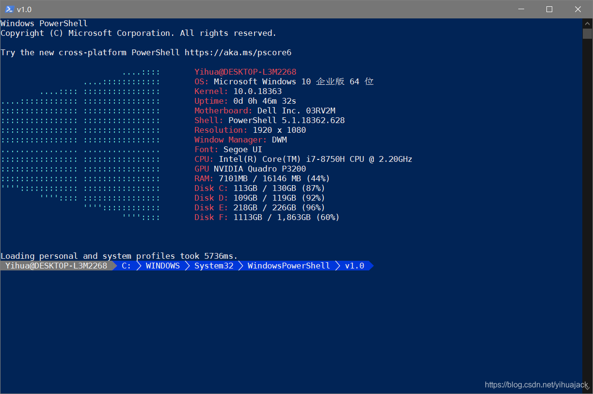
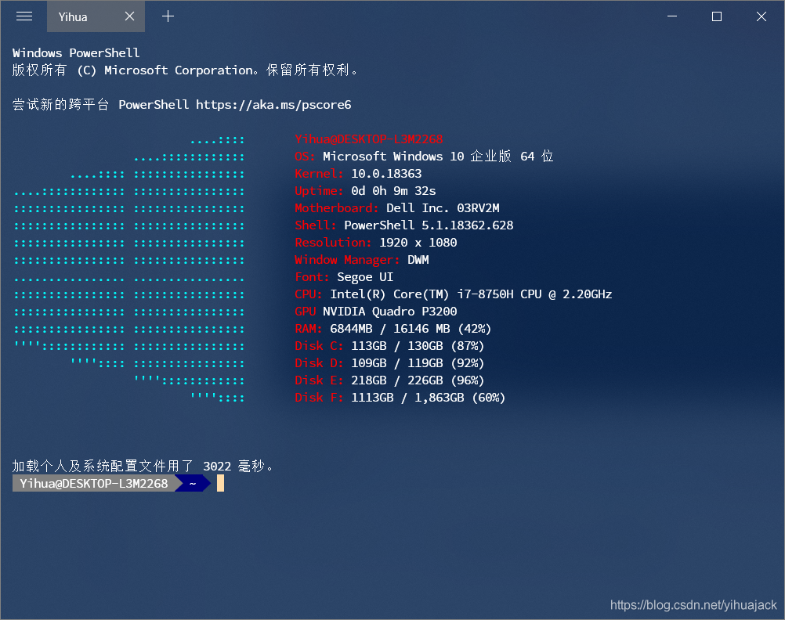

20200823更新：

请阅读20200520更新文章：[PowerShell Core 7配置与美化（结合Fluent Terminal/Windows Terminal）](https://blog.csdn.net/yihuajack/article/details/106234124)。

\------------------------------------------------------------

笔者搜索了国内外网络上关于Windows PowerShell配置DirColors基本是抄“小马哥”andot@qq.com博主的文章，文章中说

> 其中 `~\dir_colors` 就是配置文件的路径，关于 dir_colors 的配置文件，在 github 上可以搜到不少，比如：[dircolors-solarized](https://github.com/seebi/dircolors-solarized)。这里就不再列举更多了。

本来打算只写写dircolors怎么配置，但后来为避免配置不全或错误，索性写了一个整套美化Windows PowerShell以及Fluent Terminal配置Posh-git、Oh-my-posh、DirColors的方法，也以备后用。

首先安装[Fluent Terminal](https://github.com/felixse/FluentTerminal)，安装好后用管理员权限打开PowerShell，先执行命令：

```
Set-ExecutionPolicy -ExecutionPolicy ByPass
```

否则会出现错误，参考微软文档[About Execution Policies](https://docs.microsoft.com/zh-cn/powershell/module/microsoft.powershell.core/about/about_execution_policies?view=powershell-7)。

安装posh-git和oh-my-posh（如已安装跳过）：

```
Install-Module posh-git -Scope CurrentUser
Install-Module oh-my-posh -Scope CurrentUser
```

遇到提示选是或全是即可，接着执行

```
Install-Module DirColors
Install-Module windows-screenfetch
```

或

```
Install-Module DirColors -Scope CurrentUser
Install-Module windows-screenfetch -Scope CurrentUser
```

遇到提示选是或全是即可。ScreenFetch的效果是启动时显示系统信息（参见文末的效果图）。然后安装字体[Source Code Pro for Powerline](https://github.com/powerline/fonts)（clone到本地然后复制相应字体文件到C:\WINDOWS\Fonts）。

注意，正常使用posh-git和oh-my-posh可能会git报错，建议使用Git for Windows作为Windows的Git环境。

接着，在C:\Users\<username>\Documents\WindowsPowerShell中新建Microsoft.PowerShell_profile.ps1，在其中添加

```
Import-Module posh-git;
Import-Module oh-my-posh;
Import-Module DirColors;
Update-DirColors ~/dir_colors;
```

然后从GitHub上clone [dircolors-solarized](https://github.com/seebi/dircolors-solarized)，问题是该放到哪儿呢？笔者先尝试在C:\Users\<username>中新建文件夹dir_colors或dircolors放入dircolors.256dark或者整个仓库，如果路径错误会报错：

```
Get-Content : 找不到路径“C:\Users\<username>\dir_colors”，因为该路径不存在。
所在位置 C:\Program Files\WindowsPowerShell\Modules\DirColors\1.1.2\DirColors.psm1:121 字符: 21
+     ForEach ($_ In (Get-Content -Path:$Path -ReadCount 0) -Split "`n" ...
+                     ~~~~~~~~~~~~~~~~~~~~~~~~~~~~~~~~~~~~
    + CategoryInfo          : ObjectNotFound: (C:\Users\<username>\dir_colors:String) [Get-Content], ItemNot
   FoundException
    + FullyQualifiedErrorId : PathNotFound,Microsoft.PowerShell.Commands.GetContentCommand
```

更正路径名称后报错：

```
Get-Content : 对路径“C:\Users\<username>\dir_colors”的访问被拒绝。
所在位置 C:\Program Files\WindowsPowerShell\Modules\DirColors\1.1.2\DirColors.psm1:121 字符: 21
+     ForEach ($_ In (Get-Content -Path:$Path -ReadCount 0) -Split "`n" ...
+                     ~~~~~~~~~~~~~~~~~~~~~~~~~~~~~~~~~~~~
    + CategoryInfo          : PermissionDenied: (C:\Users\<username>\dir_colors:String) [Get-Content], Unaut
   horizedAccessException
    + FullyQualifiedErrorId : GetContentReaderUnauthorizedAccessError,Microsoft.PowerShell.Commands.Get
   ContentCommand
```

想到C#报错UnauthorizedAccessException异常与获取文件的目录与文件的不同有关，于是直接将dircolors.256dark复制到C:\Users\<username>下（也可以选择其他主题如dircolors.ansi-dark等）下，然后将以下文本复制到Microsoft.PowerShell_profile.ps1中

```
Import-Module DirColors
Update-DirColors ~/dircolors.256dark
Import-Module posh-git
if (!(Get-SshAgent)) {
    Start-SshAgent
}
Import-Module oh-my-posh
Set-Theme PowerLine
Screenfetch
```

如遇到SSH Agent启动失败，执行如下命令即可：

```
Get-Service | select -property name,starttype
Set-Service -Name ssh-agent -StartupType Manual
```

该配置可能会出现瑕疵，用该ps1代码打开PowerShell一开始光标会和箭头空出一段距离，执行任意其他命令后光标恢复到紧贴箭头处，但是**后来该问题并未复现**。我们还可以复制一份改名Microsoft.VSCode_profile.ps1，可参考[PowerShell 美化指南](https://coolcode.org/2018/03/16/how-to-make-your-powershell-beautiful/)。如果不用oh-my-posh而采用个性化自定义，可参考知乎大佬[vilicvane](https://www.zhihu.com/people/vilicvane)的代码（已修改过路径、Project、Screenfetch和SSH Agent等）【为什么 Windows 的终端（如命令提示符、PowerShell）都这么丑？ - vilicvane的回答 - 知乎 https://www.zhihu.com/question/38752831/answer/80133586】下评论链接[https://onedrive.live.com/?authkey=%21ABivZ6uPBrm68t0&cid=26DFC7B235D3DFB1&id=26DFC7B235D3DFB1%21984614&parId=26DFC7B235D3DFB1%21984613&o=OneUp](https://onedrive.live.com/?authkey=!ABivZ6uPBrm68t0&cid=26DFC7B235D3DFB1&id=26DFC7B235D3DFB1!984614&parId=26DFC7B235D3DFB1!984613&o=OneUp)：

```
Set-Alias gh Get-Help;
Set-Alias cd Push-Location -Option AllScope;
Set-Alias cdb Pop-Location -Option AllScope;
Set-PSReadLineOption -HistoryNoDuplicates;
$ProjectDirectory = 'D:\Documents\Programming\PowerShell';
function cdp {
	[CmdletBinding()]
    Param()
    DynamicParam {
        # Set the dynamic parameters' name
        $ParameterName = 'Path';
        # Create the dictionary
        $RuntimeParameterDictionary = New-Object System.Management.Automation.RuntimeDefinedParameterDictionary;
        # Generate and set the ValidateSet
        $DirectorySet = Get-ChildItem -Path $ProjectDirectory -Directory | Select-Object -ExpandProperty Name;
        $ValidateSetAttribute = New-Object System.Management.Automation.ValidateSetAttribute($DirectorySet);
        # Create and set the parameters' attributes
        $ParameterAttribute = New-Object System.Management.Automation.ParameterAttribute;
        $ParameterAttribute.Position = 0;
        # Create the collection of attributes
        $AttributeCollection = New-Object System.Collections.ObjectModel.Collection[System.Attribute];
		$AttributeCollection.Add($ValidateSetAttribute);
		$AttributeCollection.Add($ParameterAttribute);
        # Create and return the dynamic parameter
        $RuntimeParameter = New-Object System.Management.Automation.RuntimeDefinedParameter($ParameterName, [string], $AttributeCollection);
        $RuntimeParameterDictionary.Add($ParameterName, $RuntimeParameter);
        return $RuntimeParameterDictionary;
    }
    Begin {
        # Bind the parameter to a friendly variable
        $ProjectName = $PsBoundParameters[$ParameterName];
    }
    Process {
		cd $ProjectDirectory\$ProjectName;
    }
}
function cdh {
    cd ~;
}
Push-Location (Split-Path -Path $MyInvocation.MyCommand.Definition -Parent);
Import-Module posh-git;
Import-Module oh-my-posh;
Import-Module DirColors;
Update-DirColors ~/dircolors.256dark;
$Global:GitPromptSettings.BeforeText = ' ';
$Global:GitPromptSettings.BeforeForegroundColor = [ConsoleColor]::DarkGray;
$Global:GitPromptSettings.BeforeBackgroundColor = [ConsoleColor]::White;
$Global:GitPromptSettings.DelimText = " $([char]0xb7)";
$Global:GitPromptSettings.DelimForegroundColor = [ConsoleColor]::DarkGray;
$Global:GitPromptSettings.DelimBackgroundColor = [ConsoleColor]::White;
$Global:GitPromptSettings.AfterText = ' ';
$Global:GitPromptSettings.AfterForegroundColor = [ConsoleColor]::DarkGray;
$Global:GitPromptSettings.AfterBackgroundColor = [ConsoleColor]::White;
$Global:GitPromptSettings.LocalStagedStatusForegroundColor = [ConsoleColor]::DarkGray;
$Global:GitPromptSettings.LocalStagedStatusBackgroundColor = [ConsoleColor]::White;
$Global:GitPromptSettings.BranchForegroundColor = [ConsoleColor]::DarkGray;
$Global:GitPromptSettings.BranchBackgroundColor = [ConsoleColor]::White;
$Global:GitPromptSettings.BranchIdenticalStatusToForegroundColor = [ConsoleColor]::DarkGray;
$Global:GitPromptSettings.BranchIdenticalStatusToBackgroundColor = [ConsoleColor]::White;
$Global:GitPromptSettings.BranchBehindAndAheadStatusForegroundColor = [ConsoleColor]::DarkYellow;
$Global:GitPromptSettings.BranchBehindAndAheadStatusBackgroundColor = [ConsoleColor]::White;
$Global:GitPromptSettings.BranchBehindStatusForegroundColor = [ConsoleColor]::DarkRed;
$Global:GitPromptSettings.BranchBehindStatusBackgroundColor = [ConsoleColor]::White;
$Global:GitPromptSettings.BranchAheadStatusForegroundColor = [ConsoleColor]::DarkGreen;
$Global:GitPromptSettings.BranchAheadStatusBackgroundColor = [ConsoleColor]::White;
$Global:GitPromptSettings.LocalWorkingStatusBackgroundColor = [ConsoleColor]::White;
$Global:GitPromptSettings.BeforeIndexBackgroundColor = [ConsoleColor]::White;
$Global:GitPromptSettings.IndexBackgroundColor = [ConsoleColor]::White;
$Global:GitPromptSettings.WorkingBackgroundColor = [ConsoleColor]::White;
$Global:GitPromptSettings.EnableWindowTitle = $false;
$Global:GitPromptSettings.ShowStatusWhenZero = $false;
# Set up a simple prompt, adding the git prompt parts inside git repos
function global:prompt {
    $realLASTEXITCODE = $Global:LASTEXITCODE;
    $hostline = " $env:Username@$env:UserDomain ";
    Write-Host;
    if ($realLASTEXITCODE -eq 0) {
        $hostColor = [ConsoleColor]::DarkGreen;
    } else {
        $hostColor = [ConsoleColor]::DarkRed;
        $hostline += "(0x$('{0:X0}' -f $realLASTEXITCODE)) ";
    }
    Write-Host $hostline -ForegroundColor White -BackgroundColor $hostColor -NoNewLine;
    Write-Host "$([char]0xe0b0)" -ForegroundColor $hostColor -BackgroundColor DarkGray -NoNewline;
    $realFolderName = (Get-Item $pwd.ProviderPath).Name;
    if ($pwd.ProviderPath -eq $env:UserProfile) {
        $folderName = '~';
    } else {
        $folderName = $realFolderName;
    }
    Write-Host " $folderName " -ForegroundColor White -BackgroundColor DarkGray -NoNewline;
    $gitStatus = Get-GitStatus;
    if ($gitStatus -ne $null) {
        Write-Host "$([char]0xe0b0)" -ForegroundColor DarkGray -BackgroundColor White -NoNewline;
        Write-GitStatus $gitStatus;
        Write-Host "$([char]0xe0b0)" -ForegroundColor White;
    } else {
        Write-Host "$([char]0xe0b0)" -ForegroundColor DarkGray;
    }
    $Global:LASTEXITCODE = 0;
    Write-Host " PS " -ForegroundColor DarkGray -BackgroundColor White -NoNewline;
    Write-Host "$([char]0xe0b0)" -ForegroundColor White -NoNewline;
    Write " ";
    try {
        & "$env:ConEmuBaseDir\ConEmuC.exe" "/GUIMACRO", 'Rename(0,@"'$realFolderName'")' > $null;
    } catch { }
}
Pop-Location;
if (!(Get-SshAgent)) {
    Start-SshAgent -Quiet;
}
Screenfetch;
```

然而使用该ps1代码启动PowerShell初始会爆红(0x1)，后续执行任意其他命令才转绿，该问题一时不清楚原因，故慎用。我们可以发现语句末尾的分号是非必需的。

接下来可以添加右键菜单项，在注册表：计算机\HKEY_CLASSES_ROOT\Directory\Background\shell下新建项Open PowerShell Here，新建子项command默认REG_SZ型值为C:\WINDOWS\System32\WindowsPowerShell\v1.0\powershell.exe。一般Fluent Terminal安装会自动创建右键菜单，若没有，则新建项Open Fluent Terminal Here，新建子项command默认REG_SZ型值为"%LOCALAPPDATA%\Microsoft\WindowsApps\flute.exe" new "%V"，也可以任取项名，然后将项的默认值改为想在右键菜单中显示的名称。如果想在菜单项左边显示一个小图标，可以在"Open ... Here"下新建REG_SZ值名Icon，数据为图标Icon的路径。

最后，为避免中文乱码问题，在注册表项：计算机\HKEY_CURRENT_USER\Console\%SystemRoot%_System32_WindowsPowerShell_v1.0_powershell.exe下新建REG_DWORD值名CodePage，数据为十进制65001（或十六进制0x0000fde9），FaceName值数据改为[DejaVu Sans Mono for Powerline](https://github.com/powerline/fonts)（还可以参考[Microsoft YaHei Mono](https://github.com/Microsoft/BashOnWindows/files/1362006/Microsoft.YaHei.Mono.zip)，还有另外一款字体来源于[自定义 Windows PowerShell 和 cmd 的字体](https://blog.walterlv.com/post/customize-fonts-of-command-window) [Inziu Iosevka](https://be5invis.github.io/Iosevka/inziu.html)已迁移到[更纱黑体](https://github.com/be5invis/Sarasa-Gothic)（最新下载链接在GitHub项目页的Release里面），但是其包含的OpenType字体很多而且体积很大，如果C盘空间有限并不推荐），**重启计算机后生效**，否则会出现打开PowerShell窗口后无任何显示（这是最常见的问题）或报错：

```
Program 'git.exe' failed to run: Valid values are between 0 and 65535, inclusive.
Parameter name: codepageAt C:\Users\<username>\Documents\WindowsPowerShell\Modules\posh-git\0.7.3\CheckVersion.ps1:10 char:1
4
+ if ([String](git --version 2> $null) -match '(?<ver>\d+(?:\.\d+)+)')  ...
+              ~~~~~~~~~~~~~~~~~~~~~~.
At C:\Users\<username>\Documents\WindowsPowerShell\Modules\posh-git\0.7.3\CheckVersion.ps1:10 char:5
+ if ([String](git --version 2> $null) -match '(?<ver>\d+(?:\.\d+)+)')  ...
+     ~~~~~~~~~~~~~~~~~~~~~~~~~~~~~~~~~~~~~~~~~~~~~~~~~~~~~~~~~~~~~~~
    + CategoryInfo          : ResourceUnavailable: (:) [], ApplicationFailedException
    + FullyQualifiedErrorId : NativeCommandFailed
 
WARNING: posh-git requires Git 1.7.2 or better. You have .
Program 'ssh-agent.exe' failed to run: Valid values are between 0 and 65535, inclusive.
Parameter name: codepageAt C:\Users\<username>\Documents\WindowsPowerShell\Modules\posh-git\0.7.3\GitUtils.ps1:491 char:9
+         & $sshAgent | ForEach-Object {
+         ~~~~~~~~~~~.
At C:\Users\<username>\Documents\WindowsPowerShell\Modules\posh-git\0.7.3\GitUtils.ps1:491 char:9
+         & $sshAgent | ForEach-Object {
+         ~~~~~~~~~~~~~~~~~~~~~~~~~~~~~~
    + CategoryInfo          : ResourceUnavailable: (:) [], ApplicationFailedException
    + FullyQualifiedErrorId : NativeCommandFailed
```

实际上，如果确定配置好了但是PowerShell控制台就是没反应或报错，重启就完事儿了，不行再另说。在Fluent Terminal设置->终端中更改字体为Source Code Pro for Powerline。然后以Fira Code Retina字体为例，注册表：计算机\HKEY_LOCAL_MACHINE\SOFTWARE\Microsoft\Windows NT\CurrentVersion\FontLink\SystemLink下新建项名Fira Code Retina，数据为：

```
MICROSS.TTF,Microsoft Sans Serif,108,122
MICROSS.TTF,Microsoft Sans Serif
MINGLIU.TTC,PMingLiU
MSMINCHO.TTC,MS PMincho
BATANG.TTC,Batang
MSYH.TTC,Microsoft YaHei UI
MSJH.TTC,Microsoft JhengHei UI
YUGOTHM.TTC,Yu Gothic UI
MALGUN.TTF,Malgun Gothic
SEGUISYM.TTF,Segoe UI Symbol
```

检查计算机\HKEY_LOCAL_MACHINE\SOFTWARE\Microsoft\Windows NT\CurrentVersion\Fonts是否已有安装好的字体，若没有则参照我的另一篇博文[Windows 10 ttf字体文件右键菜单没有安装选项导致MATLAB预设无法识别使用已安装字体的问题的解决方法](https://blog.csdn.net/yihuajack/article/details/104384983)手动补加注册表。

注意：以上所有配置均针对于C:\WINDOWS\System32\WindowsPowerShell\v1.0\powershell.exe，另外一个PowerShell在C:\WINDOWS\SysWOW64\WindowsPowerShell\v1.0\powershell.exe则保持原样未被修改。修改过程中，原来PowerShell的快捷方式会失效，**即使新建快捷方式，所使用的代码页与字体与powershell.exe控制台程序不同，仍会使用系统默认，所以全程调试PowerShell控制台应该直接打开C:\WINDOWS\System32\WindowsPowerShell\v1.0\powershell.exe或使用Win+R运行powershell或任务管理器新建任务powershell的界面**。

为避免可能的中文字符问题，可执行：

```
Install-Module -Name PowerShellGet -Force
Install-Module -Name PSReadLine -Force
```

此外，你还可以尝试[PSColor](https://github.com/Davlind/PSColor)、[Get-ChildItemColor](https://github.com/joonro/Get-ChildItemColor)。如果嫌加载个人及系统配置文件时间过长，可以在ps1文件中删掉screenfetch语句。

以上的配置实际上不仅美化了Fluent Terminal，而且直接美化了powershell.exe Console。贴张PowerShell控制台的效果图：



Fluent Terminal效果图：



 