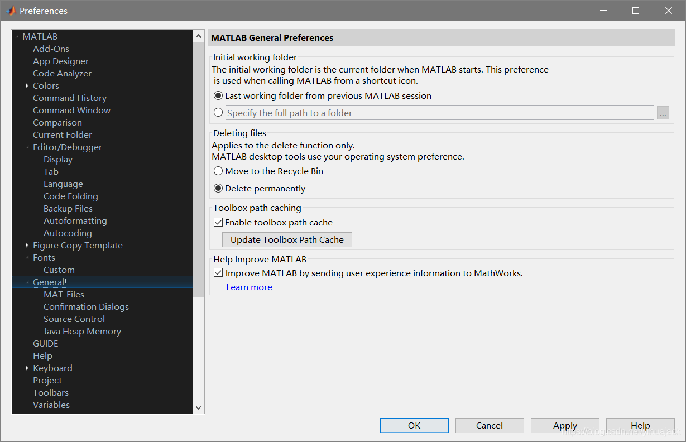
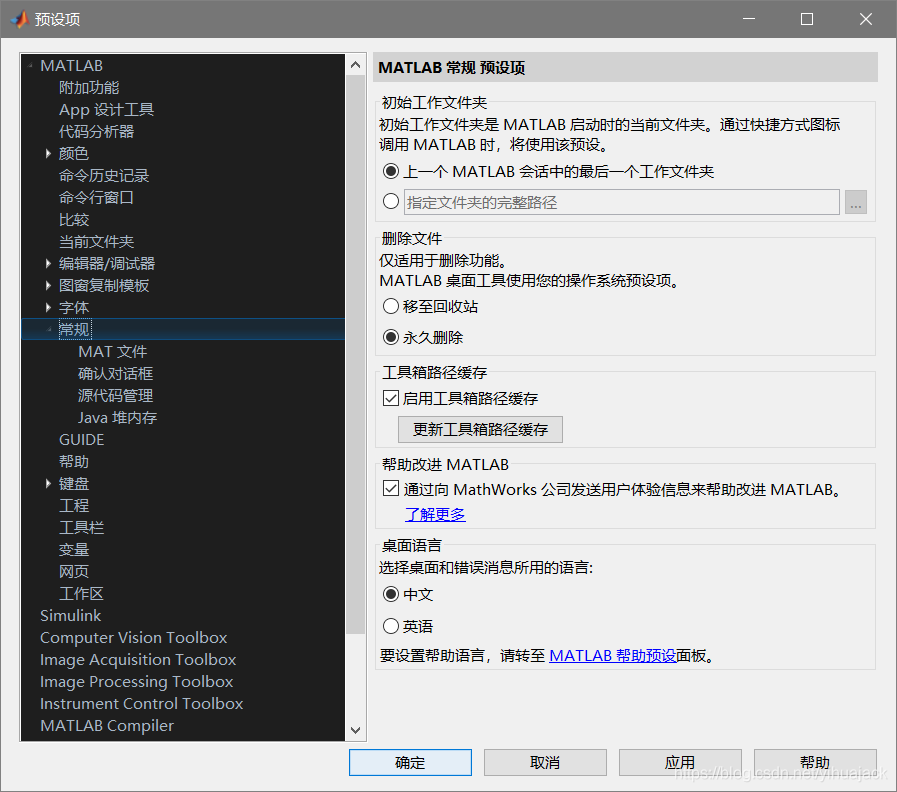

```
plot(x,y,'DatetimeTickFormat','MMM-yyyy');
```

x为日期格式（datetime）的一个向量，MMM表示月份的简写（Jan或一月），MMMM表示月份（January或一月），yyyy表示年。对于中文用户而言月份会自动写成“1月”或“一月”的格式，而如果想在坐标轴上显示英文月份则不行，即使在MATLAB预设项中更改语言为英文并重启MATLAB后也不行，解决方法是：

（对于Windows 10）控制面板->时钟和区域->日期和时间->更改日期和时间->更改日历设置->格式改为英语(美国)（或控制面板->时钟和区域->区域）。重启MATLAB，发现英文字体发生了改变（Monospaced），脚本中的汉字字符变为乱码。打开Preferences->General：



对比原先的界面，

少了最下方“桌面语言”的一栏，这时再执行开头的plot语句发现绘得的图像的横坐标月份变成英文：


完成后将区域改回中文(简体，中国)，重启MATLAB即自动恢复到原来的中文界面。