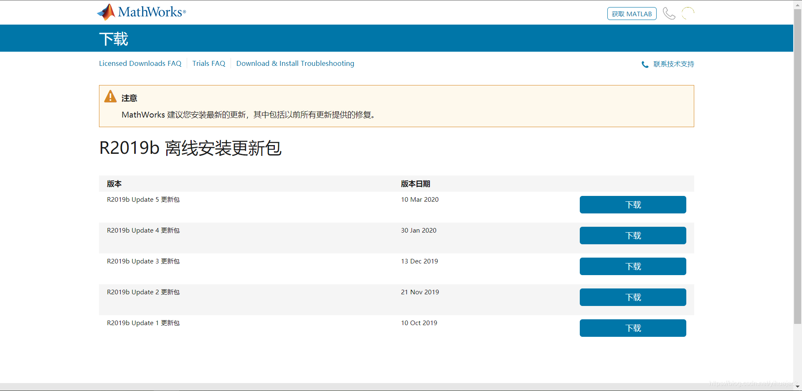

在安装MATLAB R2019b Update 5的过程中出现未知错误unexpected error，并且找不到日志文件可供查询（如果有高手找到请指教），打开代理后仍然出现未知错误还连带了连接错误connection error。本来想暂时放弃更新，结果打开MATLAB发现命令行窗口报错：

```
Caught "std::exception" Exception message is:
Bundle#136 start failed: Loading E:\Program Files\MATLAB\R2019b\bin\win64\builtins\matlab_graphics_hg\mwhg_builtinimpl.dllfailed with error: 鎵句笉鍒版寚瀹氱殑妯″潡銆�
 
 
在后台初始化图形期间出错: Bundle#136 start failed: Loading E:\Program
Files\MATLAB\R2019b\bin\win64\builtins\matlab_graphics_hg\mwhg_builtinimpl.dllfailed
with error: 鎵句笉鍒版寚瀹氱殑妯″潡銆
```

而试图打开一个m文件则继续报错

```
Exception in thread "AWT-EventQueue-0": java.lang.NoClassDefFoundError: com/mathworks/toolbox/coder/nide/editor/StateflowStorageLocation
	at java.lang.ClassLoader.defineClass1(Native Method)
	at java.lang.ClassLoader.defineClass(ClassLoader.java:763)
	at java.security.SecureClassLoader.defineClass(SecureClassLoader.java:142)
	at java.net.URLClassLoader.defineClass(URLClassLoader.java:468)
	at java.net.URLClassLoader.access$100(URLClassLoader.java:74)
	at java.net.URLClassLoader$1.run(URLClassLoader.java:369)
	at java.net.URLClassLoader$1.run(URLClassLoader.java:363)
	at java.security.AccessController.doPrivileged(Native Method)
	at java.net.URLClassLoader.findClass(URLClassLoader.java:362)
	at java.lang.ClassLoader.loadClass(ClassLoader.java:424)
	at sun.misc.Launcher$AppClassLoader.loadClass(Launcher.java:349)
	at java.lang.ClassLoader.loadClass(ClassLoader.java:357)
	at com.mathworks.toolbox.eml.breakpoints.EmlMarginProvider.isApplicable(EmlMarginProvider.java:21)
	at com.mathworks.mde.editor.EditorView.getApplicableMarginProviders(EditorView.java:252)
	at com.mathworks.mde.editor.EditorView.initSyntaxTextPane(EditorView.java:885)
	at com.mathworks.mde.editor.EditorView.<init>(EditorView.java:222)
	at com.mathworks.mde.editor.EditorView.<init>(EditorView.java:153)
	at com.mathworks.mde.editor.EditorViewClient.init(EditorViewClient.java:232)
	at com.mathworks.mde.editor.EditorViewClient.<init>(EditorViewClient.java:181)
	at com.mathworks.mde.editor.MatlabEditorApplication.createEditorViewClient(MatlabEditorApplication.java:700)
	at com.mathworks.mde.editor.MatlabEditorApplication.createEditorViewClient(MatlabEditorApplication.java:685)
	at com.mathworks.mde.editor.MatlabEditorApplication.createEditorViewClientFromExistingFile(MatlabEditorApplication.java:677)
	at com.mathworks.mde.editor.MatlabEditorApplication.access$300(MatlabEditorApplication.java:73)
	at com.mathworks.mde.editor.MatlabEditorApplication$4.runWithOutput(MatlabEditorApplication.java:402)
	at com.mathworks.jmi.AWTUtilities$Invoker$2.watchedRun(AWTUtilities.java:475)
	at com.mathworks.jmi.AWTUtilities$WatchedRunnable.run(AWTUtilities.java:436)
	at java.awt.event.InvocationEvent.dispatch(InvocationEvent.java:311)
	at java.awt.EventQueue.dispatchEventImpl(EventQueue.java:758)
	at java.awt.EventQueue.access$500(EventQueue.java:97)
	at java.awt.EventQueue$3.run(EventQueue.java:709)
	at java.awt.EventQueue$3.run(EventQueue.java:703)
	at java.security.AccessController.doPrivileged(Native Method)
	at java.security.ProtectionDomain$JavaSecurityAccessImpl.doIntersectionPrivilege(ProtectionDomain.java:74)
	at java.awt.EventQueue.dispatchEvent(EventQueue.java:728)
	at java.awt.EventDispatchThread.pumpOneEventForFilters(EventDispatchThread.java:205)
	at java.awt.EventDispatchThread.pumpEventsForFilter(EventDispatchThread.java:116)
	at java.awt.EventDispatchThread.pumpEventsForHierarchy(EventDispatchThread.java:105)
	at java.awt.EventDispatchThread.pumpEvents(EventDispatchThread.java:101)
	at java.awt.EventDispatchThread.pumpEvents(EventDispatchThread.java:93)
	at java.awt.EventDispatchThread.run(EventDispatchThread.java:82)
Caused by: java.lang.ClassNotFoundException: com.mathworks.toolbox.coder.nide.editor.StateflowStorageLocation
	at java.net.URLClassLoader.findClass(URLClassLoader.java:382)
	at java.lang.ClassLoader.loadClass(ClassLoader.java:424)
	at sun.misc.Launcher$AppClassLoader.loadClass(Launcher.java:349)
	at java.lang.ClassLoader.loadClass(ClassLoader.java:357)
	... 40 more
```

不禁让人联想起更新NVIDIA显卡驱动程序时MATLAB出现的临时性错误。经过回忆想起在这期间由于需要给开始菜单截图提交GitHub issue而把系统的语言更改成了英文。这时我们把系统的语言改回中文，命令行窗口仍会报错，这可能是因为更新失败无法回滚造成的，点击右上角铃铛图标显示通知中更新Update 5，无需代理即可成功安装更新。这启示如果出现类似错误，可以先检查一下系统设置是否发生了改变。

另外，如有需求，我们可以直接从https://ww2.mathworks.cn/downloads/web_downloads/show_updates?release=R2019b（URL最后的R2019b可换成你想更新的MATLAB版本号）下载MATLAB Update更新包，如图所示：

