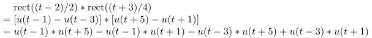
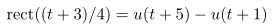

有时在写LaTeX公式时过长就需要把它们用对齐方式书写，而有时公式的第一个等号左边的量也太长了，对齐方式书写不美观，于是就要把它放在第一行然后第二行另起等号对齐书写。这时我们可以采用array环境书写，如

```
$$\begin{array}{ll}
    &XXX\\
    &=XXX
\end{array}$$
```

然而这种方式书写出来的等号之间的间距不是过宽就是过窄，于是我们需要在公式开始前加入关键一条语句：

```
\setlength{\arraycolsep}{1.4pt}
```

其中，1.4pt正是LaTeX数学公式中等号的默认间距。效果如下：



对比LaTeX数学公式中默认的等号：



可以看出完美一致。

如果还想调节行间距使其与align环境一致，则可以按如下方式书写：

```
\[\arraycolsep=1.4pt\def\arraystretch{1.2}
\begin{array}{ll}
    &XXX\\
    =&XXX
\end{array}
\]
```

其中

```
\[...\]
```

是LaTeX数学公式的另一种写法，但是比

```
$$...$$
```

更好；arraystretch表示的是行间距，单位是倍数。

这种写法有个好处就是我们只在这条公式中定义array的列间距和行间距而不会影响文档中其他array的列间距和行间距。