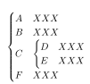
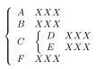

LaTeX中书写嵌套大括号可以使用嵌套cases：

```
$$\begin{cases}
    A&XXX\\
    B&XXX\\
    C&
    \begin{cases}
        D&XXX\\
        E&XXX
    \end{cases}\\
    F&XXX
\end{cases}$$
```

效果：



也可以使用嵌套array：

```
$$\left\{\begin{array}{ll}
    A&XXX\\
    B&XXX\\
    C&\left\{
    \begin{array}{ll}
        D&XXX\\
        E&XXX
	\end{array}
	\right.\\
    F&XXX
\end{array}
\right.$$
```



也可以array嵌套cases（效果同cases嵌套cases）

```
$$\left\{\begin{array}{ll}
    A&XXX\\
    B&XXX\\
    C&
    \begin{cases}
        D&XXX\\
        E&XXX
	\end{cases}\\
    F&XXX
\end{array}
\right.$$
```

cases嵌套array（效果同array嵌套array）

```
$$\begin{cases}
    A&XXX\\
    B&XXX\\
    C&\left\{
    \begin{array}{ll}
        D&XXX\\
        E&XXX
	\end{array}
	\right.\\
    F&XXX
\end{cases}$$
```

如果想对每条cases标号只需将cases环境换成numcases即可。如果只想在内层嵌套使用大括号而外层不使用，只需要将外层确定为array并去掉

```
\left\{...\right.
```

即可，这种方法在等号对齐中有重要的应用。不过在array嵌套array中有一个问题，如果我们想用

```
\arraycolsep=1.4pt\def\arraystretch{1.2}
```

或

```
\setlength{\arraycolsep}{1.4pt}
```

调整行间距和列间距时，**该命令只能在一条数学公式内生效一次**，如果想在嵌套的array中使用与外层array不同的行间距和列间距是无解的。