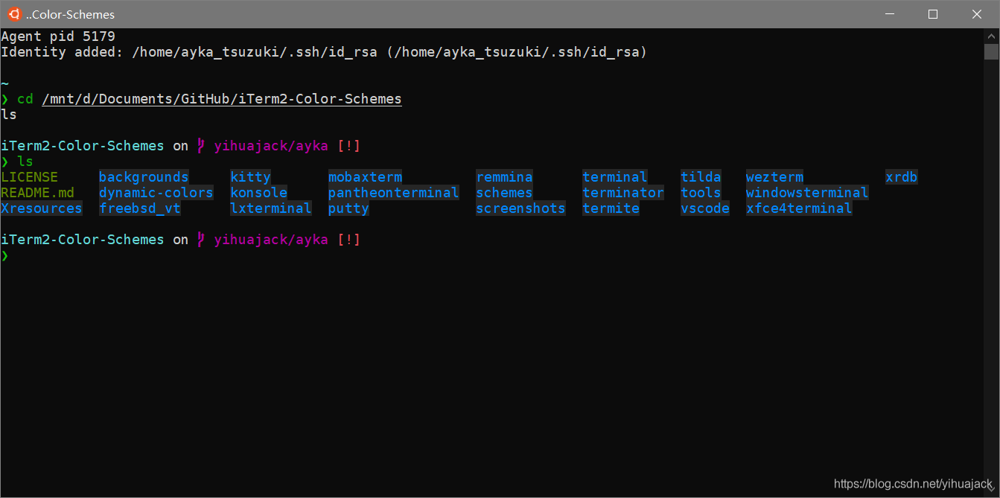

对于WSL，Starship官网推荐的安装方法是执行

```
curl -fsSL https://starship.rs/install.sh | bash
```

然而总是没反应，显示：

```
  Configuration
> Bin directory: /usr/local/bin
> Platform:      unknown-linux-gnu
> Arch:          x86_64
 
> Tarball URL: https://github.com/starship/starship/releases/latest/download/starship-x86_64-unknown-linux-gnu.tar.gz
? Install Starship latest to /usr/local/bin? [y/N] y
! Escalated permission are required to install to /usr/local/bin
> Installing Starship as root, please wait…
```

然后我试图执行

```
wget https://starship.rs/install.sh | bash
```

显示

```
Will not apply HSTS. The HSTS database must be a regular and non-world-writable file.
ERROR: could not open HSTS store at '/home/ayka_tsuzuki/.wget-hsts'. HSTS will be disabled.
--2020-03-27 13:06:48--  https://starship.rs/install.sh
Resolving starship.rs (starship.rs)... 104.27.178.8, 104.27.179.8, 2606:4700:3033::681b:b208, ...
Connecting to starship.rs (starship.rs)|104.27.178.8|:443... connected.
HTTP request sent, awaiting response... 200 OK
Length: unspecified [application/x-shellscript]
Saving to: ‘install.sh’
 
install.sh                        [ <=>                                              ]   6.78K  --.-KB/s    in 0.001s
 
2020-03-27 13:06:51 (12.5 MB/s) - ‘install.sh’ saved [6941]
```

但却并未执行该.sh脚本，于是使用

```
bash install.sh
```

有可能成功，也有可能不成功（我第一次就是不成功），尽管显示信息未能保存下来，关键报错信息是在

```
rc=$?
if [ rc -neq 0 ]
```

后产生报错信息。我尝试了在PowerShell中使用scoop安装成功，说明是WSL的问题，一时未能解决，不过在Starshp官网上发现cargo可以安装Starship，于是执行

```
curl --proto '=https' --tlsv1.2 -sSf https://sh.rustup.rs | sh
```

安装rustc，然后为cargo等components添加环境变量：

```
source $HOME/.cargo/env
```

这时运行

```
cargo install starship
```

却报错

```
the SSL certificate is invalid; class=Ssl (16); code=Certificate (-17)
```

运行

```
ssh-add -L
```

检验，发现没有启动ssh-agent，干脆在.zshrc或.bashrc中添加（确认你的ssh之前已经正确配置）：

```
ZSH_DISABLE_COMPFIX="true"
eval $(ssh-agent -s)
ssh-add ~/.ssh/id_rsa
```

如果你没有添加export ZSH="/home/yourname/.oh-my-zsh"还要再加上这一条。

然后重启WSL并重新配置git：

```
git config --global user.name "yourname"
git config --global user.email "youremail"
```

再次运行cargo install starship，报错：

```
failed to connect to github.com: Resource temporarily unavailable; class=Os
```

找到GitHub中rust-lang/cargo的[#6513号issue](https://github.com/rust-lang/cargo/issues/6513)，你可以参考其他人的comment，也可以直接看我的comment：

I found that it was indeed a network problem and solved it. If you do not have alternative choice to fetch what you want, you can try using SS or SSR, just go Option Settings (选项设置)->Local Proxy (本地代理), tick "Allow connections from LAN" (允许来自局域网的连接) and set Local Port (本地端口) = 1080. Then append the following to your .zshrc or .bashrc file:

```
alias proxy="git config --global http.proxy http://127.0.0.1:1080"
alias unproxy="git config --global --unset http.proxy"
```

Then cargo starts fetching successfully.

就是说在SS或SSR里选项设置->本地代理勾选允许来自局域网的链接，本地端口填写1080，然后在.zshrc或.bashrc加上这两行代码，当然速度会很慢，不料compile到一半又报错：

```
error: failed to run custom build command for `openssl-sys v0.9.54`
 
Caused by:
  process didn't exit successfully: `/tmp/cargo-installi4HyMw/release/build/openssl-sys-2869942195258ab3/build-script-main` (exit code: 101)
--- stdout
cargo:rustc-cfg=const_fn
cargo:rerun-if-env-changed=X86_64_UNKNOWN_LINUX_GNU_OPENSSL_LIB_DIR
X86_64_UNKNOWN_LINUX_GNU_OPENSSL_LIB_DIR unset
cargo:rerun-if-env-changed=OPENSSL_LIB_DIR
OPENSSL_LIB_DIR unset
cargo:rerun-if-env-changed=X86_64_UNKNOWN_LINUX_GNU_OPENSSL_INCLUDE_DIR
X86_64_UNKNOWN_LINUX_GNU_OPENSSL_INCLUDE_DIR unset
cargo:rerun-if-env-changed=OPENSSL_INCLUDE_DIR
OPENSSL_INCLUDE_DIR unset
cargo:rerun-if-env-changed=X86_64_UNKNOWN_LINUX_GNU_OPENSSL_DIR
X86_64_UNKNOWN_LINUX_GNU_OPENSSL_DIR unset
cargo:rerun-if-env-changed=OPENSSL_DIR
OPENSSL_DIR unset
run pkg_config fail: "Failed to run `\"pkg-config\" \"--libs\" \"--cflags\" \"openssl\"`: Permission denied (os error 13)"
 
--- stderr
thread 'main' panicked at '
 
Could not find directory of OpenSSL installation, and this `-sys` crate cannot
proceed without this knowledge. If OpenSSL is installed and this crate had
trouble finding it,  you can set the `OPENSSL_DIR` environment variable for the
compilation process.
 
Make sure you also have the development packages of openssl installed.
For example, `libssl-dev` on Ubuntu or `openssl-devel` on Fedora.
 
If you're in a situation where you think the directory *should* be found
automatically, please open a bug at https://github.com/sfackler/rust-openssl
and include information about your system as well as this message.
 
$HOST = x86_64-unknown-linux-gnu
$TARGET = x86_64-unknown-linux-gnu
openssl-sys = 0.9.54
 
 
It looks like you're compiling on Linux and also targeting Linux. Currently this
requires the `pkg-config` utility to find OpenSSL but unfortunately `pkg-config`
could not be found. If you have OpenSSL installed you can likely fix this by
installing `pkg-config`.
 
', /home/ayka_tsuzuki/.cargo/registry/src/github.com-1ecc6299db9ec823/openssl-sys-0.9.54/build/find_normal.rs:150:5
note: run with `RUST_BACKTRACE=1` environment variable to display a backtrace
 
warning: build failed, waiting for other jobs to finish...
error: failed to compile `starship v0.38.1`, intermediate artifacts can be found at `/tmp/cargo-installi4HyMw`
 
Caused by:
  build failed
```

openssl已经安装了，于是再安装上pkg-config和libssl-dev，最后终于成功安装：

```
    Updating crates.io index
  Installing starship v0.38.1
   Compiling libc v0.2.68
   Compiling autocfg v1.0.0
   Compiling cfg-if v0.1.9
   Compiling pkg-config v0.3.17
   Compiling lazy_static v1.4.0
   Compiling proc-macro2 v1.0.9
   Compiling unicode-xid v0.2.0
   Compiling syn v1.0.17
   Compiling bitflags v1.2.1
   Compiling log v0.4.8
   Compiling maybe-uninit v2.0.0
   Compiling serde v1.0.105
   Compiling memchr v2.3.3
   Compiling matches v0.1.8
   Compiling semver-parser v0.7.0
   Compiling smallvec v1.2.0
   Compiling scopeguard v1.1.0
   Compiling ryu v1.0.3
   Compiling arrayvec v0.4.12
   Compiling foreign-types-shared v0.1.1
   Compiling typenum v1.11.2
   Compiling rayon-core v1.7.0
   Compiling percent-encoding v2.1.0
   Compiling openssl v0.10.28
   Compiling itoa v0.4.5
   Compiling quick-error v1.2.3
   Compiling native-tls v0.2.4
   Compiling nodrop v0.1.14
   Compiling version_check v0.9.1
   Compiling regex-syntax v0.6.17
   Compiling doc-comment v0.3.3
   Compiling static_assertions v0.3.4
   Compiling fnv v1.0.6
   Compiling termcolor v1.1.0
   Compiling bytes v0.5.4
   Compiling battery v0.7.5
   Compiling unicode-width v0.1.7
   Compiling dtoa v0.4.5
   Compiling either v1.5.3
   Compiling openssl-probe v0.1.2
   Compiling sysinfo v0.11.7
   Compiling lazycell v1.2.1
   Compiling vec_map v0.8.1
   Compiling linked-hash-map v0.5.2
   Compiling strsim v0.8.0
   Compiling once_cell v1.3.1
   Compiling ansi_term v0.11.0
   Compiling open v1.4.0
   Compiling unicode-segmentation v1.6.0
   Compiling path-slash v0.1.1
   Compiling ansi_term v0.12.1
   Compiling urlencoding v1.0.0
   Compiling byte-unit v3.0.3
   Compiling thread_local v1.0.1
   Compiling unicode-bidi v0.3.4
   Compiling semver v0.9.0
   Compiling unicode-normalization v0.1.12
   Compiling foreign-types v0.3.2
   Compiling humantime v1.3.0
   Compiling crossbeam-utils v0.7.2
   Compiling memoffset v0.5.4
   Compiling crossbeam-epoch v0.8.2
   Compiling num-traits v0.2.11
   Compiling num-integer v0.1.42
   Compiling textwrap v0.11.0
   Compiling http v0.2.1
   Compiling yaml-rust v0.4.3
   Compiling nom v5.1.1
   Compiling rustc_version v0.2.3
   Compiling idna v0.2.0
   Compiling aho-corasick v0.7.10
   Compiling quote v1.0.3
   Compiling lexical-core v0.6.7
   Compiling url v2.1.1
   Compiling crossbeam-queue v0.2.1
   Compiling regex v1.3.6
   Compiling jobserver v0.1.21
   Compiling num_cpus v1.12.0
   Compiling atty v0.2.14
   Compiling time v0.1.42
   Compiling dirs-sys v0.3.4
   Compiling gethostname v0.2.1
   Compiling term_size v0.3.1
   Compiling uom v0.26.0
   Compiling crossbeam-deque v0.7.3
   Compiling cc v1.0.50
   Compiling clap v2.33.0
   Compiling dirs v2.0.2
   Compiling env_logger v0.7.1
   Compiling chrono v0.4.11
   Compiling pretty_env_logger v0.4.0
   Compiling rayon v1.3.0
   Compiling openssl-sys v0.9.54
   Compiling libz-sys v1.0.25
   Compiling libgit2-sys v0.12.0+0.99.0
   Compiling serde_derive v1.0.105
   Compiling starship_module_config_derive v0.1.1
   Compiling git2 v0.13.0
   Compiling serde_urlencoded v0.6.1
   Compiling serde_json v1.0.48
   Compiling os_info v2.0.2
   Compiling toml v0.5.6
   Compiling attohttpc v0.12.0
   Compiling starship v0.38.1
    Finished release [optimized] target(s) in 2m 24s
  Installing /home/yourname/.cargo/bin/starship
   Installed package `starship v0.38.1` (executable `starship`)
```

最后别忘了这条指示（使用sh脚本安装会有，但是cargo安装没有）：

```
> Please follow the steps for your shell to complete the installation:
 
  Bash
  Add the following to the end of ~/.bashrc:
 
      eval "$(starship init bash)"
 
  Fish
  Add the following to the end of ~/.config/fish/config.fish:
 
      starship init fish | source
 
  Zsh
  Add the following to the end of ~/.zshrc:
 
      eval "$(starship init zsh)"
 
  Ion
  Add the following to the end of ~/.config/ion/initrc:
 
      eval eval $(/home/ayka_tsuzuki/.cargo/bin/starship init ion --print-full-init)
```

例如对于zsh，在.zshrc中添加eval "$(starship init zsh)"。效果图：

