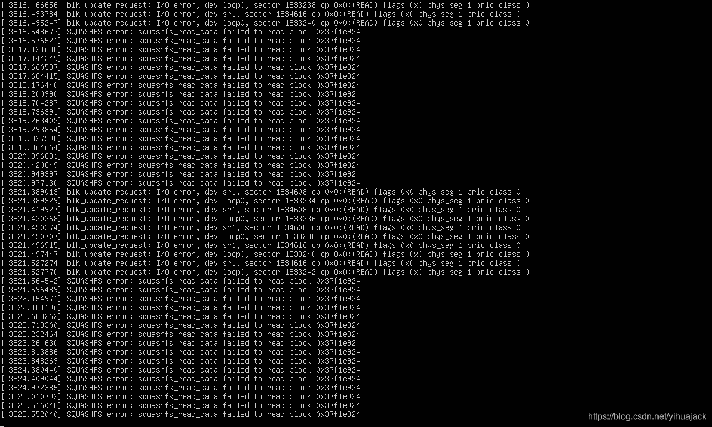
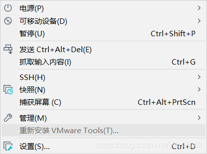

用VMware Workstation 15 Pro 15.5.1安装Ubuntu 19.10接近完成时显示Ubuntu的启动界面，即五个点一直闪烁的界面却一直不动：


检查VMware Workstation VMX进程发现其CPU使用率一直维持在1%左右的低位，而GPU使用率却一直在10%左右（使用GPU 0 - 3D），更改虚拟机设置为2个处理器后仍然没有解决，最后发现虚拟机->可移动设备->CD/DVD 2 (SATA)和CD/DVD (SATA)均未被连接，因为我是通过移动硬盘中的镜像安装Ubuntu的，所以尝试点击CD/DVD 2 (SATA)->连接后系统进入命令行界面执行一段时间，显示正在安装open-vm-tools，然后顺利启动Ubuntu，尽管发现此时CD/DVD 2 (SATA)还是处于未连接的状态。

还有一个问题，这样解决既然不是正常安装，那么VMware Tools就会出现问题，比如不能使用剪贴板，打开菜单栏虚拟机选项卡发现安装VMware Tools是灰色的，可尝试将虚拟机->CD/DVD (SATA)连接设置使用ISO映像文件的autoinst.iso改成vmware安装目录下的linux.exe。

之所以安装新版本的Ubuntu 19.10一方面是想要更新系统，另一方面是原来的Ubuntu 19.04突然出现了网络连接问题（NAT模式），有线网络和无线网络都不可用，索性直接重装，不过吸取了上次的教训，即在创建新的虚拟机的设置过程中选择将虚拟磁盘存储为单个文件。不过后来才想起来，网络适配器->网络连接一定要选桥接模式（不用选复制物理网络连接状态）即可正常使用。

另外，因为Ubuntu 14.04以后版本安装需要Internet连接，而一开始网络连接错误设置成了NAT模式而非桥接模式导致安装程序不能成功进行Retrieve files、Download language packs等操作及其后续Unpack等操作，导致不完全安装，即使安装成功也是英文版本，所以遇到这种情况还是**重装**为好，记得创建新的虚拟机时网络设置设置为**桥接模式**或者你能用的模式。另外推荐给虚拟机分配1/3的处理器和内核（比如6核12线程分配处理器数量为2、每个处理器的核心数量为2），这样安装会快不少。

使用新设置重装后却发现仍然同样的结果，于是用Ctrl+Alt+F1或Ctrl+Alt+F2调出终端：



这两条信息不停地循环显示。然而经Hard Disk Sentinel检测磁盘很健康，无坏道，（Windows下进入镜像目录）用

```
certutil -hashfile ubuntu-19.10-desktop-amd64.iso MD5
```

MD5码校验正确，猜测可能是硬盘数据线老化的问题，仍然是执行连接CD/DVD 2 (SATA)后成功安装VMware Tools，这时打开菜单栏虚拟机选项卡：



显示重新安装VMware Tools为灰色，剪贴板等VMware Tools功能正常，虚拟机正常运行。发现文件选项卡中找不到共享文件夹，可执行：

```
vmhgfs-fuse .host:/  /mnt/hgfs/
```

还可以给共享文件夹创建到HOME目录的软链接（share为共享文件夹名称）：

```
cd /mnt/hgfs
ln -s /mnt/hgfs/share/ ~/share
```