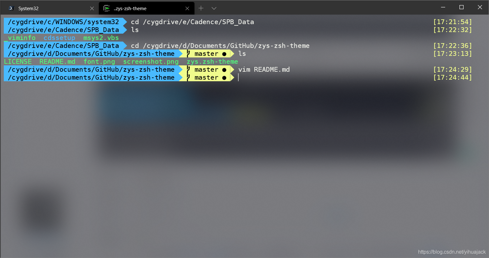

由于用户变量中的HOME由于需要使用Cadence的原因被迫改到E:\Cadence\SPB_Data下，MSYS2使用的ZSH的配置文件都自动放在这一目录下，然而想为Cygwin也配置ZSH发现产生乱码，这并不是由于字体或者编码问题导致的，其原因是MSYS2和Cygwin共用HOME目录下的.zshrc文件，而.zshrc文件中两个系统使用的路径表示不一样，Cygwin需要在盘符前面加"/cygdrive"，如在MSYS2使用的.zshrc中，ZSH的PATH配置语句为：

```
export ZSH="/e/Cadence/SPB_Data/.oh-my-zsh"
```

而Cygwin中则应为：

```
export ZSH="/cygdrive/c/Users/<userename>/.oh-my-zsh"
```

解决这个问题只能通过更改Cygwin的HOME目录的方式来解决（而不只是启动目录设置）。

首先，Cygwin现在已有zsh包可通过setup程序安装，不要再使用apt-cyg，它已经过时，经测验安装zsh会报错。

经过测验，https://superuser.com/questions/585331/is-it-possible-to-have-cygwin-ignore-the-windows-home-environment-variable上提出的在/etc/profile中添加

```
HOME=$(eval echo "~$USER")
```

的方法并不可行。你可以更改Cygwin的快捷方式为Cygwin.bat启动，在Cygwin.bat中可以随意更改HOME等设置，但是这样启动使用的是Windows命令提示符的Shell，并非Cygwin自带的mintty shell，这样就会出现乱码。另外经检验，https://stackoverflow.com/questions/1494658/how-can-i-change-my-cygwin-home-folder-after-installation中提出的在/etc/nsswitch.conf中将db_home的注释去掉并改为/%H、/%H/cygwin、windows、/home/%U等等统统没用，而且试图执行mkpasswd、mkgroup语句或https://superuser.com/questions/289444/how-do-i-change-my-home-folder-in-cygwin中提出的更改/etc/passwd文件等方法全部无效，而经http://mintty.github.io/mintty.1.html查mintty.exe的启动参数也无计可施。

正确方法是：

1. 在C:\Users\<username>中另安装一个oh-my-zsh，可在该目录下执行命令（用Cygwin执行）：

   ```
   sh -c "$(curl -fsSL https://raw.github.com/ohmyzsh/ohmyzsh/master/tools/install.sh)"
   ```

   或

   ```
   sh -c "$(wget https://raw.github.com/ohmyzsh/ohmyzsh/master/tools/install.sh -O -)"
   ```

   等。

2. 编辑.zshrc文件，确定语句：

   ```
   export ZSH="/cygdrive/c/Users/<userename>/.oh-my-zsh"
   ```

   并将ZSH_THEME更改为你喜欢的主题，我使用的是agnoster的变种

   zys主题

   。

3. 在/etc/bash.bashrc中添加：

   ```
   HOME="C:\Users\<username>"
   PATH="/usr/local/bin:/usr/bin"
   exec zsh
   ```

   其中第一句是真正地设定了Cygwin的HOME目录，第二句是定义环境变量PATH，如没有这一句则很多命令无法执行，第三句是自动启动ZSH。

4. 在/etc/profile中添加：

   ```
   HOME="C:\Users\<username>"
   ```

   这一句是设定了启动目录为~，其中~为C:\Users\<username>。

5. 确认Cygwin快捷方式的目标为：

   ```
   D:\Program_Files\cygwin64\bin\mintty.exe -i /Cygwin-Terminal.ico -
   ```

   其中目录请按照自己的安装目录修改，最后的-也可改为-~，都保证启动目录为~，但是如果没有则启动目录变成快捷方式所在的目录。经验证，

   https://superuser.com/questions/940529/how-to-change-the-default-shell-in-cygwin/1134672#1134672

   和

   https://medium.com/@alllexsm/how-to-install-z-shell-zsh-on-cygwin-dd9ee380d783

   中所提出的自动启动zsh的参数会导致闪退，原因不明。

另外如果想为Windows Terminal配置Cygwin可在profiles.json的"profiles"里的"list"里添加：

```
{
    "guid": "{xxxxxxxx-xxxx-xxxx-xxxx-xxxxxxxxxxxx}",
    "name": "Cygwin64",
    "commandline": "D:\\Program_Files\\cygwin64\\bin\\bash.exe",
    "icon": "D:\\Program_Files\\cygwin64\\Cygwin.ico"
}
```

其中GUID可使用PowerShell命令

```
New-GUID
```

生成一个，其他个性化设置在此就不提供了，发现Windows Terminal可以完美运行Cygwin（Windows Terminal有自己的默认启动目录）：

