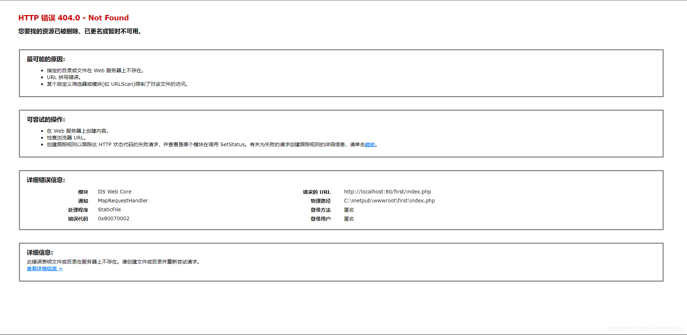

在Windows中使用MAMP新建E:\MAMP\htdocs\first文件夹和E:\MAMP\htdocs\first\index.php文件，使用Apache和Mysql服务器，然后打开http://localhost/first/index.php出现以下错误页面

首先在MAMP中的Settings->Hosts->General确认Host name为localhost，尝试在open中用浏览器打开出现页面显示：

The virtual host was set up successfully.

If you can see this page, your new virtual host was set up successfully. Now, web content can be added and this placeholder page1 should be replaced or deleted.

Server name: localhost
Document root: E:/MAMP/htdocs 

1 Files: index.php and MAMP-PRO-Logo.png

检查端口，由于80已经被系统占用，所以使用的是82，于是改为打开http://localhost:82/first/index.php成功。