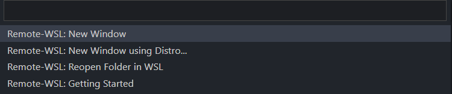
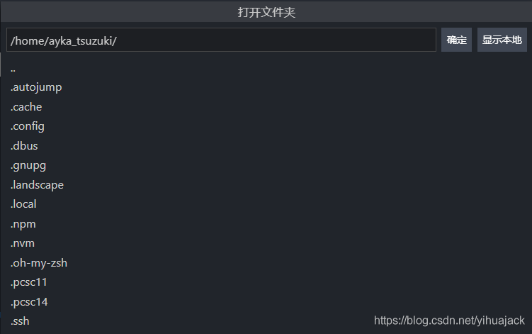
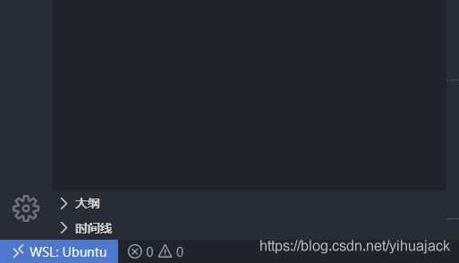
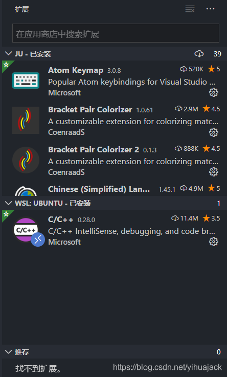
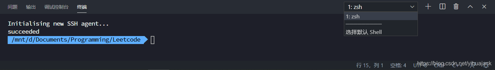
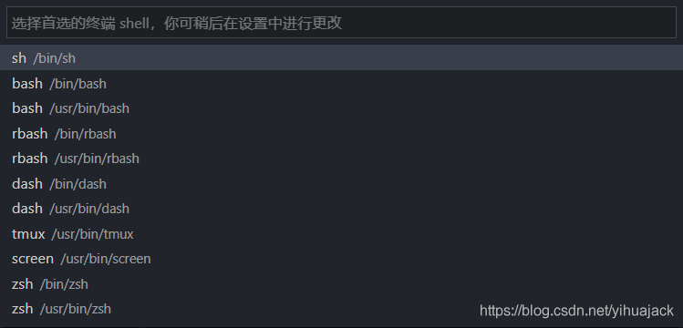
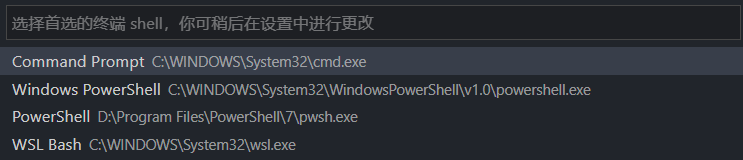
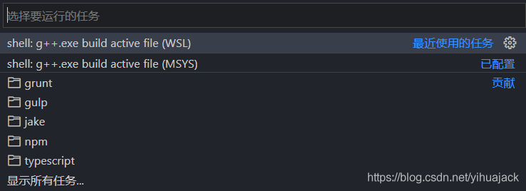
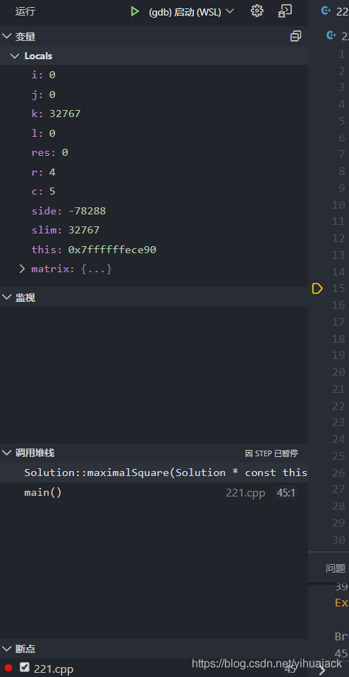

【参考Microsoft官方文档：https://code.visualstudio.com/docs/cpp/cpp-debug和https://code.visualstudio.com/docs/cpp/config-wsl】

1.在VSCode中安装扩展“C/C++”和"Remote - WSL"。如果要使用WSL远程桌面，那么在第2步启动WSL远程桌面后在左边栏->扩展中搜索“C/C++”点击“在WSL: Ubuntu中安装”。

2.点击左下角的蓝色图标。


在上方弹出窗口中选择Remote-WSL: New Window。


如果VSCode处于打开文件夹的状态，则弹出窗口会多一个选项Remote-WSL: Reopen Folder in WSL。



如果VSCode远程打开文件夹会弹出窗口：



可以通过“显示本地”直接选取Windows文件夹。成功打开远程后左下角图标如下：



左边栏扩展会显示三栏：JU - 已安装、WSL: UBUNTU - 已安装、推荐。WSL: UBUNTU - 已安装的扩展图标会增加一个代表远程扩展的贴纸：



3.使用VSCode终端方法：远程连接WSL时，在下方终端中：



如果显示的并非zsh，点击“选择默认Shell”。



未处于远程模式时，下方终端的名称为wsl，同样“选择默认Shell"如下：



WSL可通过在设置"settings.json"中添加行：

```
"terminal.integrated.shell.windows": "C:\\WINDOWS\\System32\\wsl.exe"
```

这样就可以在终端中运行编译命令和调试命令了。

4.VSCode菜单栏->运行->打开配置，打开launch.json文件，在WSL远程窗口中运行参考：

```
{
    // 使用 IntelliSense 了解相关属性。 
    // 悬停以查看现有属性的描述。
    // 欲了解更多信息，请访问: https://go.microsoft.com/fwlink/?linkid=830387
    "version": "0.2.0",
    "configurations": [
        {
            "name": "(gdb) 启动 (WSL)",
            "type": "cppdbg",
            "request": "launch",
            "program": "${workspaceFolder}/${fileBasenameNoExtension}",
            "args": [],
            "stopAtEntry": false,
            "cwd": "${workspaceFolder}",
            "environment": [],
            "externalConsole": false,
            "MIMode": "gdb",
            "miDebuggerPath": "/usr/bin/gdb",
            "setupCommands": [
                {
                    "description": "为 gdb 启用整齐打印",
                    "text": "-enable-pretty-printing",
                    "ignoreFailures": false
                }
            ],
            "preLaunchTask": "shell: g++.exe build active file (WSL)"
        }
    ]
}
```

在Windows（MSYS）中运行参考：

```
{
    // 使用 IntelliSense 了解相关属性。 
    // 悬停以查看现有属性的描述。
    // 欲了解更多信息，请访问: https://go.microsoft.com/fwlink/?linkid=830387
    "version": "0.2.0",
    "configurations": [
        {
            "name": "(gdb) 启动 (MSYS)",
            "type": "cppdbg",
            "request": "launch",
            "program": "${workspaceFolder}/${fileBasenameNoExtension}.exe",
            "args": [],
            "stopAtEntry": false,
            "cwd": "${workspaceFolder}",
            "environment": [],
            "externalConsole": false,
            "MIMode": "gdb",
            "miDebuggerPath": "E:/msys64/mingw64/bin/gdb",
            "setupCommands": [
                {
                    "description": "为 gdb 启用整齐打印",
                    "text": "-enable-pretty-printing",
                    "ignoreFailures": false
                }
            ],
            "preLaunchTask": "shell: g++.exe build active file (MSYS)"
        }
    ]
}
```

VSCode菜单栏->终端->配置任务【若未配置，则点击终端->运行任务会显示”没有配置的任务。配置任务…“，点击后会显示：

点击第一个“shell: cl.exe build active file"会自动创建使用cl.exe编译器的运行任务如下：

```
{
	"version": "2.0.0",
	"tasks": [
		{
			"type": "shell",
			"label": "shell: cl.exe build active file",
			"command": "cl.exe",
			"args": [
				"/Zi",
				"/EHsc",
				"/Fe:",
				"${fileDirname}\\${fileBasenameNoExtension}.exe",
				"${file}"
			],
			"problemMatcher": [
				"$msCompile"
			],
			"group": "build"
		}
	]
}
```

cl.exe是Visual Studio使用的C/C++编译器（即MSVC）。若使用该编译器，应将X:\Program Files (x86)\Microsoft Visual Studio\2019\Enterprise\VC\Tools\MSVC\14.25.28610\bin\Hostx64\x64添加到环境变量。但如果仅如此配置会报错：“fatal error C1034: iostream: 不包括路径集”，需要另行配置。】

打开tasks.json文件，在WSL远程窗口中参考：

```
{
	"version": "2.0.0",
	"tasks": [
		{
			"type": "shell",
			"label": "shell: g++.exe build active file (WSL)",
			"command": "/usr/bin/g++",
			"args": [
				"-g",
				"${file}",
				"-o",
				"${fileDirname}/${fileBasenameNoExtension}"
			],
			"options": {
				"cwd": "/usr/bin"
			},
			"problemMatcher": [
				"$gcc"
			],
			"group": {
				"kind": "build",
				"isDefault": true
			}
		}
	]
}
```

在Windows（MSYS）中参考：

```
{
	"version": "2.0.0",
	"tasks": [
		{
			"type": "shell",
			"label": "shell: g++.exe build active file (MSYS)",
			"command": "E:\\msys64\\mingw64\\bin\\g++.exe",
			"args": [
				"-g",
				"${file}",
				"-o",
				"${fileDirname}\\${fileBasenameNoExtension}.exe"
			],
			"options": {
				"cwd": "E:\\msys64\\mingw64\\bin"
			},
			"problemMatcher": [
				"$gcc"
			],
			"group": {
				"kind": "build",
				"isDefault": true
			}
		}
	]
}
```

配置好后选择菜单栏->终端->运行任务弹出窗口为：



5.打开要调试的代码文件。如果只想编译，选择菜单栏->运行->以非调试模式运行即可。如果要调试，编译后在行号左侧单击添加断点，菜单栏->运行->启动调试，左边栏->运行会启动一个活动会话：



它会自动编译后运行调试，无需先运行生成二进制文件。接下来就可以在下方使用调试控制台了。具体单步跳过、单步调试、单步跳出的调试功能与Visual Studio、JetBrains CLion等IDE并无异。注意事项：在使用Windows中的gcc、g++等调试时不要同时打开WSL远程窗口，否则在下方终端中会报错：“终端 shell CWD“\usr\bin”不存在”。参考：[The terminal shell CWD "\usr\bin" does not exist？](https://www.zhihu.com/question/380270740/answer/1229921060)。