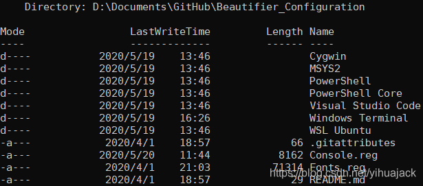
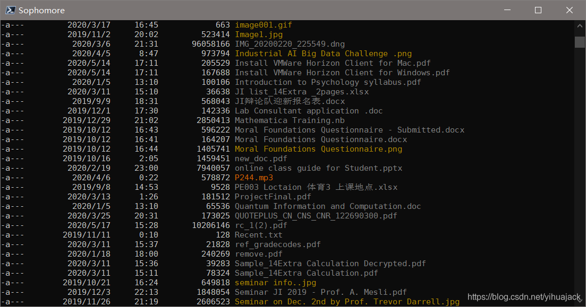

【本篇是在[美化Windows PowerShell以及Fluent Terminal配置Posh-git、Oh-my-posh、DirColors方法](https://blog.csdn.net/yihuajack/article/details/104565634)基础上针对PowerShell Core 7部分配置与美化的更新，推荐先通过本文的方法配置PowerShell Core 7，再配置Fluent Terminal或Windows Terminal等，其中[Fluent Terminal](https://github.com/felixse/FluentTerminal)从https://github.com/felixse/FluentTerminal/releases下载zip文件，然后双击*.appxbundle文件安装，也可使用scoop安装：

```
scoop install 7zip git
scoop bucket add nonportable
scoop install fluent-terminal-np
```

或使用chocolatey安装：

```
choco install fluent-terminal
```

而[Windows Terminal](https://github.com/microsoft/terminal)可从https://github.com/microsoft/terminal/releases下载msixbundle文件安装，也可在Microsoft Store中搜索Terminal安装，也可使用chocolatey安装：

```
choco install microsoft-windows-terminal
```

配置文件可参考我的配置[https://github.com/yihuajack/Beautifier_Configuration/blob/master/Windows%20Terminal/profiles.json](https://github.com/yihuajack/Beautifier_Configuration/blob/master/Windows Terminal/profiles.json)。建议使用PowerShell Core 7完全代替PowerShell 5，无需再对PowerShell 5配置。】

1.安装[PowerShell](https://github.com/PowerShell/PowerShell)。在GitHub的[release](https://github.com/PowerShell/PowerShell/releases)页面下载Latest release或Pre-release并安装。

2.以管理员身份运行PowerShell 7 (x64)，执行

```bash
Set-ExecutionPolicy -ExecutionPolicy RemoteSigned -Scope CurrentUser
$env:SCOOP='D:\Program_Files\scoop'
[environment]::setEnvironmentVariable('SCOOP',$env:SCOOP,'User')
$env:SCOOP_GLOBAL='D:\Program_Files\scoop\apps'
[Environment]::SetEnvironmentVariable('SCOOP_GLOBAL', $env:SCOOP_GLOBAL, 'Machine')
iwr -useb get.scoop.sh | iex
```

安装[scoop](https://github.com/lukesampson/scoop)。这里手动设置了scoop的安装目录和scoop的global programs的安装目录。

3.执行

```
Set-ExecutionPolicy Bypass -Scope Process -Force; [System.Net.ServicePointManager]::SecurityProtocol = [System.Net.ServicePointManager]::SecurityProtocol -bor 3072; iex ((New-Object System.Net.WebClient).DownloadString('https://chocolatey.org/install.ps1'))
```

安装chocolatey。

4.执行

```
Set-PSRepository -Name PSGallery -InstallationPolicy Trusted
```

信任来自PSGallery的所有模块（执行过程不会是想象的那么快）。

5.安装[posh-git](https://github.com/dahlbyk/posh-git)：【注意：现有教程所说明的命令

```
Install-Module posh-git
```

会安装一个过时的版本0.7.3，这个版本对于Windows有一个bug出现在源码的/src/GitUtils.ps1的“Get-SshAgent()”、“Start-SshAgent()”、“Stop-SshAgent()”等函数中，由于开发者没有意识到Windows环境中SSH_AGENT_PID与实际上的Windows的ssh-agent.exe进程的Process ID（PID）是不同的，导致在Windows中这几个SSH Agent函数从未起作用。不仅如此，它还有一个原因不明的bug，即启动时会有乱码，在Fluent Terminal显示为输入光标与左边tab edge之间有一段空白，乱码或空白会在执行完第一个任意命令后消失，见oh-my-posh Issue #220：[PowerShell with oh-my-posh shows unreadable marks at startup](https://github.com/JanDeDobbeleer/oh-my-posh/issues/220)。开发者很晚才意识到这一点，该bug在0.7.3.1版本中也没有被修复，自1.0.0 Beta 1版本起，posh-git将不再支持SSH Agent功能，这部分功能被分出一个新项目[posh-sshell](https://github.com/dahlbyk/posh-sshell)，在这个项目中开发者采用Windows Native SSH Agent取代原先的调用（见源码的/src/Agent.ps1（包含原先的和Get-SshAgent()、Start-SshAgent()、Stop-SshAgent()等函数）和/src/Win32-OpenSSH.ps1文件（包含Get-NativeSshAgent和Start-NativeSshAgent函数，它们被Agent.ps1文件中的函数所调用））。】

执行

```
PowerShellGet\Install-Module posh-git -Scope CurrentUser -AllowPrerelease -Force
```

或通过chocolatey安装：

```
choco install poshgit
```

或通过scoop安装：

```
scoop install posh-git
Add-PoshGitToProfile
```

6.安装[posh-sshell](https://github.com/dahlbyk/posh-sshell)：

```
PowerShellGet\Install-Module posh-sshell -Scope CurrentUser
```

7.安装[oh-my-posh](https://github.com/JanDeDobbeleer/oh-my-posh)：

```
Install-Module oh-my-posh -Scope CurrentUser
```

8.安装[PSReadLine](https://github.com/PowerShell/PSReadLine)（PowerShell Core中自带该模块，但其版本往往落后于最新版本）：

```
Install-Module -Name PSReadLine -AllowPrerelease -Scope CurrentUser -Force -SkipPublisherCheck
```

9.安装[InstallModuleFromGithub](https://github.com/dfinke/InstallModuleFromGitHub)（虽然该模块的README很久没有更新，但是其GitHub仓库和版本仍在不断更新）：

```
Install-Module -Name InstallModuleFromGitHub
```

可参考模块开发者dfinke在2016年11月21日发布的GitHub博文：[Quickly Install PowerShell Modules from GitHub](https://dfinke.github.io/powershell/2016/11/21/Quickly-Install-PowerShell-Modules-from-GitHub.html)。

10.安装[windows-screenfetch](https://github.com/JulianChow94/Windows-screenFetch)：

```
Install-Module -Name windows-screenfetch
```

注意：该模块仅限于在PowerShell 5中安装，若在PowerShell Core中安装会报错：

```
Install-Package: D:\program files\powershell\7\Modules\PowerShellGet\PSModule.psm1:9709                                 Line |                                                                                                                  9709 |  … talledPackages = PackageManagement\Install-Package @PSBoundParameters                                             |                     ~~~~~~~~~~~~~~~~~~~~~~~~~~~~~~~~~~~~~~~~~~~~~~~~~~~~                                              | The following commands are already available on this system:'Get-Uptime'. This module                                 | 'windows-screenfetch' may override the existing commands. If you still want to install this module
     | 'windows-screenfetch', use -AllowClobber parameter. 
```

如果添加了-AllowClobber参数会进一步报错，参考[为PowerShell和PowerShell Core 7设置不同的profile配置文件路径](https://blog.csdn.net/yihuajack/article/details/104868474)与Windows-screenFetch Issue #19：[Doesn't support PowerShell Core](https://github.com/JulianChow94/Windows-screenFetch/issues/19)。考虑到PowerShell Gallery中的[windows-screenfetch](https://www.powershellgallery.com/packages/windows-screenfetch/1.0.2)模块最新版本为1.0.2，上次更新已是2018年2月20日，根据Windows-screenFetch Issue #33：[how to get latest version of this?](https://github.com/JulianChow94/Windows-screenFetch/issues/33)，通过InstallModuleFromGithub：

```
Find-Module windows-screenfetch | Install-ModuleFromGitHub
```

报错：

```
Invoke-RestMethod: C:\Users\Yihua\Documents\PowerShell\Modules\InstallModuleFromGitHub\1.3.0\InstallModuleFromGitHub.psm1:47                                                                                                                    Line |                                                                                                                    47 |  …             Invoke-RestMethod $url -OutFile $OutFile -Headers $header …                                          |                ~~~~~~~~~~~~~~~~~~~~~~~~~~~~~~~~~~~~~~~~~~~~~~~~~~~~~~~~~                                              | {"message":"Not Found","documentation_url":"https://developer.github.com/v3"}                                                                                                                                                            Unblock-File: C:\Users\Yihua\Documents\PowerShell\Modules\InstallModuleFromGitHub\1.3.0\InstallModuleFromGitHub.psm1:49 Line |                                                                                                                    49 |                    Unblock-File $OutFile                                                                              |                    ~~~~~~~~~~~~~~~~~~~~~                                                                              | Cannot find path 'C:\Users\Yihua\AppData\Local\Temp\Windows-screenFetch.zip' because it does not exist.                                                                                                                                  Get-FileHash: C:\Users\Yihua\Documents\PowerShell\Modules\InstallModuleFromGitHub\1.3.0\InstallModuleFromGitHub.psm1:52 Line |                                                                                                                    52 |                  $fileHash = $(Get-FileHash -Path $OutFile).hash                                                      |                                ~~~~~~~~~~~~~~~~~~~~~~~~~~~                                                            | Cannot find path 'C:\Users\Yihua\AppData\Local\Temp\Windows-screenFetch.zip' because it does not exist.                                                                                                                                  Expand-Archive: C:\Users\Yihua\Documents\PowerShell\Modules\InstallModuleFromGitHub\1.3.0\InstallModuleFromGitHub.psm1:55                                                                                                                       Line |                                                                                                                    55 |  …             Expand-Archive -Path $OutFile -DestinationPath $tmpDir -F …                                          |                ~~~~~~~~~~~~~~~~~~~~~~~~~~~~~~~~~~~~~~~~~~~~~~~~~~~~~~~~~                                              | The path 'C:\Users\Yihua\AppData\Local\Temp\Windows-screenFetch.zip' either does not exist or is not a                | valid file system path.
 
Join-Path: C:\Users\Yihua\Documents\PowerShell\Modules\InstallModuleFromGitHub\1.3.0\InstallModuleFromGitHub.psm1:73
Line |
  73 |  … hildItem (Join-Path -Path $tmpDir -ChildPath $unzippedArchive) -Inclu …
     |                                                 ~~~~~~~~~~~~~~~~
     | Cannot convert 'System.Object[]' to the type 'System.String' required by parameter 'ChildPath'.
     | Specified method is not supported.
 
Join-Path: C:\Users\Yihua\Documents\PowerShell\Modules\InstallModuleFromGitHub\1.3.0\InstallModuleFromGitHub.psm1:81
Line |
  81 |  … y-Item "$(Join-Path -Path $tmpDir -ChildPath $unzippedArchive)" $dest …
     |                                                 ~~~~~~~~~~~~~~~~
     | Cannot convert 'System.Object[]' to the type 'System.String' required by parameter 'ChildPath'.
     | Specified method is not supported.
 
Copy-Item: C:\Users\Yihua\Documents\PowerShell\Modules\InstallModuleFromGitHub\1.3.0\InstallModuleFromGitHub.psm1:81
Line |
  81 |  … = Copy-Item "$(Join-Path -Path $tmpDir -ChildPath $unzippedArchive)"  …
     |                ~~~~~~~~~~~~~~~~~~~~~~~~~~~~~~~~~~~~~~~~~~~~~~~~~~~~~~~~
     | Cannot bind argument to parameter 'Path' because it is an empty string.
```

见InstallModuleFromGithub Issue #17：[Invoke-RestMethod errors](https://github.com/dfinke/InstallModuleFromGitHub/issues/17)与Windows-screenFetch Issue #37：[Command conflict 'Get-Uptime'](https://github.com/JulianChow94/Windows-screenFetch/issues/37)。

11.安装[powerline fonts](https://github.com/powerline/fonts)，并将console的字体改为安装的Powerline字体。详见开头引用的博文。

12.更改PowerShell console代码页为UTF-8：

```bash
chcp 65001
```

13.创建$PROFILE文件（可手动在C:\Users\<username>\Documents\PowerShell下创建Microsoft.PowerShell_profile.ps1文件）：

```
if (!(Test-Path -Path $PROFILE )) { New-Item -Type File -Path $PROFILE -Force }
notepad $PROFILE
```

14.安装[Get-ChildItemColor](https://github.com/joonro/Get-ChildItemColor)（该项目目前处于活跃开发状态）：

```
Install-Module -AllowClobber Get-ChildItemColor
```

若不使用-AllowClobber参数会报错：

```
Install-Package: D:\program files\powershell\7\Modules\PowerShellGet\PSModule.psm1:9709
Line |
9709 |  … talledPackages = PackageManagement\Install-Package @PSBoundParameters
     |                     ~~~~~~~~~~~~~~~~~~~~~~~~~~~~~~~~~~~~~~~~~~~~~~~~~~~~
     | The following commands are already available on this system:'Out-Default'. This module
     | 'Get-ChildItemColor' may override the existing commands. If you still want to install this module
     | 'Get-ChildItemColor', use -AllowClobber parameter.
```

关于Out-Default的信息：

```
CommandType     Name                                               Version    Source
-----------     ----                                               -------    ------
Cmdlet          Out-Default                                        7.0.1.0    Microsoft.PowerShell.Core
```

或先git clone项目仓库，然后在$ENV:UserProfile\Documents\PowerShell\Modules即PSModulePath下新建文件夹Get-ChildItemColor，将源码中的/src目录复制到该文件夹中。

或使用chocolatey安装：

```bash
choco install get-childitemcolor
```

对于中文单引号、双引号、星号（★，※，☆）、省略号、破折号、箭头（↑↓←→）、对勾（√）、形状符号（○，△，□）执行ls命令会报错：

```
Sort-Object: C:\Users\Yihua\Documents\PowerShell\Modules\Get-ChildItemColor\2.2.0\Get-ChildItemColor.psm1:60
Line |
  60 |  … ject Name | Sort-Object { LengthInBufferCells("$_") } -Descending | S …
     |                ~~~~~~~~~~~~~~~~~~~~~~~~~~~~~~~~~~~~~~~~~~~~~~~~~~~~~
     | Cannot convert value "-2171" to type "System.UInt32". Error: "Value was either too large or too small
     | for a UInt32."
```

value重复"-2171"、"-3684"和"-3692"多次以及

```
InvalidArgument: C:\Users\Yihua\Documents\PowerShell\Modules\Get-ChildItemColor\2.2.0\PSColorHelper.ps1:39
Line |
  39 |      [bool]$isWide = $Char -ge 0x1100 -and
     |      ~~~~~~~~~~~~~~~~~~~~~~~~~~~~~~~~~~~~~
     | Cannot convert value "-2171" to type "System.UInt32". Error: "Value was either too large or too small
     | for a UInt32."
```

value重复"-3684"、"-2171"、"-3683"、"-3692"、"-3688"和"-3687"多次，参考Get-ChildItemColor Issue #38：[ls command failed for special marks: Sort-Object and InvalidArgument errors](https://github.com/joonro/Get-ChildItemColor/issues/38)。

 **不推荐安装[DirColors](https://github.com/DHowett/DirColors)**（请使用Get-ChildItemColor替代）：

```
Install-Module DirColors -Scope CurrentUser
```

该模块在PowerShell Gallery上的最近版本[1.1.2](https://www.powershellgallery.com/packages/DirColors/1.1.2)上次发布在2018年8月13日，也是其GitHub仓库最后一次commit的日期，而开发者在GitHub issue最后一次活动为2018年1月10日，而[dircolors-solarized](https://github.com/seebi/dircolors-solarized)仍处于活跃状态。开发者对该项目的描述是：

> DirColors leverages Powershell's custom formatter support to provide an implementation of GNU coreutils' `ls --color=always` anywhere FileInfo/DirectoryInfo objects are left to self-format.

该模块用于使文件列表彩色化，能够使用dircolors-solarized等颜色配置。若还要更改Windows命令提示符的颜色，参考[cmd-colors-solarized](https://github.com/neilpa/cmd-colors-solarized)。

使用前效果：



使用后效果：




**不推荐安装[PSColor](https://github.com/Davlind/PSColor)**（请使用Get-ChildItemColor替代）：

```
Install-Module PSColor
```

该模块在PowerShell Gallery上的最近版本[1.0.0.0](https://www.powershellgallery.com/packages/PSColor/1.0.0.0)上次发布在2016年3月2日，其GitHub仓库最后一次commit在2018年3月2日，而开发者在GitHub issue最后一次活动为2018年6月27日。开发者对该项目的描述是：

> Provides color highlighting for some basic PowerShell output. It currently rewrites "Out-Default" to colorize:
>
> - FileInfo & DirectoryInfo objects (Get-ChildItem, dir, ls etc.)
> - ServiceController objects (Get-Service)
> - MatchInfo objects (Select-String etc.)

15.（可选/Optional）安装[starship](https://github.com/starship/starship)（注意：该模块会覆盖posh-git/oh-my-posh的效果），其官方页面为https://starship.rs/。

scoop下载较慢需要较长时间甚至出现RPC failed等git clone错误，所以先安装aria2实现多连接下载：

```
scoop install aria2
```

安装程序前会自动update scoop。aria2-enabled属性的默认值即为true。重要的是它还能显示下载文件的信息、已下载的size和百分比进度等，例如

```
Download:  *** Download Progress Summary as of Wed May 20 22:16:08 2020 ***
Download: ===============================================================================
Download: [#d7df86 880KiB/1.8MiB(47%) CN:1 DL:0B]
Download: FILE: D:/Program_Files/scoop/cache/starship#0.41.3#https_github.com_starship_starship_releases_download_v0.41.3_starship-x86_64-pc-windows-msvc.zip
Download: -------------------------------------------------------------------------------
Download: [#d7df86 880KiB/1.8MiB(47%) CN:1 DL:0B]
```

执行

```
scoop install starship
```

若报错“Couldn't find manifest for 'starship'.”则执行

```
scoop bucket add extras
```

添加bucket（可通过scoop bucket list查看bucket列表，默认只有“main”，实际上正常情况下是不需要添加的，出现这种情况可能是之前install或者添加bucket异常，如果一直处于Checking repo... ok的状态那么需要重新安装scoop）。

16.在C:\Users\<username>\Documents\PowerShell下新建Windows PowerShell脚本Microsoft.PowerShell_profile.ps1，将其内容编辑为：

```
Import-Module posh-git
Import-Module oh-my-posh
Set-Theme PowerLine
$ChocolateyProfile = "$env:ChocolateyInstall\helpers\chocolateyProfile.psm1"
if (Test-Path($ChocolateyProfile)) {
  Import-Module "$ChocolateyProfile"
}
Import-Module posh-sshell
If (-Not (Test-Path Variable:PSise)) {  # Only run this in the console and not in the ISE
    Import-Module Get-ChildItemColor
    Set-Alias l Get-ChildItem -option AllScope
    Set-Alias ls Get-ChildItemColorFormatWide -option AllScope
}
```

其中Set-Theme可以设置你喜欢的主题。若要启用starship，添加

```
Invoke-Expression (&starship init powershell)
```