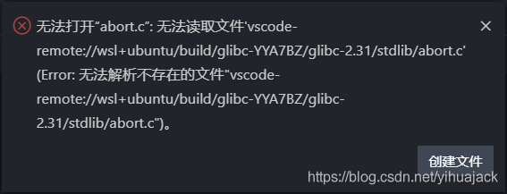
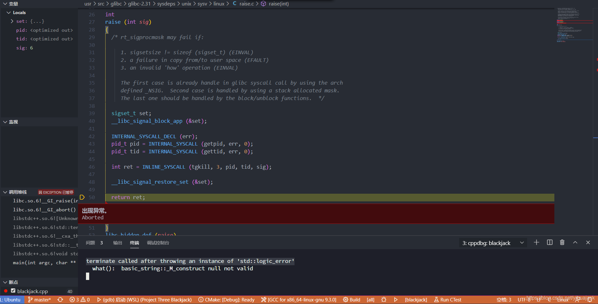

终端则会显示

```
terminate called after throwing an instance of 'std::logic_error'
  what():  basic_string::_M_construct null not valid
```

参考Github库[vscode-cpptools](https://github.com/microsoft/vscode-cpptools)的issue #1738: [Error on WSL: unable to open raise.c](https://github.com/Microsoft/vscode-cpptools/issues/1738)和#4686: [Debugging Error:Unable to open 'raise.c'](https://github.com/microsoft/vscode-cpptools/issues/4686)，根据gdb的skip功能：https://sourceware.org/gdb/onlinedocs/gdb/Skipping-Over-Functions-and-Files.html#Skipping-Over-Functions-and-Files可以在launch.json中的"configurations"下的"setupCommands"下添加：

```
{
    "description": "Skip glibc files",
    "text": "-interpreter-exec console \"skip -gfi build/glibc-YYA7BZ/glibc-2.31//**/*\""
}
```

但是并没有解决问题，将忽略的路径添加wsl+ubuntu/或vscode-remote://wsl+ubuntu也没有解决问题，该种方法可能对其他环境有效，但在VSCode使用远程连接情况下则无效。根据issue #811: [Disable "Unable to open file" during debug](https://github.com/microsoft/vscode-cpptools/issues/811)，开发者表示使用"skip"命令也是他网上搜出来的，目前（2019年1月27日）不知道有什么其他办法。但是该issue下还有其他解决方法，无需编译安装glibc库：

在WSL中执行

```
$ sudo apt install glibc-source
$ cd /usr/src/glibc
$ sudo tar xvf glibc-2.31.tar.xz
```

其中“2.31”应改为实际安装的source的版本号，可通过"ls"命令查看。然后在launch.json中的"configurations"下添加

```
"sourceFileMap": {
    "/build/glibc-YYA7BZ": "/usr/src/glibc"
}
```

其中"YYA7BZ"要改为报错信息中显示的glibc后缀。如该方法无效则可将路径<target-path>改为：C:\\Users\\<username>\\AppData\\Local\\Packages\\CanonicalGroupLimited.UbuntuonWindows_79rhkp1fndgsc\\LocalState\\rootfs\\usr\\src\\glibc，其中79rhkp1fndgsc应改为自己系统上的文件夹名称。

现在搜索出现终端报错信息的原因：

```
[1] + Done                       "/usr/bin/gdb" --interpreter=mi --tty=${DbgTerm} 0<"/tmp/Microsoft-MIEngine-In-p3q623bu.gbr" 1>"/tmp/Microsoft-MIEngine-Out-s4xm3p6g.lqk"
```



根据[运行时错误：terminate called after throwing an instance of 'std::logic_error'](https://blog.csdn.net/judgejames/article/details/84666468)，这是对一个空指针进行操作导致的。出现这一问题的可能原因之一是忘记在launch.json中的"configurations"下的"args"列表中添加运行程序所必要的参数。