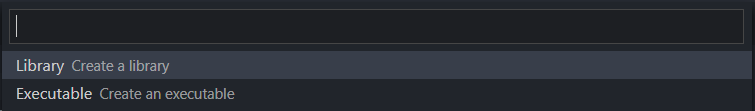

1. 确定VSCode、gcc、cmake、gdb、build-essential以及VSCode的插件C/C++和CMake Tools安装正常（在远程窗口中安装）。
2. Ctrl+Shift+P，输入CMake: Quick Start：
   如右下角弹出选择窗口选择是即可，然后继续到Select a kit：
   如未弹出，则在VSCode底部选择
   No Kit Selected即可选择工具。再次CMake: Quick Start：
   输入新项目的名称，然后选择Executable：
   之后会自动创建并打开CMakeList.txt，完成后：
   然后修改CMakeLists.txt，保存会自动配置并在“输出”栏输出cmake配置信息：选择CMake: Select Variant：
   然后选择Debug：
   
3. Build project：
   
   成功后在输出栏显示[build] Build finished with exit code 0。
4. 像使用launch.json和tasks.json调试一样，设置断点后Debug project：
   