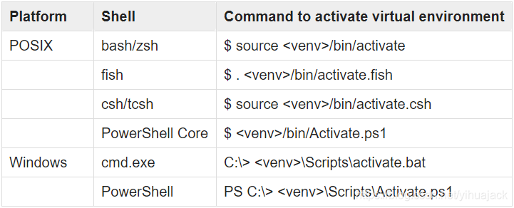

进入venv文件夹，执行

```bash
.\bin\activate
```

后出现错误或没有反应，zsh效果中venv目录显示为红色及叉号，发现Python 3.8中创建的venv与之前版本的venv有所不同，之前版本的venv下python.exe等文件在Scripts下，且使用activate.bat激活，但是在该venv中有新文件夹bin包括python.exe等文件，而取代了原来的Scripts。

参考[venv — Creation of virtual environments](https://docs.python.org/3.8/library/venv.html)，

如果在PowerShell或PowerShell Core环境中使用Python venv，应执行Activate.ps1文件。激活venv后依旧显示错误，查看venv目录下的pyvenv.cfg：

```
home = D:\Program_Files\msys64\mingw\bin
include-system-site-packages = false
version = 3.8.5
```

这是由于使用了msys2中的mingw64中的python和Windows的python环境变量混淆所致，需删除msys2的环境变量并重新生成venv，发现使用PowerShell Core生成的venv亦为原先的Include、Libs、Scripts三文件夹，在没有该路径的环境变量的情况下重新生成venv环境，查看pyvenv.cfg为：

```
home = D:\Program_Files\Python38
include-system-site-packages = false
version = 3.8.5
```

进入venv目录下使用

```
Scripts\Activate.ps1
```

命令激活该venv，尽管仍有叉号，但可正常运行。