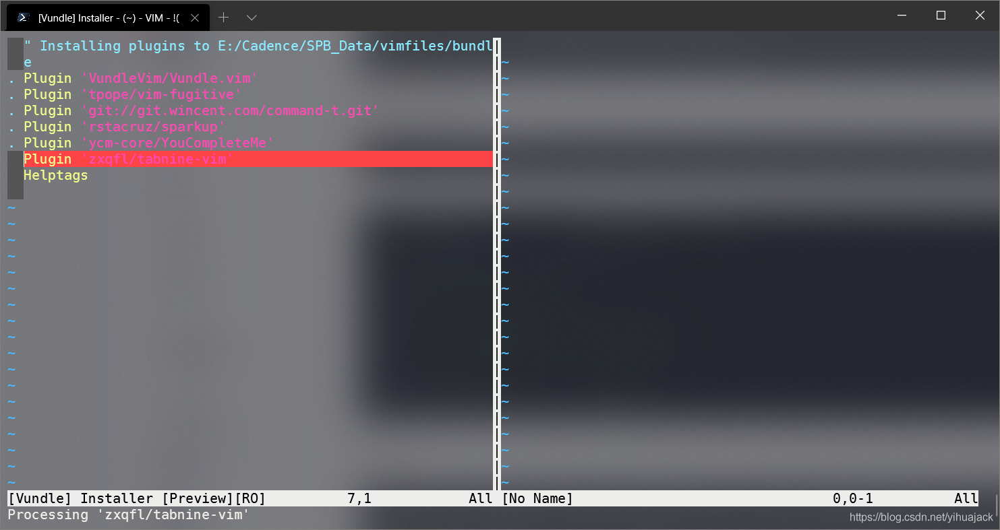
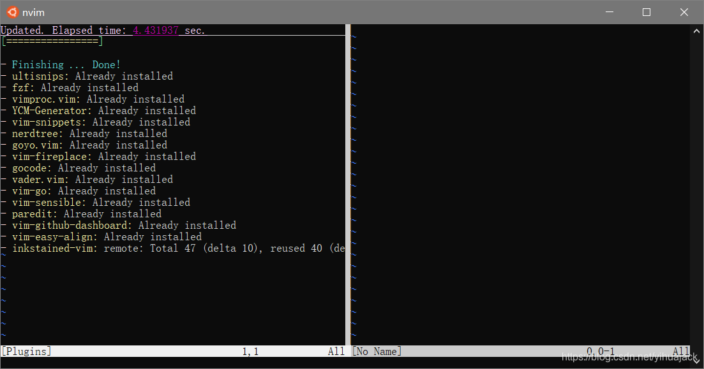
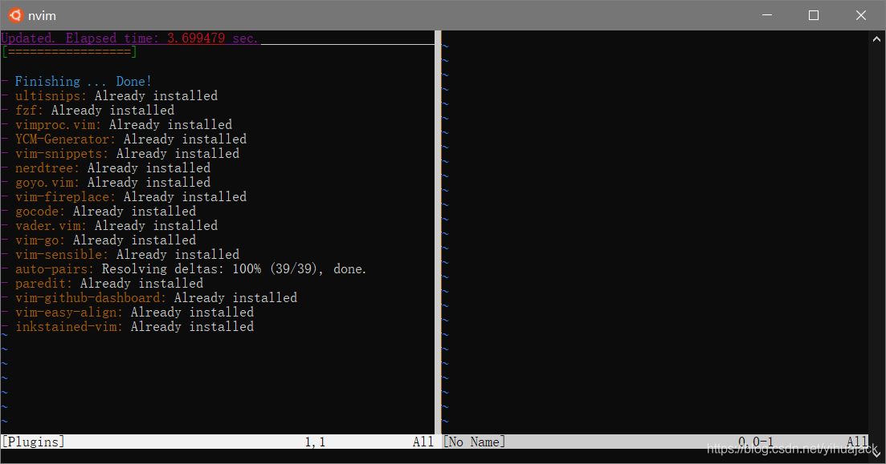
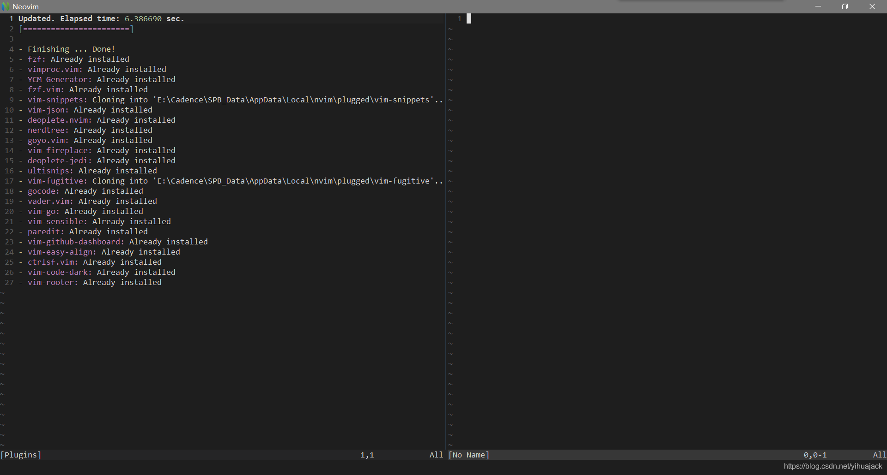

1. “Vundle, the plug-in manager for Vim” [Vundle.vim](https://github.com/VundleVim/Vundle.vim)：
   Ubuntu：

   ```bash
   git clone https://github.com/VundleVim/Vundle.vim.git ~/.vim/bundle/Vundle.vim
   ```

   根据README.md的Quick Start在.vimrc中添加配置。打开vim，然后输入:PluginInstall并回车，或者直接从命令行输入

   ```bash
   vim +PluginInstall +qall
   ```

   安装。
   对于[TabNine（Codota）](https://www.tabnine.com/)有不使用Vundle的方法：

   ```bash
   git clone --depth 1 https://github.com/zxqfl/tabnine-vim
   ```

   .vimrc中添加

   ```bash
   set rtp+=~/.vim/bundle/Vundle.vim
   ```

   .vimrc如下：

   ```
   set nocompatible              " be iMproved, required
   filetype off                  " required
   set rtp+=~/tabnine-vim
   call vundle#begin()
   Plugin 'VundleVim/Vundle.vim'
   Plugin 'tpope/vim-fugitive'
   Plugin 'git://git.wincent.com/command-t.git'
   Plugin 'rstacruz/sparkup', {'rtp': 'vim/'}
   Plugin 'zxqfl/tabnine-vim'
   call vundle#end()            " required
   filetype plugin indent on    " required
   ```

   Windows：

   ```bash
   git clone https://github.com/VundleVim/Vundle.vim.git ~/vimfiles/bundle/Vundle.vim
   ```

   然后在_vimrc中添加配置如下：

   ```
   set encoding=utf-8
   set nocompatible
   filetype off
   set shellslash
   set rtp+=~/vimfiles/bundle/Vundle.vim
   call vundle#begin('~/vimfiles/bundle')
   Plugin 'VundleVim/Vundle.vim'
   Plugin 'tpope/vim-fugitive'
   Plugin 'git://git.wincent.com/command-t.git'
   Plugin 'rstacruz/sparkup', {'rtp': 'vim'}
   Plugin 'ycm-core/YouCompleteMe'
   Plugin 'zxqfl/tabnine-vim'
   call vundle#end()            " required
   filetype plugin indent on    " required
   removal
   source $VIMRUNTIME/vimrc_example.vim
   source $VIMRUNTIME/mswin.vim
   behave mswin
   if &diffopt !~# 'internal'
     set diffexpr=MyDiff()
   endif
   function MyDiff()
     let opt = '-a --binary '
     if &diffopt =~ 'icase' | let opt = opt . '-i ' | endif
     if &diffopt =~ 'iwhite' | let opt = opt . '-b ' | endif
     let arg1 = v:fname_in
     if arg1 =~ ' ' | let arg1 = '"' . arg1 . '"' | endif
     let arg1 = substitute(arg1, '!', '\!', 'g')
     let arg2 = v:fname_new
     if arg2 =~ ' ' | let arg2 = '"' . arg2 . '"' | endif
     let arg2 = substitute(arg2, '!', '\!', 'g')
     let arg3 = v:fname_out
     if arg3 =~ ' ' | let arg3 = '"' . arg3 . '"' | endif
     let arg3 = substitute(arg3, '!', '\!', 'g')
     if $VIMRUNTIME =~ ' '
       if &sh =~ '\<cmd'
         if empty(&shellxquote)
           let l:shxq_sav = ''
           set shellxquote&
         endif
         let cmd = '"' . $VIMRUNTIME . '\diff"'
       else
         let cmd = substitute($VIMRUNTIME, ' ', '" ', '') . '\diff"'
       endif
     else
       let cmd = $VIMRUNTIME . '\diff'
     endif
     let cmd = substitute(cmd, '!', '\!', 'g')
     silent execute '!' . cmd . ' ' . opt . arg1 . ' ' . arg2 . ' > ' . arg3
     if exists('l:shxq_sav')
       let &shellxquote=l:shxq_sav
     endif
   endfunction
   ```

   “A code-completion engine for Vim” [YouCompleteMe](https://github.com/ycm-core/YouCompleteMe)在安装Vim plugin后：
   Ubuntu：

   ```bash
   sudo apt install build-essential cmake vim python3-dev
   ```

   以及mono-complete、go、node和npm，然后编译：

   ```bash
   cd ~/.vim/bundle/YouCompleteMe
   python3 install.py --all
   ```

   Windows：
   安装Visual Studio Build Tools 2017+、cmake、vim、python、go、node、npm后编译：

   ```
   cd YouCompleteMe
   python3 install.py --all
   ```

2. “Minimalist Vim Plugin Manager” [vim-plug](https://github.com/junegunn/vim-plug)：
   Ubuntu Vim：

   ```bash
   curl -fLo ~/.vim/autoload/plug.vim --create-dirs \
       https://raw.githubusercontent.com/junegunn/vim-plug/master/plug.vim
   ```

   Ubuntu NeoVim：

   ```bash
   sh -c 'curl -fLo "${XDG_DATA_HOME:-$HOME/.local/share}"/nvim/site/autoload/plug.vim --create-dirs \
          https://raw.githubusercontent.com/junegunn/vim-plug/master/plug.vim'
   ```

   Windows Vim：

   ```bash
   iwr -useb https://raw.githubusercontent.com/junegunn/vim-plug/master/plug.vim |`
       ni $HOME/vimfiles/autoload/plug.vim -Force
   ```

   Windows NeoVim：

   ```bash
   iwr -useb https://raw.githubusercontent.com/junegunn/vim-plug/master/plug.vim |`
       ni "$env:LOCALAPPDATA/nvim-data/site/autoload/plug.vim" -Force
   ```

   PowerShell命令可能会出现“Invoke-WebRequest: 由于目标计算机积极拒绝，无法连接。”错误。
   手动将[plug.vim](https://raw.githubusercontent.com/junegunn/vim-plug/master/plug.vim)文件保存到$HOME\vimfiles\autoload文件夹（对于Vim）|C:\Users\<username>\AppData\Local\nvim-data\site\autoload文件夹下。参考[Neovim in Windows](https://jakeg.dev/neovim-in-windows/)执行

   ```
   md ~\AppData\Local\nvim\autoload
   $uri = 'https://raw.githubusercontent.com/junegunn/vim-plug/master/plug.vim'
   (New-Object Net.WebClient).DownloadFile(
     $uri,
     $ExecutionContext.SessionState.Path.GetUnresolvedProviderPathFromPSPath(
       "~\AppData\Local\nvim\autoload\plug.vim"
     )
   )
   ```

   Ubuntu：创建~/.config/nvim/init.vim（需要先mkdir ~/.config/nvim），添加

   ```
   call plug#begin('~/.vim/plugged')
   Plug 'junegunn/vim-easy-align'
   Plug 'https://github.com/junegunn/vim-github-dashboard.git'
   Plug 'SirVer/ultisnips' | Plug 'honza/vim-snippets'
   Plug 'scrooloose/nerdtree', { 'on':  'NERDTreeToggle' }
   Plug 'tpope/vim-fireplace', { 'for': 'clojure' }
   Plug 'rdnetto/YCM-Generator', { 'branch': 'stable' }
   Plug 'fatih/vim-go', { 'tag': '*' }
   Plug 'nsf/gocode', { 'tag': 'v.20150303', 'rtp': 'vim' }
   Plug 'junegunn/fzf', { 'dir': '~/.fzf', 'do': './install --all' }
   Plug '~/my-prototype-plugin'
   Plug 'tpope/vim-sensible'
   Plug 'scrooloose/nerdtree', { 'on': 'NERDTreeToggle' }
   Plug 'junegunn/vim-github-dashboard', { 'on': ['GHDashboard', 'GHActivity'] }
   Plug 'kovisoft/paredit', { 'for': ['clojure', 'scheme'] }
   Plug 'junegunn/vader.vim',  { 'on': 'Vader', 'for': 'vader' }
   Plug 'junegunn/goyo.vim', { 'for': 'markdown' }
   autocmd! User goyo.vim echom 'Goyo is now loaded!'
   Plug 'Shougo/vimproc.vim', { 'do': 'make' }
   Plug 'yuttie/inkstained-vim'
   call plug#end()
   syntax enable
   set background=light
   ```

   以上包括了“An experimental color scheme for Vim.” [inkstained-vim](https://github.com/yuttie/inkstained-vim)、“Vim plugin, insert or delete brackets, parens, quotes in pair” [auto-pairs](https://github.com/jiangmiao/auto-pairs)等。
   其中

   ```bash
   colorsheme inkstained
   ```

   命令报错”Not an editor command: colorsheme“故删去。
   然后输入:PlugInstall回车，顶部出现“Updated. Elapsed time: 19.219560 sec.”表示安装成功。使用主题后的效果：Windows：执行

   ```
   scoop config proxy 127.0.0.1:11000
   scoop bucket add versions
   scoop install python27
   pip install virtualenv
   virtualenv -p D:\Program_Files\scoop\apps\python27\2.7.18\python.exe E:\Program_Files\nvimpy2
   E:\Program_Files\nvimpy2\Scripts\pip.exe install pynvim jedi
   E:\Program_Files\nvimpy2\Scripts\python.exe -m pip install --upgrade pip
   E:\Program_Files\venv\Scripts\pip.exe install pynvim jedi
   ```

   创建C:\Users\<username>\AppData\Local\nvim\init.vim，将init.vim填写如下：

   ```
   set nocompatible
   filetype off
   set t_Co=256
   call plug#begin('~/AppData/Local/nvim/plugged')
   Plug 'junegunn/vim-easy-align'
   Plug 'https://github.com/junegunn/vim-github-dashboard.git'
   Plug 'SirVer/ultisnips' | Plug 'honza/vim-snippets'
   Plug 'scrooloose/nerdtree', { 'on':  'NERDTreeToggle' }
   Plug 'tpope/vim-fireplace', { 'for': 'clojure' }
   Plug 'rdnetto/YCM-Generator', { 'branch': 'stable' }
   Plug 'fatih/vim-go', { 'tag': '*' }
   Plug 'nsf/gocode', { 'tag': 'v.20150303', 'rtp': 'vim' }
   Plug 'junegunn/fzf', { 'dir': '~/.fzf', 'do': './install --all' }
   Plug 'junegunn/fzf.vim'
   Plug '~/my-prototype-plugin'
   Plug 'tpope/vim-sensible'
   Plug 'junegunn/vim-github-dashboard', { 'on': ['GHDashboard', 'GHActivity'] }
   Plug 'kovisoft/paredit', { 'for': ['clojure', 'scheme'] }
   Plug 'junegunn/vader.vim',  { 'on': 'Vader', 'for': 'vader' }
   Plug 'junegunn/goyo.vim', { 'for': 'markdown' }
   autocmd! User goyo.vim echom 'Goyo is now loaded!'
   Plug 'Shougo/vimproc.vim', { 'do': 'make' }
   if has('nvim')
     Plug 'Shougo/deoplete.nvim', { 'do': ':UpdateRemotePlugins' }
   else
     Plug 'Shougo/deoplete.nvim'
     Plug 'roxma/nvim-yarp'
     Plug 'roxma/vim-hug-neovim-rpc'
   endif
   Plug 'zchee/deoplete-jedi'
   Plug 'tpope/vim-fugitive'
   Plug 'elzr/vim-json'
   Plug 'dyng/ctrlsf.vim'
   Plug 'airblade/vim-rooter'
   Plug 'tomasiser/vim-code-dark'
   call plug#end()
   colors codedark
   let g:airline_theme = 'codedark'
   set shiftwidth=4
   set tabstop=4
   set expandtab
   filetype plugin on
   filetype indent on
   syntax on
   set nu
   set autochdir
   nmap <leader>l :set list!<CR>
   set mouse=a
   set autoread
   let NERDTreeQuitOnOpen = 1
   set completeopt=menu
   set linebreak
   autocmd Filetype html,ruby,javascript,yml,yaml,json,haskell,ejs,htmldjango setlocal ts=2 sts=2 sw=2
   set noswapfile
   set wildignore+=*.pyc
   if &term =~ '256color'
     set t_ut=
   endif
   let g:ycm_autoclose_preview_window_after_completion=1
   set enc=utf-8
   set fileencodings=ucs-bom,utf8,prc
   set fileencoding=utf-8
   set nofoldenable
   filetype plugin indent on
   let g:python2_host_prog = 'E:\Program_Files\nvimpy2\Scripts\python.exe'
   let g:python3_host_prog = 'E:\Program_Files\venv\Scripts\python.exe'
   let g:black_virtualenv = 'E:\Program_Files\venv'
   let g:acp_enableAtStartup = 0
   let g:deoplete#enable_at_startup = 1
   inoremap <expr><tab> pumvisible() ? "\<c-n>" : "\<tab>"
   let g:fzf_action = {
         \ 'ctrl-s': 'split',
         \ 'ctrl-v': 'vsplit',
         \ 'ctrl-t': 'tabe'
         \ }
   nnoremap <c-p> :FZF<cr>
   nnoremap <c-f> :Rg<cr>
   command! -bang -nargs=* Rg
     \ call fzf#vim#grep(
     \   'rg --column --line-number --no-heading --color=always --smart-case '.shellescape(<q-args>), 1,
     \   <bang>0 ? fzf#vim#with_preview('up:60%')
     \           : fzf#vim#with_preview('right:50%:hidden', '?'),
     \   <bang>0)
   ```

   然后执行nvim命令或打开NeoVim窗口输入:PlugInstall回车。
   若出现“fatal: out of memory, malloc failed (tried to allocate 2147483648 bytes)”问题，参考[GIT: fatal: Out of memory, malloc failed (tried to allocate 889192448 bytes)](https://stackoverflow.com/questions/41120920/git-fatal-out-of-memory-malloc-failed-tried-to-allocate-889192448-bytes)调小postBuffer，执行

   ```bash
   git config --global http.postBuffer 128m
   ```

   后错误解决，又有新错误“fatal: unable to access 'https://github.com/honza/vim-snippets.git/': OpenSSL SSL_connect: SSL_ERROR_SYSCALL in connection to github.com:443”和“fatal: unable to access 'https://github.com/tpope/vim-fugitive.git/': OpenSSL SSL_connect: SSL_ERROR_SYSCALL in connection to github.com:443”，参考[OpenSSL SSL_connect: SSL_ERROR_SYSCALL in connection to github.com:443问题解决](https://blog.csdn.net/ljj125896/article/details/104350459)执行

   ```
   git config --global --unset http.http://github.com.proxy
   git config --global --unset https.http://github.com.proxy
   ```

   后成功：