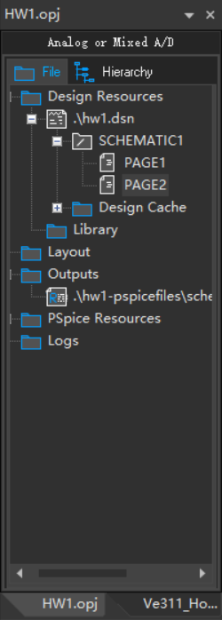
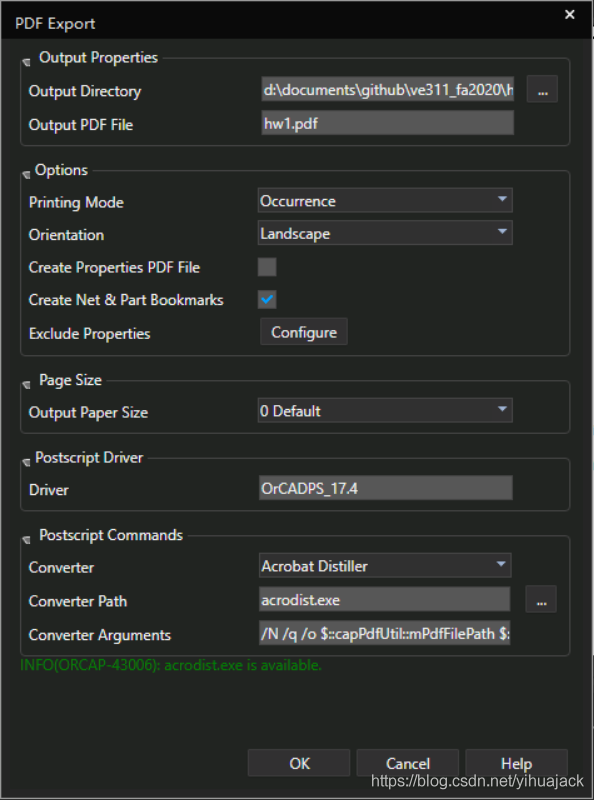
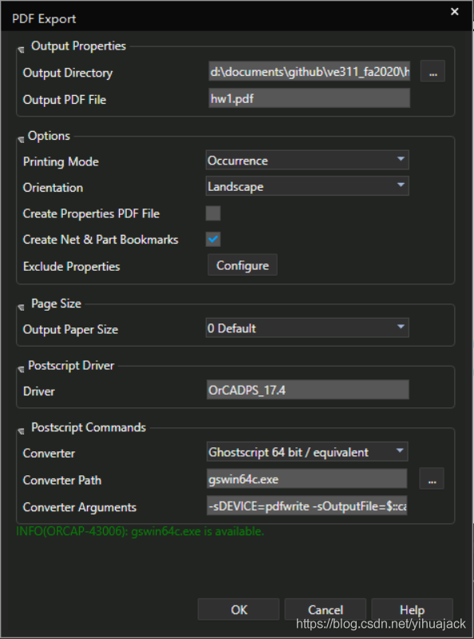

首先确定E:\Program Files\Adobe\Acrobat DC\Acrobat和D:\Program Files\gs\gs9.53.1\bin已被添加到环境变量。

选中要打印的页面：

点击菜单栏File->Export->PDF，修改文件名，确认Converter和Converter Path，其余选项配置保持默认即可：

或

即可成功导出。Acrobat Distiller和GhostScript的不同之处在于前者会创建一个同名的.log文件。

如果选中要导出的页面后仍然没反应，则点击左侧工程管理器Project名称或Design名称后再Export。