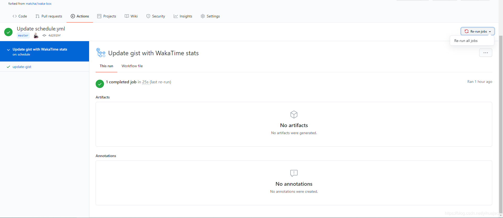
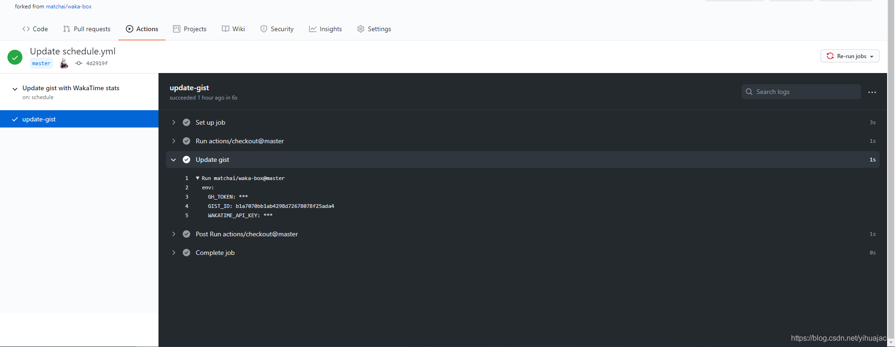

使用[waka-box](https://github.com/matchai/waka-box)或[waka-box-go](https://github.com/YouEclipse/waka-box-go)时根据其README配置完成后发现Gist未更新，根据[Issue #42](https://github.com/matchai/waka-box/issues/42)需要等WakaTime中有数据后才可以更新，于是等到WakaTime有数据后再查看依旧不更新，根据[Issue #61](https://github.com/matchai/waka-box/issues/61)，WakaTime每日更新一次，于是等过了一天Gist依旧不更新，尝试删除了GitHub Access Token、fork的Repository和创建的Gist后重新配置依旧失败，在另一个pinned-gist项目[productive-box](https://github.com/maxam2017/productive-box)的README中找到Project Setup的第2步：Open the "Actions" tab of your fork and click the "enable" button，于是在fork的repository中的Actions中选择了启用，等待一天后依旧没有更新Gist。受到[Issue #51](https://github.com/matchai/waka-box/issues/51)的启发，进入fork的waka-box仓库的/actions下查看All workflows显示两个results：Update gist with WakaTime stats Update gist with WakaTime stats #1: Scheduled和Update gist with WakaTime stats #2: Scheduled并都有绿色对勾，进入workflow:"Update gist with WakaTime stats"下选择任一个result进入显示1 completed job，左边栏update-gist为绿色对勾状态，点击update-gist下的Update Gist项显示httperror: bad credentials。受到[Error: Failed to install 'unknown package' from GitHub: HTTP error 401. Bad credentials](https://blog.csdn.net/qq_22884761/article/details/102769390)启发检查[Personal access tokens](https://github.com/settings/tokens)发现之前删除了token，于是重新Generate new token并修改库->Settings->Secrets Update GH_TOKEN后回到Actions下选择最新的result右上角点击Re-run jobs->Re-run all jobs：

等待片刻后任务完成，检查Update Gists项详情：

成功运行，此时检查对应Gist发现其已被正确更新。
