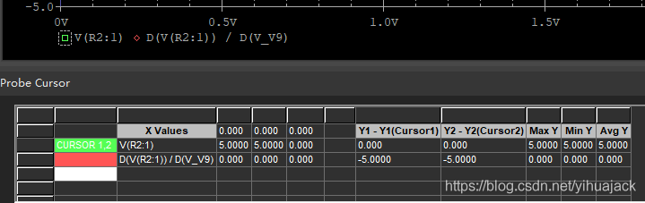
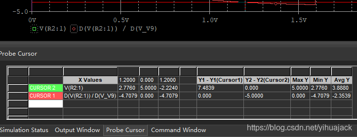
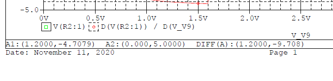

画好原理图，Run PSpice运行仿真显示仿真曲线后在菜单栏Trace->Cursor->Display显示Cursor，在图上左键单击为Cursor 1，右键单击为Cursor 2，默认如图示：

单击图上的红色菱形图标，Cursor即被切换到红色菱形图标所代表的曲线上（如果单击的是图标右边的表达式，则是选中表达式所代表的曲线），在图上单击到大致位置后通过键盘左右方向键调整到合适的X Values，如图示：

若要在打印的PDF等图像中下方显示的Cursor信息从默认的第一条曲线改为第二条曲线，则将鼠标光标 移动至下方Probe Cursor栏的第三行第零列（CURSOR 1单元格左边的控制格）点击拖动第三行向上以至第二行（如果无法拖动，则先右键单击弹出右键菜单，然后左键点击其他地方取消右键菜单，再左键拖动即可拖动），拖动后最好不要点击任何地方（有时候会使得两个CURSOR的位置再次颠倒回原来的顺序），直接在菜单栏中File->Print...(Ctrl+P)打印图形，打印后下方的Cursor信息即被改成了第二条曲线的信息：

