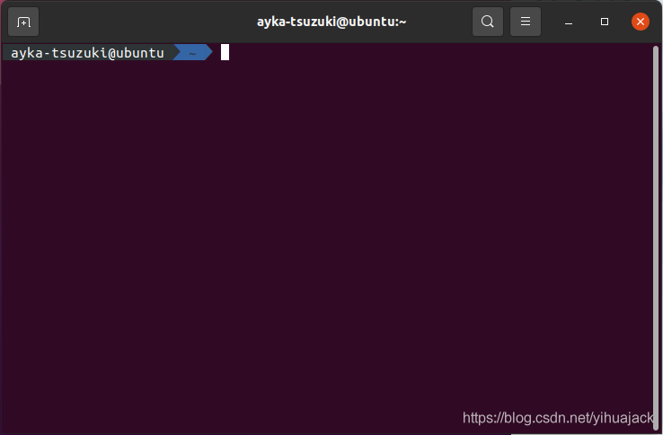

旧版的解决方法[Ubuntu 终端zsh的agnoster主题乱码](https://blog.csdn.net/codermannul/article/details/69802968)已经过时，在此根据官方文档[Fonts installation](https://powerline.readthedocs.io/en/latest/installation/linux.html#fonts-installation)提供新版的解决方法。解决Ubuntu Zsh乱码问题只需安装Powerline字体即可，与Windows是通过设置Shell窗口的属性->字体有所不同。

下载最新版本的符号字体和字体配置文件：:

```bash
wget https://github.com/powerline/powerline/raw/develop/font/PowerlineSymbols.otf
wget https://github.com/powerline/powerline/raw/develop/font/10-powerline-symbols.conf
```

将符号字体移动到一个可用的X字体路径。可用的字体路径可以使用xset q列出：

```bash
mv PowerlineSymbols.otf ~/.local/share/fonts/
```

更新字体移动到的路径的字体缓存（为了在系统级的路径更新缓存可能需要root权限）：

```bash
fc-cache -vf ~/.local/share/fonts/
```

安装字体配置文件。新版的字体配置使用~/.config/fontconfig/conf.d/路径，对于旧版则使用~/.fonts.conf.d/路径：

```bash
mv 10-powerline-symbols.conf ~/.config/fontconfig/conf.d/
```

重启终端后显示正常：

