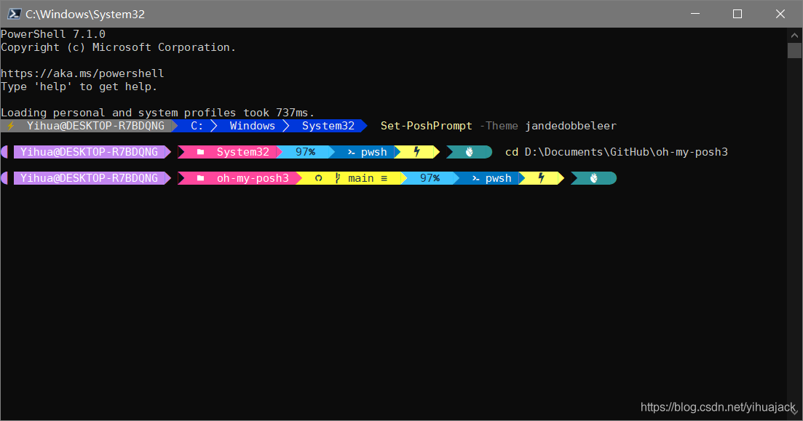
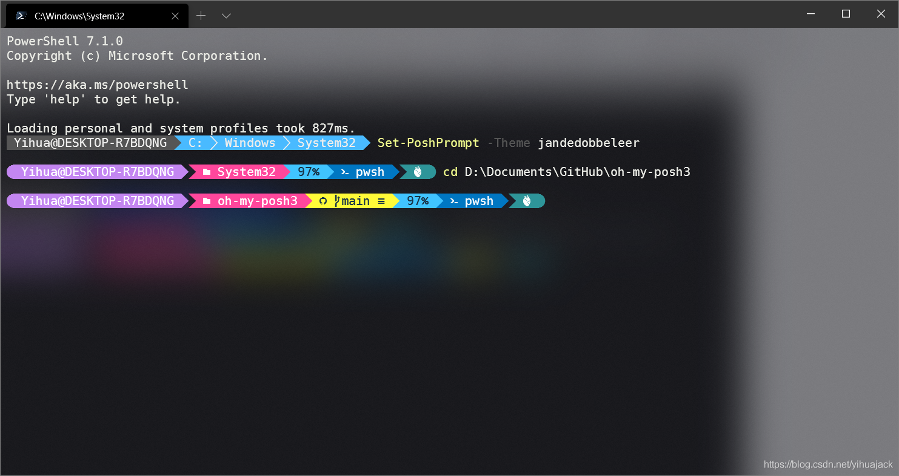
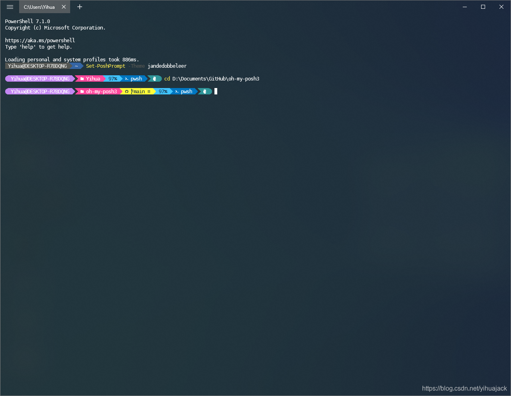

本篇是从oh-my-posh3写起的，但是对oh-my-zsh也适用。

笔者之前使用[oh-my-posh](https://github.com/JanDeDobbeleer/oh-my-posh)（V2）为Windows窗口设置powerline字体成功实现了powerline等主题的效果，然而更新至oh-my-posh3后发现agnoster等多个主题在PowerShell、Fluent Terminal、Windows Terminal均显示不正常，其出错的主题的形态各异，研究C:\Users\<username>\Documents\PowerShell\Modules\oh-my-posh\3.55.0\themes下的.omp.json文件或克隆GitHub库下的themes文件夹下的.omp.json文件，发现出现问题的主题包含了一些不同寻常的字符如\uF7DB、\uF115等。根据powerline [Issue #2008](https://github.com/powerline/powerline/issues/2008)找到powerline字体的code points列在其官方文档中：[Glyph table](https://apw-bash-settings.readthedocs.io/en/latest/fontpatching.html#glyph-table)，可以看到powerline字体仅支持U+E0A0、U+E0A1、U+E0A2、U+E0B0、U+E0B1、U+E0B2、U+E0B3七种code points，自然无法正常显示包含其他字形的主题。

解决方法在oh-my-posh3 [Issue #89](https://github.com/JanDeDobbeleer/oh-my-posh3/issues/89)中被找到，有两种方法，第一种是使用Nerd Fonts（Nerd字体），第二种是用Cascadia Code图标替换，前者更直接，所以采用前者。对于Windows而言，在[Nerd Fonts - Iconic font aggregator, glyphs/icons collection, & fonts patcher](https://www.nerdfonts.com/font-downloads)下载喜欢的字体然后右键选择“为所有用户安装”后更改PowerShell窗口的字体即可，比如Caskaydia Cove、DejaVu Sans Mono、Fira Code、Inconsolata LGC、JetBrains Mono、Ubuntu等。对于Windows Terminal修改settings.json中的"fontFace"项为Nerd字体即可，注意要更改为其显示的正式名称；对于Fluent Terminal在设置->终端中更改字体即可。效果如下：

