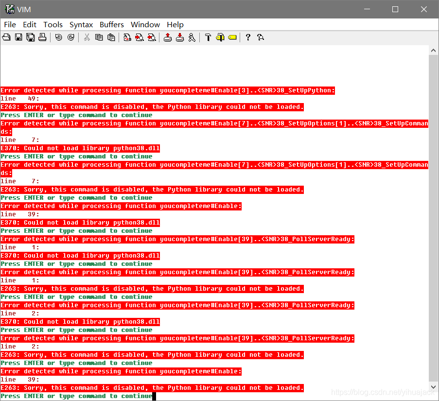

使用gVim的时候发现ycm-core/YouCompleteMe插件安装报错：




由于是将Python从3.8升级到3.9之后出现的问题，初步以为是升级Python过程导致的，根据YouCompleteMe的[Issue #3765](https://github.com/ycm-core/YouCompleteMe/issues/3765)执行了清理Python cache的操作但无济于事。经过调试以为是与zxqfl/tabnine-vim插件冲突了（但其实之前并未出现冲突情况），所以不选择安装YouCompleteMe，暂时正常。

使用SpaceVim+gVim时参考[使用 Vim 搭建 Python 开发环境](https://spacevim.org/cn/use-vim-as-a-python-ide/)配置并安装Kite对Vim的插件支持等，正常启动gVim，但是打开*.py文件即报错：

更新jedi-vim后报错：执行:verbose JediDebugInfo显示


经查E:\Cadence\SPB_Data\.cache\vimfiles\repos\github.com\davidhalter\jedi-vim\ftplugin\python\jedi.vim的36行

```
call jedi#configure_call_signatures()
```

所调用的函数的确在E:\Cadence\SPB_Data\.cache\vimfiles\repos\github.com\davidhalter\jedi-vim\autoload\jedi.vim的第586至606行

```
function! jedi#configure_call_signatures() abort
    augroup jedi_call_signatures
    autocmd! * <buffer>
    if g:jedi#show_call_signatures == 2  " Command line call signatures
        autocmd InsertEnter <buffer> let g:jedi#first_col = s:save_first_col()
    endif
    autocmd InsertEnter <buffer> let s:show_call_signatures_last = [0, 0, '']
    autocmd InsertLeave <buffer> call jedi#clear_call_signatures()
    if g:jedi#show_call_signatures_delay > 0
        autocmd InsertEnter <buffer> let b:_jedi_orig_updatetime = &updatetime
                    \ | let &updatetime = g:jedi#show_call_signatures_delay
        autocmd InsertLeave <buffer> if exists('b:_jedi_orig_updatetime')
                    \ |   let &updatetime = b:_jedi_orig_updatetime
                    \ |   unlet b:_jedi_orig_updatetime
                    \ | endif
        autocmd CursorHoldI <buffer> call jedi#show_call_signatures()
    else
        autocmd CursorMovedI <buffer> call jedi#show_call_signatures()
    endif
    augroup END
endfunction
```

根据jedi-vim的[Issue #1018](https://github.com/davidhalter/jedi-vim/issues/1018)的启示执行:python3 print(1)发现找不到命令，于是将python.exe复制了一份重命名为python3.exe。

根据jedi-vim的[Issue #1038](https://github.com/davidhalter/jedi-vim/issues/1038)，

> Resolved. This was due to vim compilation issue. Closing.

 一开始并不知道这条回复是什么意思，但是回顾转移至SpaceVim的过程中完全代替了原有的配置文件，升级Python过程本身出问题的概率很小，并确认了gVim是三天前刚编译过的分发版本，注意到.vim文件中的!has('python3')条件未通过，jedi-vim的新issue提示中包含

> If you are not using jedi-vim from Git (but e.g. from a distribution's package,
> please try it with jedi-vim's Git master, too).

根据jedi-vim的README.rst：

> You need a VIM version that was compiled with Python 2.7 or later (+python or +python3). You can check this from within VIM using :python3 import sys; print(sys.version) (use :python for Python 2).

执行:python3 import sys; print(sys.version)报错


 而执行:python import sys则不会报错，意识到这的确是vim的编译问题。根据[vim-win32-installer](https://github.com/vim/vim-win32-installer)的README.md，它是由Python 3.8编译完成的。根据[调试上游插件](https://spacevim.org/cn/documentation/#%E8%B0%83%E8%AF%95%E4%B8%8A%E6%B8%B8%E6%8F%92%E4%BB%B6)，在相应的init.toml的[options]中加入

```
disabled_plugins = ["jedi-vim"]
```

打开*.py文件没有报错。一个侧面印证是NeoVim采用同样的SpaceVim文件夹和init.toml，在用pip安装neovim包后其:checkhealth结果显示：

其:python命令不能正常执行，而其:python3命令可以正常执行。