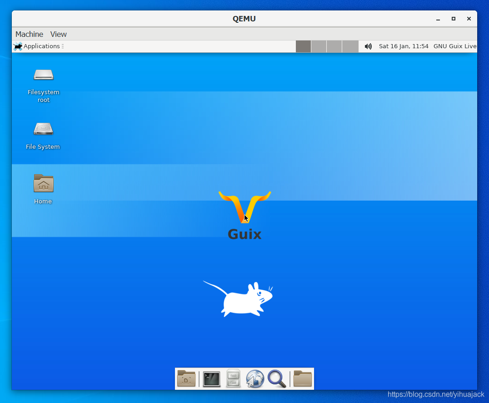

本文参考[How to Run GNU Guix System Linux in Qemu on Windows 10](https://www.trishtech.com/2020/04/how-to-run-gnu-guix-system-linux-in-qemu-on-windows-10/)、[How to Install Intel Hardware Accelerated Execution Manager (HAXM) on Windows 10](https://www.trishtech.com/2020/04/how-to-install-intel-hardware-accelerated-execution-manager-haxm-on-windows-10/)、[10.16 Running Guix in a Virtual Machine](https://guix.gnu.org/manual/en/html_node/Running-Guix-in-a-VM.html)。

1. 安装QEMU并添加环境变量后确认关闭Hyper-V等其他VM。

2. 在 https://github.com/intel/haxm/releases下载最新版本的HAXM并安装。

3. 在https://guix.gnu.org/download/页面下载GNU Guix QEMU Image，当前版本的下载链接为https://ftp.gnu.org/gnu/guix/guix-system-vm-image-1.2.0.x86_64-linux.xz。解压到要放置虚拟机的目录，如F:\Program Files\Virtual Machines。

4. 执行
   ```powershell
   qemu-system-x86_64 -accel hax -m 1024 -hda guix-system-vm-image-1.2.0.x86_64-linux
   ```

   如显示HAX is working and emulator runs in fast virt mode.说明HAX成功启动。

5. 启动界面：

更新：1.3.0版本使用的是qcow2格式的镜像，经尝试并不能按教程中所提到的那样直接用xz -d命令解压，会报错文件格式无法识别，故先使用

```powershell
qemu-img convert guix-system-vm-image-1.3.0.x86_64-linux.qcow2 -O raw guix-system-vm-image-1.3.0.x86_64-linux.img
```

命令将qcow2镜像转换成QEMU镜像，然后执行

```powershell
qemu-system-x86_64 -accel hax -m 1024 -hda guix-system-vm-image-1.3.0.x86_64-linux.img
```

即可。