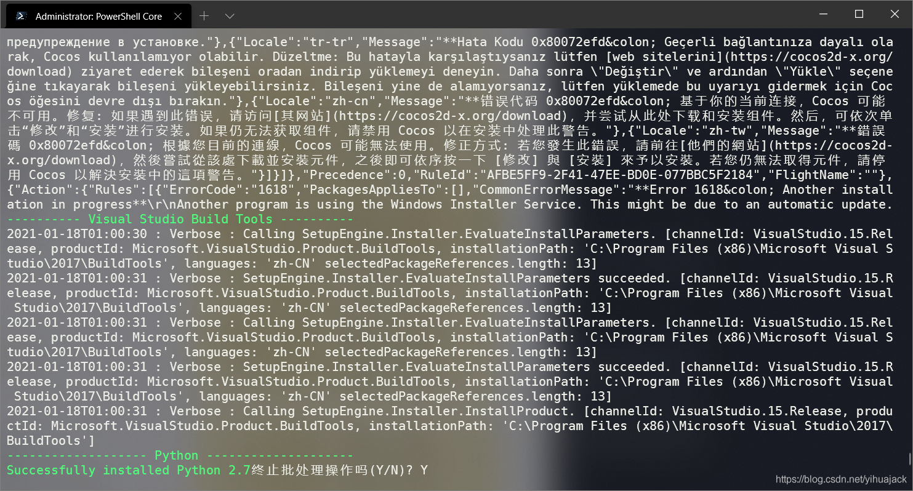
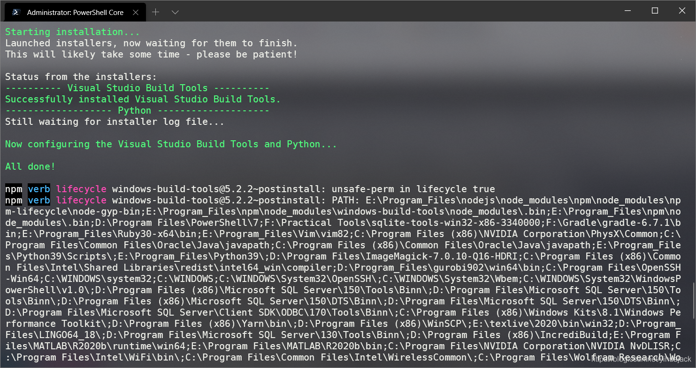
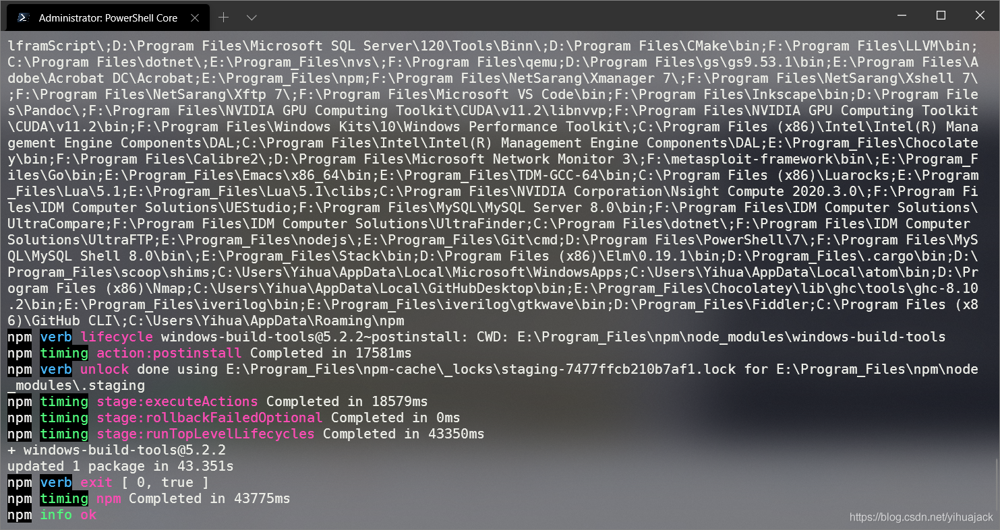

执行

```powershell
npm install -g --production windows-build-tools
```

或

```powershell
npm i -g windows-build-tools
```

出现问题：



卡在了Successfully installed Python 2.7处，只好Ctrl+C终止了批处理操作。经过一番查找，参考https://github.com/felixrieseberg/windows-build-tools/issues/123和https://github.com/felixrieseberg/windows-build-tools/issues/116，根据lost-vetern的评论，执行

```powershell
npm install --global --production --verbose windows-build-tools
```

或者

```powershell
npm install --global --dev --verbose windows-build-tools
```

也可以解决问题：