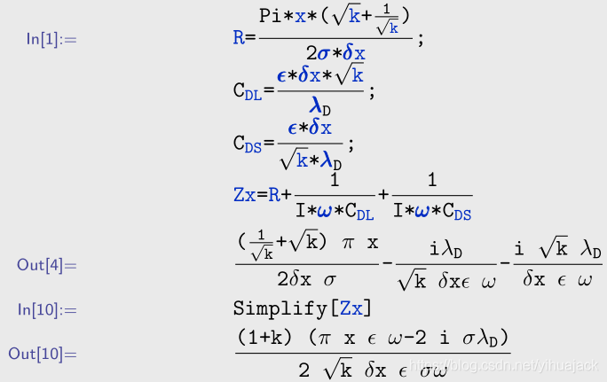

本文同步在[如何高效地联合使用 Mathematica 和 LaTeX？](https://www.zhihu.com/question/23207757/answer/1762705028)。

插入一般的代码使用listings包或minted包即可，但是Mathematica代码在前端中的显示是其实际的文本代码的再渲染，如果直接插入会插入许多多余的代码，即使手动选择其中的公式代码，其效果也比较差。

方法一：

使用Wolfram Mathematica的另存为功能另存为PDF，即可直接使用\includegraphics命令以图片形式插入PDF：

```latex
\includegraphics[width=1\textwidth]{1.pdf}
```

更好的方式是另存为PostScript (.ps) 文件，然后手动将.ps文件的文件后缀名改为.eps，即可直接使用\includegraphics命令插入EPS图片：

```latex
\includegraphics[width=1\textwidth]{1.eps}
```

方法二：

结合使用MathematicaCellsToTeX和mmacells。首先在Wolfram Mathematica中执行

```mathematica
PacletInstall@"http://github.com/jkuczm/MathematicaCellsToTeX/releases/download/v0.2.2/CellsToTeX-0.2.2.paclet"
```

安装CellsToTeX，但是安装后执行

```mathematica
Needs@"CellToTeX`"
```

有问题。根据[How best to embed various cell groups into a LATEX project?在Wolfram Mathematica](https://mathematica.stackexchange.com/questions/73223/how-best-to-embed-various-cell-groups-into-a-latex-project)中执行

```mathematica
Import@"https://raw.githubusercontent.com/jkuczm/MathematicaCellsToTeX/master/NoInstall.m"
SetOptions[CellToTeX, "CurrentCellIndex" -> Automatic];
ExportString[
 NotebookGet[] /. 
  cell : Cell[_, __] :> Cell[CellToTeX[cell], "Final"], "TeX", 
 "FullDocument" -> False, "ConversionRules" -> {"Final" -> Identity}]
```

即可生成大段的mmacells的LaTeX代码，粘贴到LaTeX文件中的相应位置，然后在LaTeX文档开头添加

```latex
\usepackage{mmacells}
```

然后将[mmacells](https://github.com/jkuczm/mmacells)克隆到本地，将其中的mmacells.sty文件复制到与LaTeX文件同一个文件夹下，或者如果要反复使用的话可以放到TEXMF目录下，对于Windows 10 TeXLive 2020而言，应在TEXLIVE安装目录下\texlive\2020\texmf-dist\tex\latex新建mmacells文件夹并将mmacells.sty文件复制到该文件夹下，在CMD或PowerShell中执行

```powershell
texhash
```

命令后即可编译，效果如下图所示：



注意：如果在beamer等环境中使用mmacells需指定frame类型为fragile：

```latex
\begin{frame}[fragile]{帧标题}{副标题}
\end{frame}
```

（参考[FancyVerb Error in using minted package with beamer](https://link.zhihu.com/?target=https%3A//tex.stackexchange.com/questions/430666/fancyverb-error-in-using-minted-package-with-beamer)）