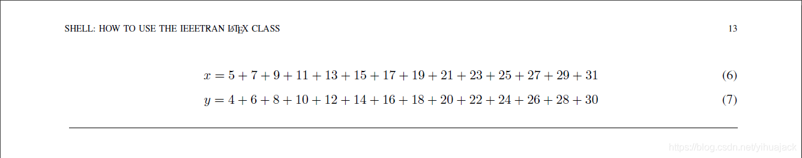

方法一：当作figure。根据其官方文档[How to Use the IEEEtran LATEX Class](http://mirrors.ctan.org/macros/latex/contrib/IEEEtran/IEEEtran_HOWTO.pdf)的第X节"FLOATING STRUCTURES"的D. Double Column Floats，在导言部分（也就是\begin{document}之前）加上

```latex
\newcounter{MYtempeqncnt}
```

然后在要插入公式的地方写

```latex
\begin{figure*}[!t]
% ensure that we have normalsize text
\normalsize
% Store the current equation number.
\setcounter{MYtempeqncnt}{\value{equation}}
% Set the equation number to one less than the one
% desired for the first equation here.
% The value here will have to changed if equations
% are added or removed prior to the place these
% equations are referenced in the main text.
\setcounter{equation}{5}
\begin{equation}
\label{eqn_dbl_x}
x = 5 + 7 + 9 + 11 + 13 + 15 + 17 + 19 + 21+ 23 + 25
+ 27 + 29 + 31
\end{equation}
\begin{equation}
\label{eqn_dbl_y}
y = 4 + 6 + 8 + 10 + 12 + 14 + 16 + 18 + 20+ 22 + 24
+ 26 + 28 + 30
\end{equation}
% Restore the current equation number.
\setcounter{equation}{\value{MYtempeqncnt}}
% The IEEE uses as a separator
\hrulefill
% The spacer can be tweaked to stop underfull vboxes.
\vspace*{4pt}
\end{figure*}
```

效果为在下一页的页面顶端最合适的地方插入带底边线的公式：



若要在页面底部插入，则将“[!t]”选项改为“[!b]”，然后将\vspace和\hrulefill放在equation前面，先放\vspace再放\hrulefill。这种方法受限于其仅能将公式放在下一页的页面顶端或底端。

方法二：使用strip环境【需要“cuted”宏包】。        

```latex
\begin{strip}
    \begin{equation}
    
	\end{equation}
	\begin{equation}
    
	\end{equation}
\end{strip}
```
还可以在此基础上定义其他效果，如加一条左栏顶线一条右栏底线（仿照为APS、Physics Review提供的revtex模板的“widetext”环境）：

```latex
\begin{strip}
    % The IEEE uses as a separator
    \rule{0.5\textwidth}{.4pt}
    \begin{equation}

    \end{equation}
    \begin{equation}
        
    \end{equation}
    \hspace{0.5\textwidth}\rule{0.5\textwidth}{.4pt}
\end{strip}
```

注：参考https://www.zhihu.com/question/373007207/answer/1025991607、One column equation in twocolumn document class，widetext的用法为：

```latex
\documentclass[twocolumn]{revtex4-2}
\begin{document}
\begin{widetext}
    \[\]
\end{widetext}
\end{document}
```