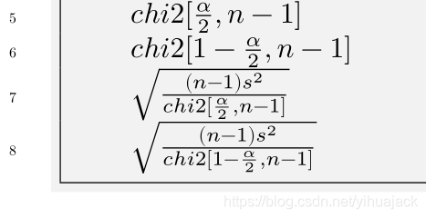

本文参考[minted](https://github.com/gpoore/minted)包官方文档v2.5 from 2017/07/19第24、26页及[minted使用](https://bleedingfight.github.io/2018/01/08/minted/)。

```latex
\begin{minted}[escapeinside=||,mathescape=true,frame=single,bgcolor=bg,breaklines,breakanywhere,numbers=left]{mma}
    |$chi2[\frac{α}{2}, n - 1]$|
    |$chi2[1 - \frac{α}{2}, n - 1]$|
    |$\sqrt{\frac{(n - 1) s^2}{chi2[\frac{α}{2}, n - 1]}}$|
    |$\sqrt{\frac{(n - 1) s^2}{chi2[1 - \frac{α}{2}, n - 1]}}$|
\end{minted}
```

起作用的是escapeinside=||选项和mathescape=true选项。escapeinside=||表示在两个竖杠之间的内容不按照verbatim或者minted方式渲染，而以常规的LaTeX文本渲染，这里|$...$|中的内容是LaTeX公式，即可被正确渲染成LaTeX公式。如果是在注释里用LaTeX数学模式，则启用mathescape。效果如下：



利用escapeinside还可以实现往minted环境里如上篇博文[LaTeX在minted环境中插入希腊字母等Unicode字符的方法](https://blog.csdn.net/yihuajack/article/details/116141934)所述写希腊字母等功能。
