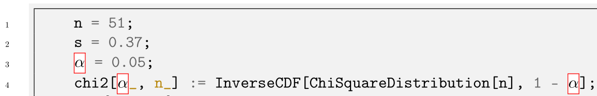

本文参考[How do I display Unicode characters with minted?](https://tex.stackexchange.com/questions/458627/how-do-i-display-unicode-characters-with-minted)。

传统上用PDFLaTeX更复杂，这里不推荐。在导言区加上：

```latex
\documentclass{article} 
\usepackage[LGR, T1]{fontenc}
\usepackage{textcomp}
\usepackage[utf8]{inputenc}
\usepackage{lmodern, newunicodechar}
\usepackage[cache=false]{minted}
\renewcommand\textphisymbol{\ensuremath{\mathtt{\phi}}}
\newunicodechar{ⁿ}{\textsuperscript{n}}
% 𝚽(U+1D6DF)在特定的字体包中有定义，但是没有粗体typewriter upright字体（无论cmtt还是lmtt，在LGR还是OT1），因此会变为普通样式。
\newunicodechar{𝚽}{{\usefont{LGR}{\ttdefault}{bf}{n}\selectfont\symbol{"46}}}
% 使用数学符号而非小写的希腊字母θ
\renewcommand\texttheta{\ensuremath{\mathtt{\theta}}}
```

使用LuaLaTeX或XeLaTeX，在导言区加上：

```latex
\documentclass{article} 
\usepackage{unicode-math}
\usepackage{minted}
\usepackage{newunicodechar}
\defaultfontfeatures{Scale = MatchLowercase}
\setmainfont{CMU Serif}[Scale = 1.0]
\setsansfont{CMU Sans Serif}
\setmonofont{CMU Typewriter Text}
\setmathfont{Latin Modern Math}
\newfontface\mathsymbolfont{Latin Modern Math}
\newunicodechar{ϕ}{{\mathsymbolfont\mitphi}}
\newunicodechar{𝚽}{{\mathsymbolfont\mbfPhi}}
```

效果如下：



此外还可参考下篇博文[LaTeX在minted环境使用数学公式环境（如分式等）](https://blog.csdn.net/yihuajack/article/details/116141948)中直接作为数学公式的方式实现。
