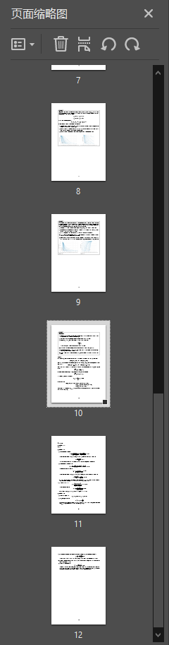
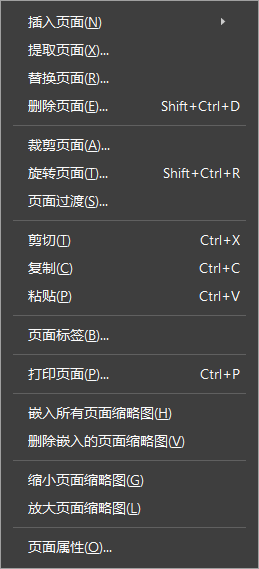
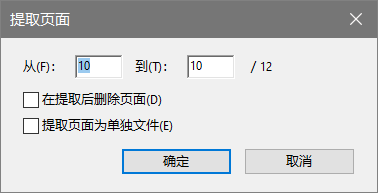

这本来是一个非常简单的问题，然而某度一搜出来居然都是用什么打印文件的方法，于是专门写一篇博文说说怎么提取。

1. 展开页面缩略图：

2. 选中并右键单击要提取的页面，点击提取页面(X)...

3. 选择要提取的范围，并根据自己的需要选择是否要在提取后删除页面或是提取页面为单独文件：

若勾选了提取页面为单独文件，则在确定后会弹出浏览文件夹的对话框，选择路径后直接导出到所在路径下。

注意：如果选择了多个页面，勾选了提取页面为单独文件会将每一页提取为单独文件，如要提取到一个PDF里面，则不勾选，待其生成并自动打开后手动保存为文件。
