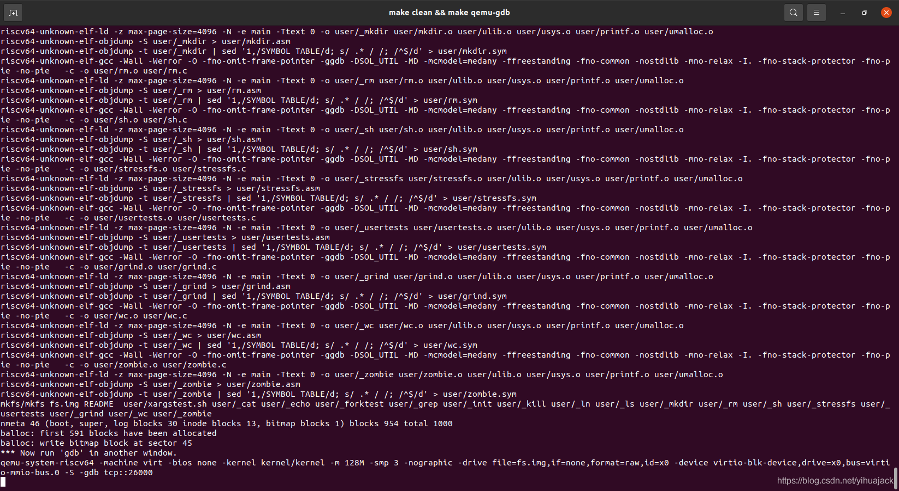
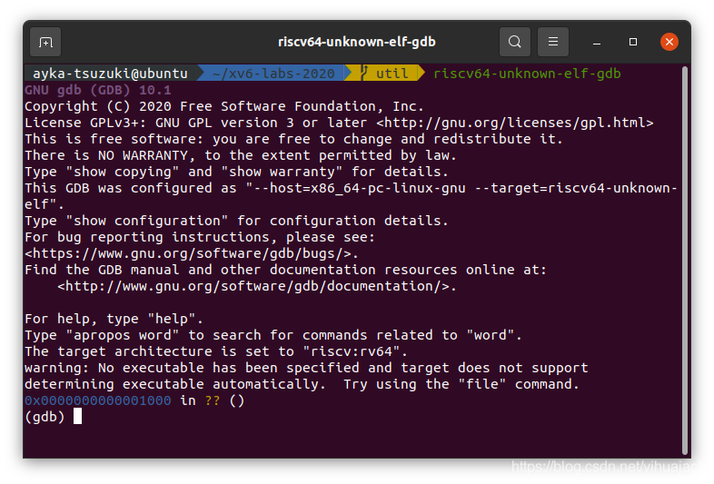
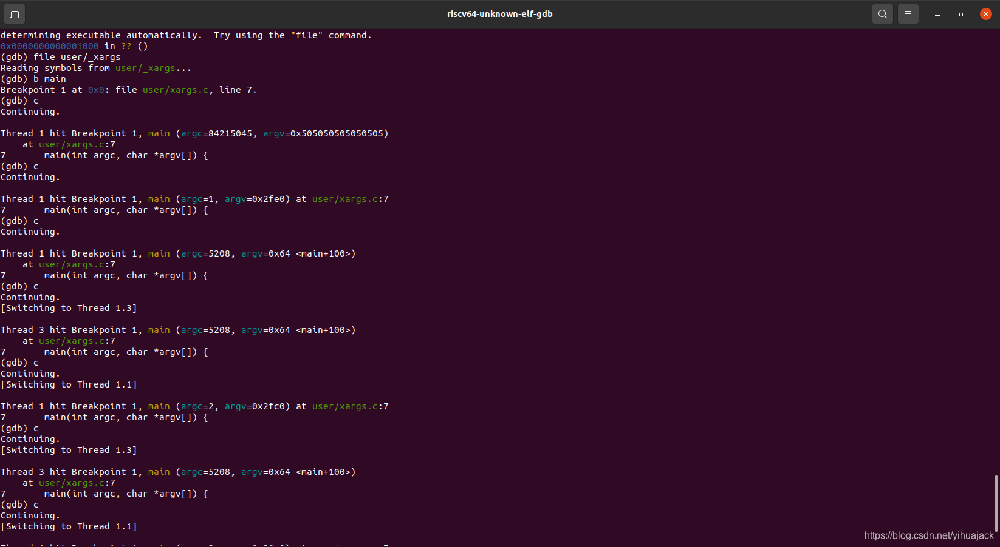

本文参考了[MIT 6.S081 2020 操作系统 实验环境搭配详解及问题处理](https://zhuanlan.zhihu.com/p/331492444)，作者为[余晨（北海草鱼）](https://www.zhihu.com/people/bodylangeuages)。xv6的安装方法见[Windows/Ubuntu qemu虚拟机xv6-riscv利用riscv-gnu-toolchain编译安装方法](https://blog.csdn.net/yihuajack/article/details/113347306)。该方法适用于Ubuntu上搭建的riscv版的xv6的QEMU虚拟机，其他网上的方法大多不适用于此。

首先切到xv6-labs-2020目录下，切到例如util分支（branch）上，执行

```bash
make clean && make qemu-gdb
```

注意2020版的Makefile文件中提供的是qemu-gdb选项，不是qemu-nox-gdb选项。



注意这里打开的TCP端口是26000。另开一个Terminal窗口，切到xv6-labs-2020目录下，切到util分支，执行

```bash
riscv64-unknown-elf-gdb kernel/kernel
```

然后在(gdb)环境下执行

```
(gdb) target remote localhost:26000
```

不过可以按如下操作简化：在~目录下新建.gdbinit文件，内容为：

> add-auto-load-safe-path ~/xv6-labs-2020/.gdbinit

其中~改为自己的xv6-labs-2020目录所在路径。仍返回xv6-labs-2020目录util分支，执行

```bash
riscv64-unknown-elf-gdb
```

即可：



在(gdb)环境中执行

```
(gdb) b exec
```

显示

> Breakpoint 1 at 0x80004b0c: file kernel/exec.c, line 14.

然后执行

```
(gdb) c
```

c是continue的缩写，也可缩写为co或cont。显示

> Continuing.
> [Switching to Thread 1.3]
>
> Thread 3 hit Breakpoint 1, exec (path=path@entry=0x3fffffdf00 "/init", 
>     argv=argv@entry=0x3fffffde00) at kernel/exec.c:14
> 14    {

另一个窗口中显示

> xv6 kernel is booting
>
> hart 1 starting
> hart 2 starting

再执行c，显示

> Continuing.
> [Switching to Thread 1.1]
>
> Thread 1 hit Breakpoint 1, exec (path=path@entry=0x3fffffbf00 "sh", 
>     argv=argv@entry=0x3fffffbe00) at kernel/exec.c:14
> 14    {

另一个窗口显示

> init: starting sh

再执行c，显示

> Continuing.

另一个窗口显示

> $

即可输入命令调试。如果想调试特定的文件例如xargs.c，则在一开始启动gdb后执行

```
(gdb) file user/_xargs
(gdb) b main
(gdb) c
```

然后一直c下去，步骤同上：


