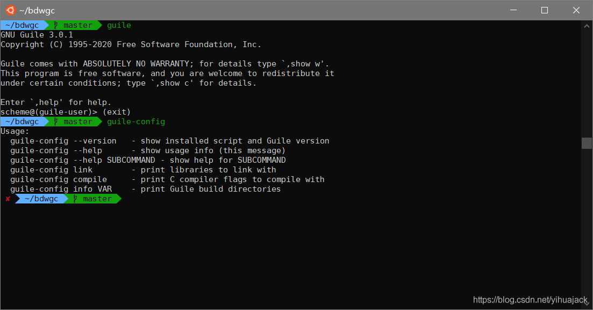

执行guile或者guile-3.0、guile-config等命令报错：

> Wrong \_\_data_start/_end pair
> [1]    19492 abort (core dumped)  guile

已知该问题会连带导致[weechat](https://github.com/weechat/weechat)错误、FFMPEG在WSL Ubuntu 20.04环境中编译libsndfile库失败、guile-gi编译安装失败（configure: error: found development files for Guile 3.0, but /usr/bin/guile-3.0 has effective version）。

本文参考[guile-config fails to run](https://stackoverflow.com/questions/61975554/guile-config-fails-to-run)及其引用的链接[weechat segfaults on arm with message 'Wrong __data_start/_end pair'](https://github.com/weechat/weechat/issues/988)、[Allow parallel installs of guile 2.0 and 2.2](https://github.com/weechat/weechat/issues/988)。据[rogerdpack](https://stackoverflow.com/users/32453/rogerdpack)推测，该问题由WSL或boehm libgc导致的，也可能是因为Debian很久没更新libgc包。根据[libsndfile fails to build on Ubuntu 20.04 with WSL](https://github.com/rdp/ffmpeg-windows-build-helpers/issues/452)中[rdp](https://github.com/rdp)给出的方法，执行

```bash
sudo dpkg -r --force-depends "libgc1c2" # remove old libgc
git clone git://github.com/ivmai/bdwgc.git
cd bdwgc
./autogen.sh
./configure --prefix=/usr && make -j # its default is the wrong directory? huh?
sudo make install
```

强制卸载旧版的libgc，然后手动编译安装最新版的bdwgc。经上述操作步骤成功完成后，该问题即得到顺利解决。


