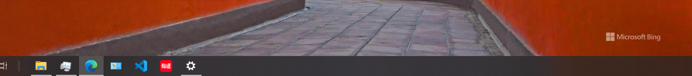
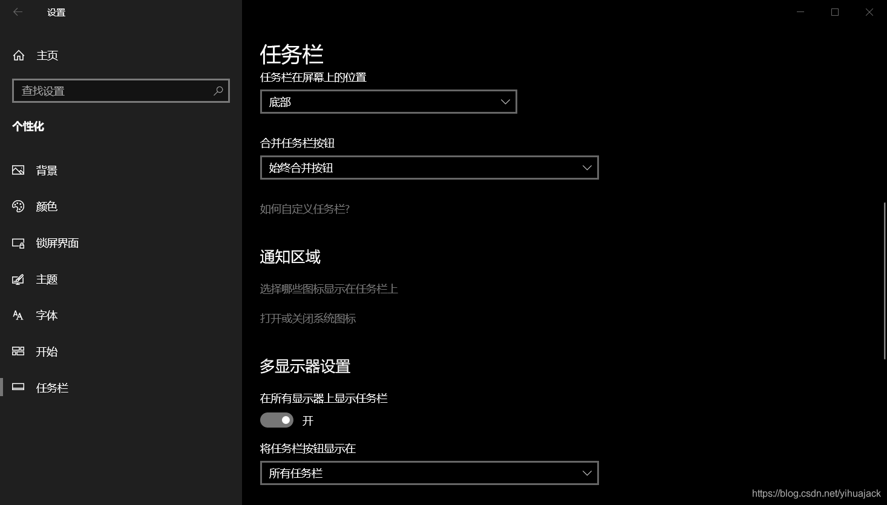
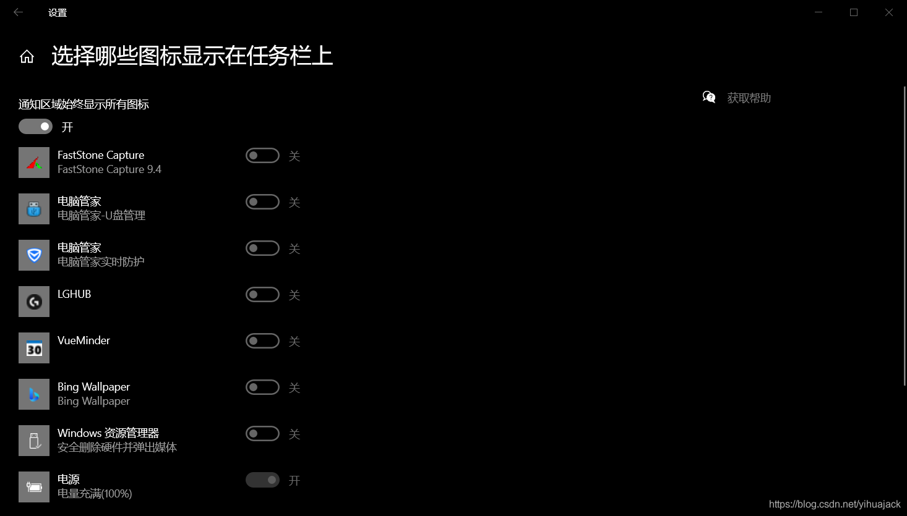
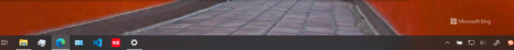
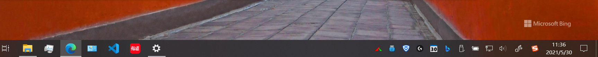

该方法仅使用于部分情况。首先参考了win10系统托盘图标不见了_Win10任务栏托盘区域图标异常怎么办？任务栏通知区域重置方法...一文重置了通知区域TrayNotify的注册表，然而没有见效。通过尝试发现，可以右键任务栏打开任务栏设置->通知区域->选择哪些图标显示在任务栏上：

然后左上角将“通知区域始终显示所有图标”关闭再打开： 

发现右下角通知区域已能显示出部分图标，但是显示不正常：

然后仍在任务栏设置中找到锁定任务栏->任务栏在屏幕上的位置，将底部改为靠右再改回底部，图标即可显示正常：

注意设置完成后必须打开任务栏设置中的“锁定任务栏”，或右键任务栏勾选“锁定所有任务栏”，否则图标有可能再次消失。
