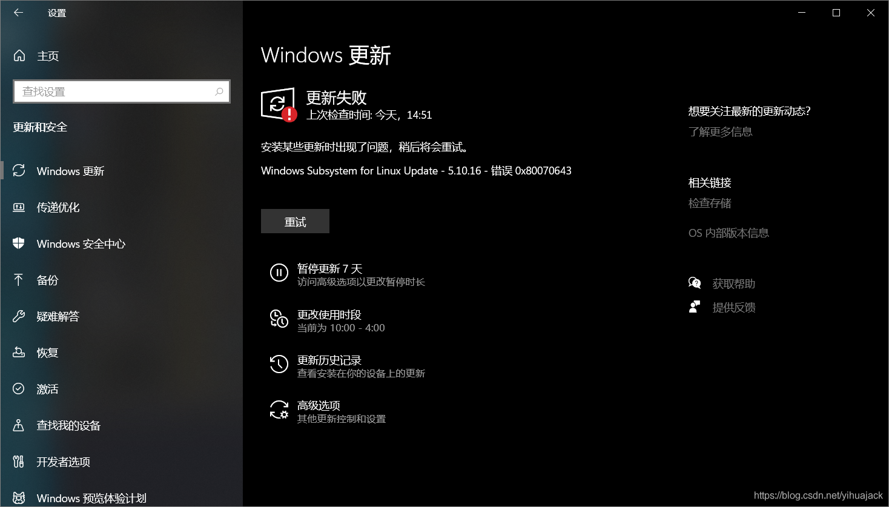
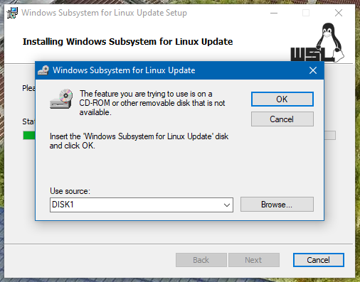
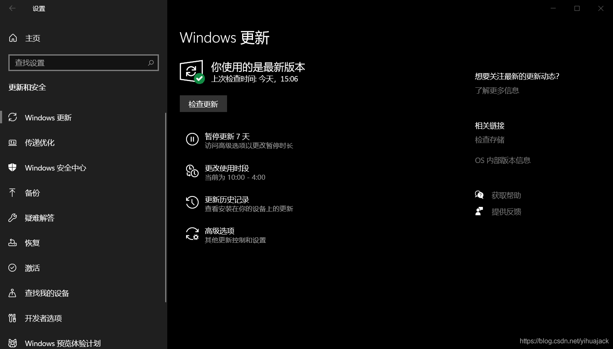
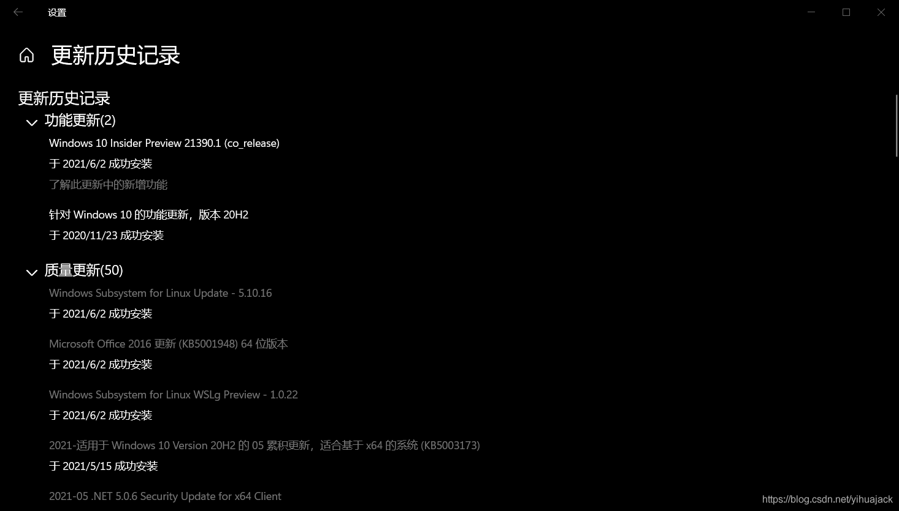
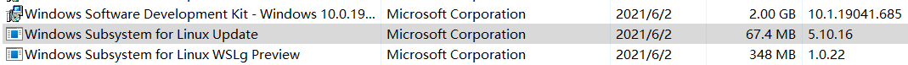

该问题从使用Windows 10 20H2到21H1版本的已经开始，到使用预览体验计划版本依旧未解决。经过几番查找，试出解决方法，其灵感来源于[Windows Subsystem For Linux Update-5.4.72 Update Error (0x80070643)](https://docs.microsoft.com/en-us/answers/questions/244180/windows-subsystem-for-linux-update-5472-update-err.html)，尝试卸载之前版本的Windows Subsystem for Linux Update安装出错，通过以往经验得知与Installer包损坏丢失有关，所以需要找到匹配的源程序执行卸载重装。

参考WSL Issue [#6613 Attempting to install WSL 5.4.91 fails](https://github.com/microsoft/WSL/issues/6613)中[MrAusnadian](https://github.com/MrAusnadian)和[kinglionsz](https://github.com/kinglionsz)的评论，首先在控制面板->卸载程序中查看当前的Windows Subsystem for Linux Update版本，我的版本是4.19.128。从https://wslstorestorage.blob.core.windows.net/wslblob/wsl_update_x64.msi下载5.4.72版本的wsl_update_x64.msi更新程序，安装，中途会弹出类似如下窗口

提示，点击Browse，找到并选择自己之前安装4.19.128版本的wsl_update_x64.msi更新程序（或从http://download.windowsupdate.com/d/msdownload/update/software/updt/2020/08/wsl_update_x64_05ec8d8e559e59127779754fc202b1fd9a3b87f8.cab下载解压），确定后即可成功安装5.4.72版本。回到Windows设置->更新和安全->Windows更新，点击重试，然后Windows更新就能成功安装最新版的Windows Subsystem for Linux Update更新：

可在控制面板->卸载程序中查看Windows Subsystem for Linux Update的版本：

可见最新版本5.10.16已经被成功安装。

后记：由于反复尝试过程中不可能完全控制变量，故如上述方法不成功，请尝试WSL Issue [#5035 wsl_update_x64.msi unable to run because "This update only applies to machines with the Windows Subsystem for Linux"](https://github.com/microsoft/WSL/issues/5035)中[sonook](https://github.com/sonook)的方法后重试，这个过程还保证系统内没有任何一个WSL实例安装。该方法使用的是WSL 2。
