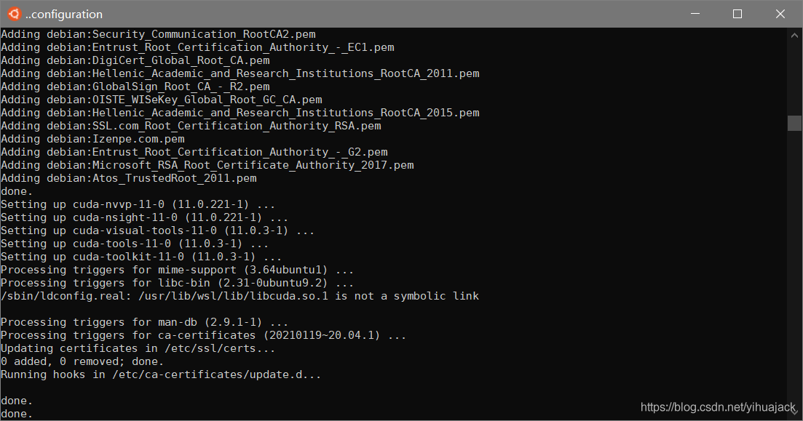

本文在遵循官方用户指南[CUDA on WSL User Guide](https://docs.nvidia.com/cuda/wsl-user-guide/index.html#abstract)的基础上增加了要注意的地方，以免踩坑。

1. 执行
   ```bash
   sudo apt-key adv --fetch-keys http://developer.download.nvidia.cn/compute/cuda/repos/ubuntu2004/x86_64/7fa2af80.pub
   sudo sh -c 'echo "deb http://developer.download.nvidia.cn/compute/cuda/repos/ubuntu2004/x86_64 /" > /etc/apt/sources.list.d/cuda.list'
   sudo apt update
   ```

   对于其他版本例如Ubuntu 18.04，只需将链接中的"ubuntu2004"改为"ubuntu1804"即可。可手动打开http://developer.download.nvidia.cn/compute/cuda/repos查看文件列表。注意不要参考另一篇官方安装指南https://docs.nvidia.com/cuda/cuda-installation-guide-linux/index.html#wsl-installation，它适用于手动在WSL中安装CUDA，不适用本文情况。此外注意：参考https://github.com/microsoft/WSL/issues/5682#issuecomment-788744572，这里与官方用户指南不同的地方是链接中的"nvidia.com"改为"nvidia.cn"，否则会在执行sudo apt update时报错

> Err:12 https://developer.download.nvidia.cn/compute/cuda/repos/ubuntu2004/x86_64  Packages
>   404  Not Found [IP: 58.205.210.80 443]
> Fetched 4379 kB in 3s (1662 kB/s)
> Reading package lists... Done
> E: Failed to fetch https://developer.download.nvidia.cn/compute/cuda/repos/ubuntu2004/x86_64/by-hash/SHA256/d937a68bad23cd52b0fe91137dffd8e701db829ccdaf61960cf4b6e39b0a0e55  404  Not Found [IP: 58.205.210.80 443]
> E: Some index files failed to download. They have been ignored, or old ones used instead

2. 如果你之前已经误操作使用了以.com结尾的原链接，需要执行
   ```bash
   sudo apt-key del "AE09 FE4B BD22 3A84 B2CC  FCE3 F60F 4B3D 7FA2 AF80"
   sudo rm /etc/apt/sources.list.d/cuda.list
   ```

   取消之前的操作，这里的GPG key可通过

   ```bash
   apt-key list
   ```

   查看，第一个key显示为：

> /etc/apt/trusted.gpg
> \--------------------
> pub   rsa4096 2016-06-24 [SC]
>       AE09 FE4B BD22 3A84 B2CC  FCE3 F60F 4B3D 7FA2 AF80
> uid           [ unknown] cudatools <cudatools@nvidia.com> 

3. 执行
   ```bash
   sudo apt install cuda-toolkit-11-0
   ```

   安装CUDA Toolkit 11.0，注意不要写错名字。这个过程会安装约153个包，下载2089 MB/2125 MB档案，占用4924 MB磁盘空间。安装完成结果如下：
   
