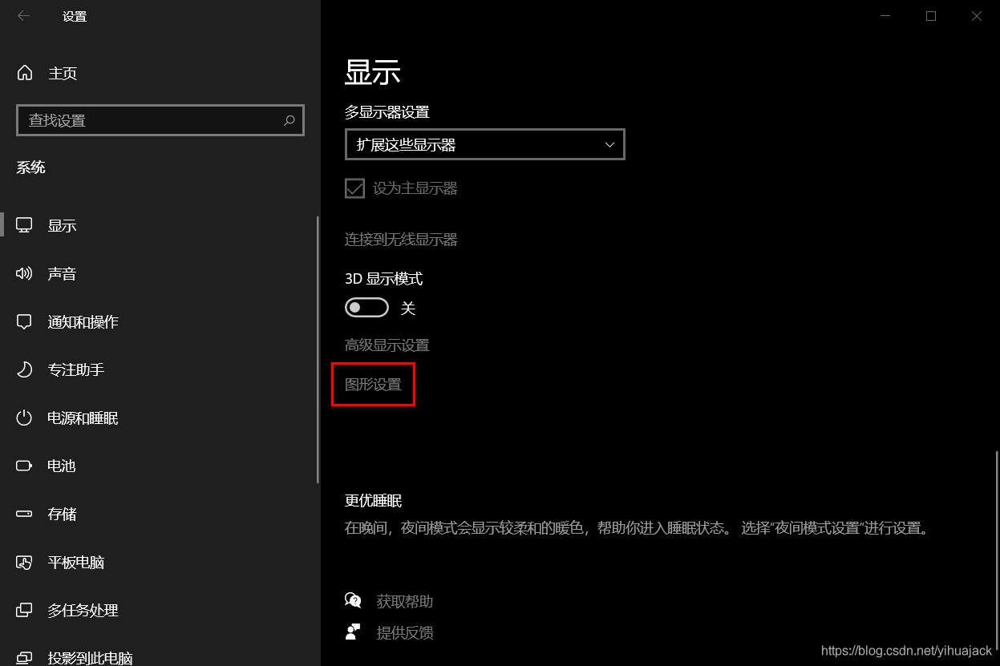
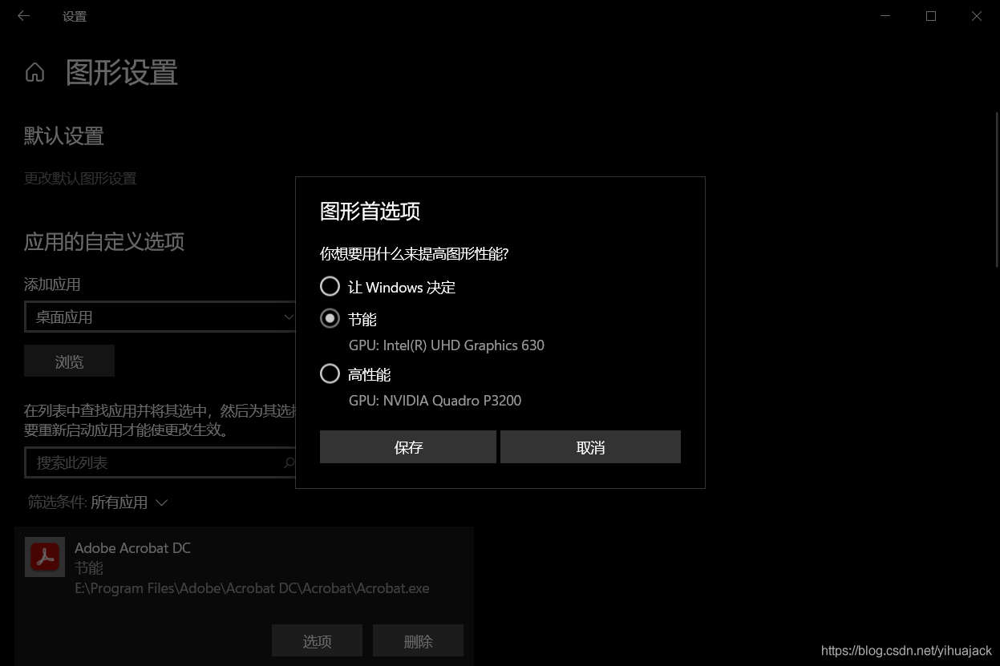
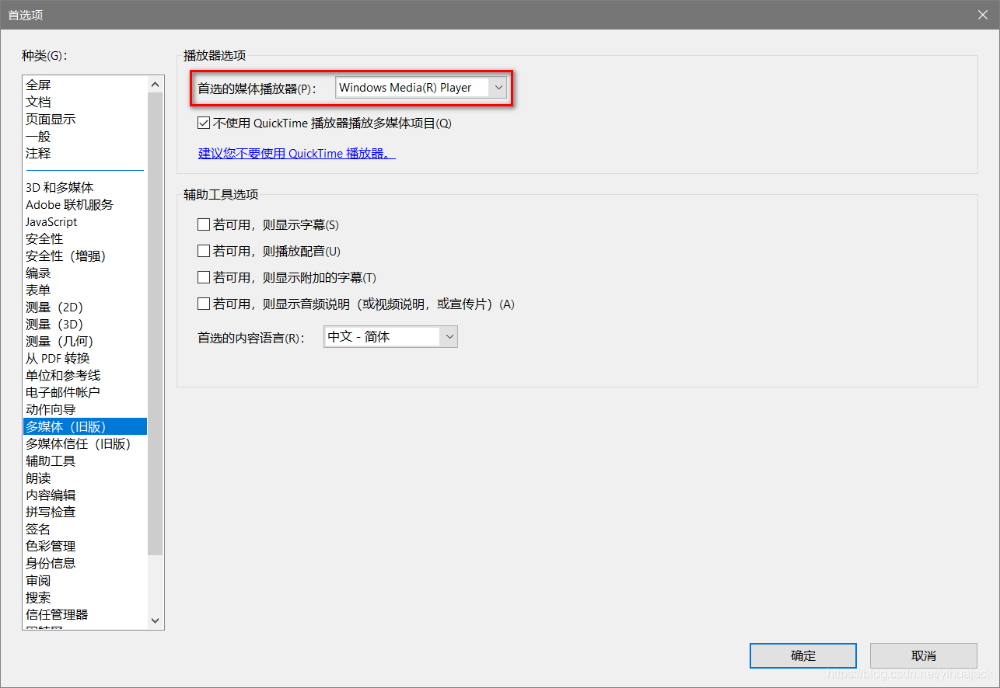
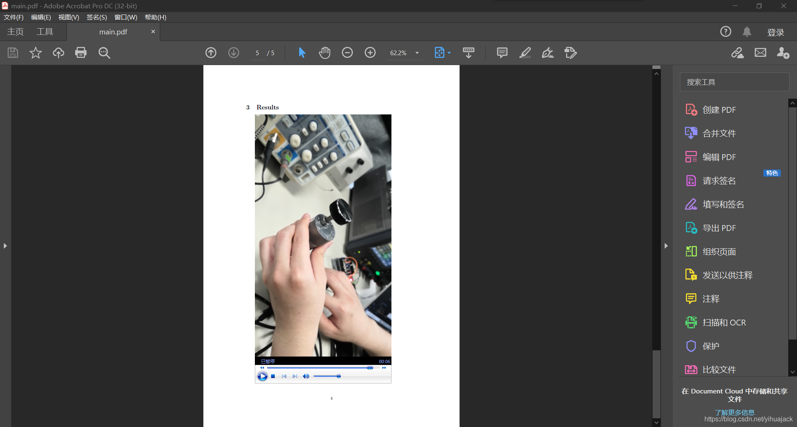

LaTeX插入MP4等类型的视频有两种方法，一种是使用[movie15](https://www.ctan.org/pkg/movie15)宏包，一种是使用[media9](https://www.ctan.org/pkg/media9)宏包。根据前者于2012年5月16日更新的最后一版文档，该宏包已被废弃，请使用media9宏包，所以不要再使用movie15宏包，而应使用media9宏包。至于multimedia宏包是包含在beamer class里的，不适用于普通article等。

自2020年12月起，Adobe不再支持Flash，这种情况下如果还用原来的方法插入视频，那么在Adobe Reader或者Adobe Acrobat等PDF阅读器中都会无法打开。因此，media9宏包的作者提出了这样一种方案，参考[Media9 is becoming obsolete Dec 2020. Any alternatives for embedding video/audio in LaTeX?](https://tex.stackexchange.com/questions/516029/media9-is-becoming-obsolete-dec-2020-any-alternatives-for-embedding-video-audio)（当前许可证：[CC BY-SA 4.0](https://creativecommons.org/licenses/by-sa/4.0/)）、[Flash support is being removed from Acrobat in Dec 2020.](https://gitlab.com/agrahn/media9/-/issues/9)：

1. 打开记事本，粘贴以下内容保存为enablePlayerControls.reg文件：
   ```
   REGEDIT4
   
   [HKEY_LOCAL_MACHINE\SOFTWARE\WOW6432Node\Adobe\Adobe Acrobat\DC\FeatureState]
   "HonorControls"=dword:00000001
   ```

   合并该注册表项，或者直接以管理员身份运行命令提示符执行

   ```powershell
   reg add "HKLM\SOFTWARE\WOW6432Node\Adobe\Adobe Acrobat\DC\FeatureState" /v HonorControls /t REG_DWORD /d 1
   ```

   这里以Adobe Acrobat为例，路径中的“Adobe Acrobat\DC"可自行修改为Adobe Acrobat的其他版本或者Adobe Reader的相应路径。

2. 仿照下面的MWE（Minimal Working Example）
   ```latex
   \documentclass{article}
   
   %%%%%%%%%%%%%%%%%%%%%%%%%%%%%%%%%%%%%%%%%%%%%%%%%%%%%%%%%%%%%%%%%%%%%%%%%%%%%%
   % \embedvideo{<poster or text>}{<video file (MP4+H264)>}
   % \embedvideo*{...}{...}                     % auto-play
   %%%%%%%%%%%%%%%%%%%%%%%%%%%%%%%%%%%%%%%%%%%%%%%%%%%%%%%%%%%%%%%%%%%%%%%%%%%%%%
   \usepackage[bigfiles]{pdfbase}
   \ExplSyntaxOn
   \NewDocumentCommand\embedvideo{smm}{
     \group_begin:
     \leavevmode
     \tl_if_exist:cTF{file_\file_mdfive_hash:n{#3}}{
       \tl_set_eq:Nc\video{file_\file_mdfive_hash:n{#3}}
     }{
       \IfFileExists{#3}{}{\GenericError{}{File~`#3'~not~found}{}{}}
       \pbs_pdfobj:nnn{}{fstream}{{}{#3}}
       \pbs_pdfobj:nnn{}{dict}{
         /Type/Filespec/F~(#3)/UF~(#3)
         /EF~<</F~\pbs_pdflastobj:>>
       }
       \tl_set:Nx\video{\pbs_pdflastobj:}
       \tl_gset_eq:cN{file_\file_mdfive_hash:n{#3}}\video
     }
     %
     \pbs_pdfobj:nnn{}{dict}{
       /Type/RichMediaInstance/Subtype/Video
       /Asset~\video
       /Params~<</FlashVars (
         source=#3&
         skin=SkinOverAllNoFullNoCaption.swf&
         skinAutoHide=true&
         skinBackgroundColor=0x5F5F5F&
         skinBackgroundAlpha=0.75
       )>>
     }
     %
     \pbs_pdfobj:nnn{}{dict}{
       /Type/RichMediaConfiguration/Subtype/Video
       /Instances~[\pbs_pdflastobj:]
     }
     %
     \pbs_pdfobj:nnn{}{dict}{
       /Type/RichMediaContent
       /Assets~<<
         /Names~[(#3)~\video]
       >>
       /Configurations~[\pbs_pdflastobj:]
     }
     \tl_set:Nx\rmcontent{\pbs_pdflastobj:}
     %
     \pbs_pdfobj:nnn{}{dict}{
       /Activation~<<
         /Condition/\IfBooleanTF{#1}{PV}{XA}
         /Presentation~<</Style/Embedded>>
       >>
       /Deactivation~<</Condition/PI>>
     }
     %
     \hbox_set:Nn\l_tmpa_box{#2}
     \tl_set:Nx\l_box_wd_tl{\dim_use:N\box_wd:N\l_tmpa_box}
     \tl_set:Nx\l_box_ht_tl{\dim_use:N\box_ht:N\l_tmpa_box}
     \tl_set:Nx\l_box_dp_tl{\dim_use:N\box_dp:N\l_tmpa_box}
     \pbs_pdfxform:nnnnn{1}{1}{}{}{\l_tmpa_box}
     %
     \pbs_pdfannot:nnnn{\l_box_wd_tl}{\l_box_ht_tl}{\l_box_dp_tl}{
       /Subtype/RichMedia
       /BS~<</W~0/S/S>>
       /Contents~(embedded~video~file:#3)
       /NM~(rma:#3)
       /AP~<</N~\pbs_pdflastxform:>>
       /RichMediaSettings~\pbs_pdflastobj:
       /RichMediaContent~\rmcontent
     }
     \phantom{#2}
     \group_end:
   }
   \ExplSyntaxOff
   %%%%%%%%%%%%%%%%%%%%%%%%%%%%%%%%%%%%%%%%%%%%%%%%%%%%%%%%%%%%%%%%%%%%%%%%%%%%%%
   \usepackage{graphicx}
   \begin{document}
   \section{autoplay}
   \embedvideo*{\includegraphics[page=1]{example-movie}}{example-movie.mp4}
   \newpage
   \section{play on click}
   \embedvideo{\includegraphics[page=1]{example-movie}}{example-movie.mp4}
   \end{document}
   ```

   其中{example-movie}这里要插入的是一个JPG/PNG/PDF/EPS等includegraphix宏包支持的图片格式的图片作为视频的预览图/封面图；[page=1]是\includegraphics命令的参数，可以改成常用的比如[width=0.8\textwidth]等。如注释所示，带星号*的\embedvideo命令表示启用自动播放，而不带星号的则不启用。

3. 使用PDFLaTeX编译即可成功。

完成上述操作后，视频已经成功插入，但是在Adobe Acrobat中仍然无法显示（如黑屏），同样根据上述参考链接以及[Video embedded into pdf with Latex does not play correctly](https://stackoverflow.com/questions/64787733/video-embedded-into-pdf-with-latex-does-not-play-correctly)，对于Windows 10，打开Windows 设置->系统->显示->图形设置：



 在应用的自定义选项->添加应用->浏览中找到Acrobat安装目录下的acrobat.exe点击添加，然后在下方列表中筛选条件：所有应用中找到Adobe Acrobat DC，点击选项，打开图形首选项窗口，选择“节能”：



重启Acrobat后可以打开，但只能闪一下地显示视频，仍不能正常显示，这时在Adobe Acrobat的菜单栏中选择编辑->首选项（Ctrl+K），在左侧种类(G)找到“多媒体（旧版）”，在“播放器选项”中将“首选的媒体播放器(P)”从“Windows 内建播放器”改为“Windows Media(R) Player”:



重启Acrobat后即可正常显示。打开文档，将光标移动到预览图上方单击以激活：



