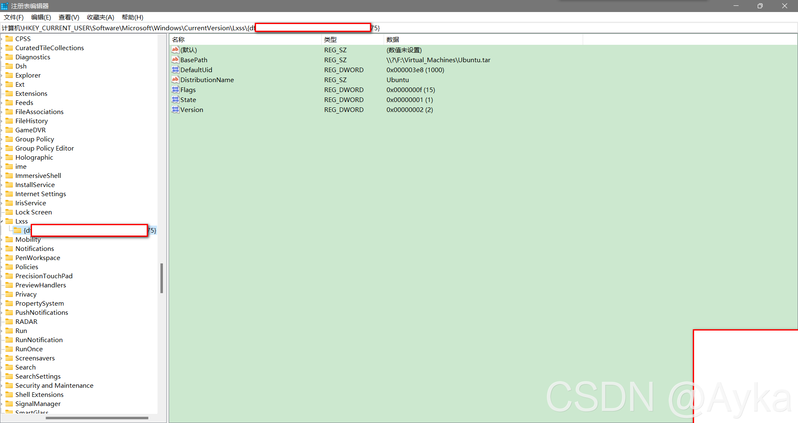

本文在[WSL2安装Ubuntu20.04](https://www.cnblogs.com/konghuanxi/p/14731846.html)的基础上参考[how to move the vhdx of wsl2 to other disk · Issue #412 · MicrosoftDocs/WSL · GitHub](https://github.com/MicrosoftDocs/WSL/issues/412#issuecomment-708142542)。本文适用于各种WSL 2 Linux发行版，适用于Windows 10和Windows 11。

以管理员身份运行PowerShell，执行：

```powershell
wsl -l -v
```

查看已安装的所有WSL实例的名称及版本：

>  NAME      STATE           VERSION
>  \* Ubuntu    Stopped         2

如果STATE不是Stopped，那么需要执行

```powershell
wsl --shutdown
```

以我的WSL实例“Ubuntu”为例，执行

```powershell
wsl --export Ubuntu G:\Virtual_Machines\Ubuntu.tar
wsl --unregister Ubuntu
wsl --import Ubuntu F:\Virtual_Machines G:\Virtual_Machines\Ubuntu.tar --version 2
```

其中G盘的路径是暂存Ubuntu压缩包的路径，F盘的路径是真正要将WSL 2实例移动到的位置。上述操作完成之后能够顺利打开WSL Ubuntu，但是显示以root身份登录，这时我们需要完成最后一步——设置默认用户：在C:\WINDOWS\System32下以管理员身份运行PowerShell，执行：

```powershell
ubuntu.exe config --default-user <username>
```

如果你的WSL Ubuntu的名称是Ubuntu-20.04，那么对应的可执行文件名为ubuntu2004.exe，具体名字可以在System32下查看。将这里的username改为之前WSL Ubuntu设置的用户名（注意不能大写）以后，重启WSL Ubuntu即可发现~路径下的文件都在，oh-my-zsh等Shell效果也都还在。

另外可以参考[pxlrbt/move-wsl: Easily move your WSL distros VHDX file to a new location. (github.com)](https://github.com/pxlrbt/move-wsl)。还可以直接修改注册表Computer\HKEY_CURRENT_USER\SOFTWARE\Microsoft\Windows\CurrentVersion\Lxss\{random uuid}\BasePath，将其值改为\\?\D:\Path\to\ext4.vhdx，例如：


