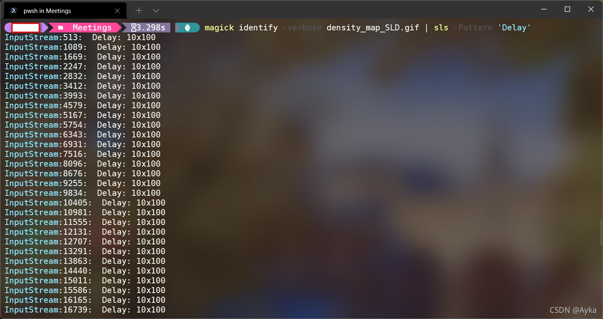
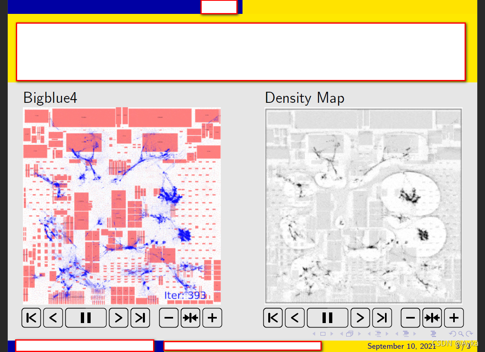

本文参考
beamer - Getting GIF and/or moving images into a LaTeX presentation - TeX - LaTeX Stack Exchange
https://tex.stackexchange.com/questions/240243/getting-gif-and-or-moving-images-into-a-latex-presentation

1. 把 GIF 动画转换为 PNG 图像序列：
   ```powershell
   convert -coalesce something.gif something.png
   ```

   或

   ```powershell
   magick convert -coalesce something.gif something.png
   ```

   如果提示未找到该命令请检查是否已安装[ImageMagick – Convert, Edit, or Compose Digital Images](https://imagemagick.org/index.php)，并检查是否将安装目录添加到了环境变量。该命令会生成文件名如 something-0.png, ..., something-16.png 的一系列 PNG 文件。-coalesce 选项用于取消对原 GIF 文件可能的优化。

2. 获取原动画的播放速度：
   对于 Linux/MacOS 用户，执行

   ```bash
   magick identify -verbose something.gif | grep 'Delay'
   ```

   对于 Windows 用户，在 PowerShell 中执行
   ```powershell
   magick identify -verbose something.gif | sls -Pattern 'Delay'
   ```

   输出结果如下：
   帧速率可被计算为 100 (tics/秒) / 10 (tics/帧) = 10 帧每秒

3. MWE：
   ```latex
   \documentclass{beamer}
   \usepackage{animate}
   \begin{document}
   \begin{frame}{Sample}
       \begin{columns}[onlytextwidth]
           \begin{column}{0.45\textwidth}
               Bigblue4
               \animategraphics[autoplay,loop,controls,width=\linewidth]{10}{bigblue4-nofiller_SLD/bigblue4-nofiller_SLD-}{0}{99}
           \end{column}
           \begin{column}{0.45\textwidth}
               Density Map
               \animategraphics[autoplay,loop,controls,width=\linewidth]{10}{density_map_SLD/density_map_SLD-}{0}{99}
           \end{column}
       \end{columns}
   \end{frame}
   \end{document}
   ```
   
   其中 {10} 是帧速率，{0} 和 {99} 是 PNG 图像文件序列文件名的后缀的初始编号和最后一个编号。正常播放需要使用 Adobe Acrobat 等工具，SumatraPDF 到目前为止尚不能完整支持。

最终效果如下：


