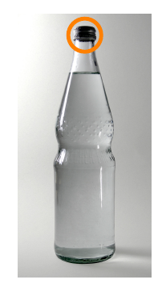
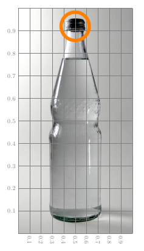
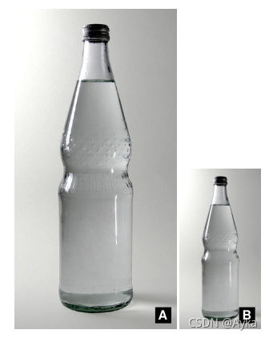
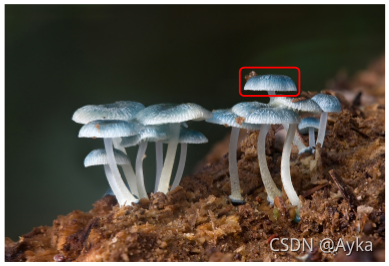

参考链接：

windows - Overlaying TikZ nodes on an image using TikzEdt and onimage.sty - TeX - LaTeX Stack Exchange
https://tex.stackexchange.com/questions/229711/overlaying-tikz-nodes-on-an-image-using-tikzedt-and-onimage-sty
tikz pgf - Simplest way to overlay a text + rectangle label an image? - TeX - LaTeX Stack Exchange
https://tex.stackexchange.com/questions/30427/simplest-way-to-overlay-a-text-rectangle-label-an-image
graphics - Drawing on an image with TikZ - TeX - LaTeX Stack Exchange
https://tex.stackexchange.com/questions/9559/drawing-on-an-image-with-tikz
首先，onimage 宏包目前尚未发布在 CTAN 上，所以需要从 http://bazaar.launchpad.net/~tex-sx/tex-sx/development/files 下载 onimage.dtx 文件，然后执行

```powershell
pdflatex onimage.dtx
```

会编译生成出 onimage 宏包的 STY 文件、PDF 文档等。当前版本为 2021 年 9 月 19 日的版本。将 onimage.sty 文件放在于 TeX 文件同一目录下，在 TeX 文件导言区添加

```latex
\usepackage{onimage}
```

编译即可。其语法为：

```latex
\begin{\tikzonimage}[<image options>]{<image file>}[<TikZ options>]
```

第一个选项参数会被传递到 \includegraphics 中，第二个选项参数和 tikzpicture 环境中的用法一致。例如，如果要在 some_image.jpg 的中央画一个红色的小圆圈，可写为：

```latex
\begin{tikzonimage}[width=0.3\textwidth]{some_image.jpg}[color=red]
    \fill (0.5,0.5) circle [radius=2pt];
\end{tikzonimage}
```

如果要把多个图像包含在一个 tikzpicture 中，同时对每一个图像都改变其坐标系统的尺度，那么可以使用 tikzonnode：

```latex
\begin{\tikzonnode}{<node>}[<TikZ options>]
```

如果要在一个 node 的中央画一个红色的小圆圈并标有文字，可写为：

```latex
\begin{tikzpicture}
    \node (A) [text width=2cm] {abc abc abc abc abc abc abc abc abc};
    \begin{tikzonnode}{A}[color=red]
        \fill (0.5,0.5) circle [radius=2pt];
    \end{tikzonnode}
\end{tikzpicture}
```

例1.



```latex
\documentclass{article}
\usepackage{onimage}
\begin{document}
\begin{tikzonimage}{bottle.jpg}
    \draw [orange, line width=5pt] (0.5,0.92) circle [radius=0.75cm];
\end{tikzonimage}
\end{document}
```

例2.



```latex
\documentclass{article}
\usepackage{onimage}
\begin{document}
\begin{tikzonimage}{bottle.jpg}[tsx/show help lines]
    \draw [orange, line width=5pt] (0.5,0.92) circle [radius=0.75cm];
\end{tikzonimage}
\end{document}
```

例3.



```latex
\begin{document}
\tikzset{
    image label/.style={
        every node/.style={
            fill=black,
            text=white,
            font=\fontfamily{phv}\selectfont\Large\bfseries,
            anchor=south east,
            xshift=-0.2cm,
            yshift=0.2cm,
            at={(1,0)}
        }
    }
}
\begin{tikzonimage}[width=0.5\textwidth]{bottle}[image label]
\node{A};
\end{tikzonimage}
\begin{tikzonimage}[width=0.25\textwidth]{bottle}[image label]
\node{B};
\end{tikzonimage}
\end{document}
```

如果不用 onimage 宏包也可以，例如：



```latex
\documentclass[tikz]{standalone}
\begin{document}
\begin{tikzpicture}
    \node[anchor=south west,inner sep=0] (image) at (0,0) {\includegraphics[width=0.9\textwidth]{some_image.jpg}};
    \begin{scope}[x={(image.south east)},y={(image.north west)}]
        \draw[red,ultra thick,rounded corners] (0.62,0.65) rectangle (0.78,0.75);
    \end{scope}
\end{tikzpicture}
\end{document}
```
