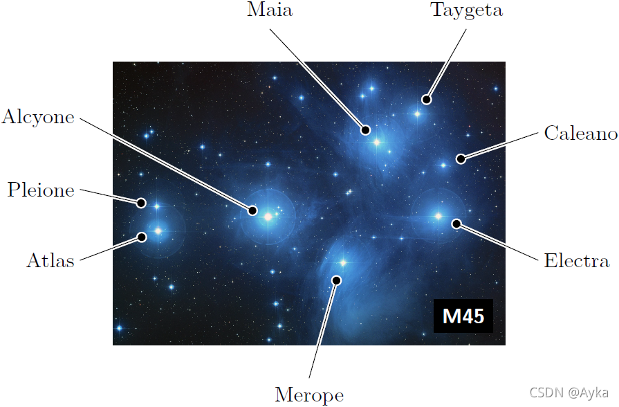
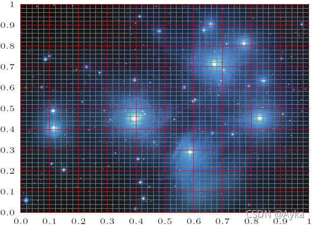
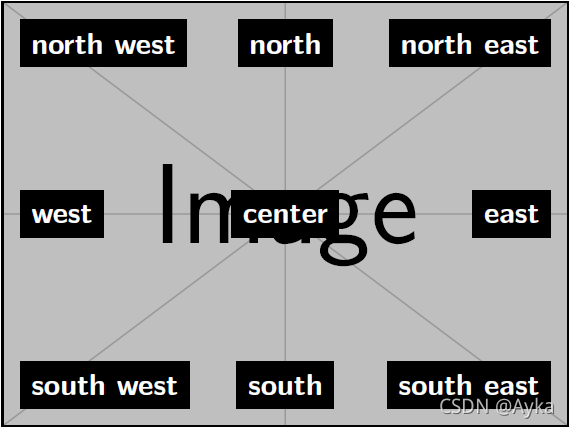
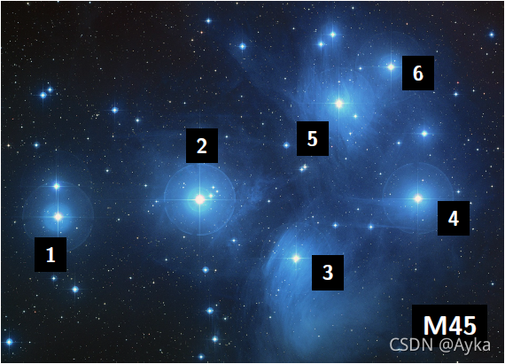

本文参考
Package documentation
http://mirrors.ctan.org/graphics/pgf/contrib/tikz-imagelabels/tikz-imagelabels.pdf

 （2019年6月27日版本的文档）

如果需要添加更复杂的元素，如矩形等，可参考我的下一篇博文

LaTeX在图片上面使用onimage宏包画TikZ（如矩形、文字）的方法
https://blog.csdn.net/yihuajack/article/details/120383009

**目录**

1. 简介

2. 用法
   2.1 包含图像
   2.2 添加标签
   2.3 添加标注

3. 风格设置


## 1. 简介

案例：



 代码如下：

```latex
\begin{annotationimage}{width=6cm}{pleiades.jpg}
\draw[annotation left = {Atlas at 0.3}] to (0.11,0.4);
\draw[annotation left = {Pleione at 0.55}] to (0.11,0.49);
\draw[annotation left = {Alcyone at 0.8}] to (0.39,0.45);
\draw[annotation below = {Merope at 0.5}] to (0.58,0.28);
\draw[annotation right = {Electra at 0.3}] to (0.84,0.45);
\draw[annotation right = {Caleano at 0.75}] to (0.85,0.64);
\draw[annotation above = {Maia at 0.4}] to (0.67,0.72);
\draw[annotation above = {Taygeta at 0.9}] to (0.78,0.82);
\draw[image label = {M45 at south east}];
\end{annotationimage}
```

## 2. 用法
### 2.1 包含图像
```latex
annotationimage[<grid>]{<options>}{<file name>}
```

<grid> 选项可以在原图上加上网格：>



 <option> 选项可以是 \includegraphics 命令的任何选项，如 width=、height= 等。

### 2.2 添加标签
方法是使用 \draw 宏：

```latex
\draw[image label = {<text> at <placement>}];
```

placement 可以是 north west, north, north east, east, south east, south, south west 或 west，如图所示：



或者可以使用坐标来打标签：

```latex
\draw[coordinate label = {<text> at (<coordinate>)}];
```

例如：



代码为

```latex
\draw[coordinate label = {1 at (0.1,0.3)}];
\draw[coordinate label = {2 at (0.4,0.6)}];
\draw[coordinate label = {3 at (0.65,0.25)}];
\draw[coordinate label = {4 at (0.9,0.4)}];
\draw[coordinate label = {5 at (0.62,0.62)}];
\draw[coordinate label = {6 at (0.83,0.8)}];
\draw[image label = {M45 at south east}];
```

### 2.3 添加标注
语法为：

```latex
\draw[annotation <placement> = {<text> at <position>}] to (<x>, <y>);
```

<placement> 选项尾：above, right, below 或 left。例如

```latex
\draw[annotation left = {Atlas at 0.3}] to (0.11,0.4);
```

会把文字“Atlas”标注在图像是左手边，y=0.3 的位置处，箭头指向 (0.11, 0.4)。

## 3. 风格设置
默认风格为：

```latex
\imagelabelset{
coarse grid color = red,
fine grid color = gray,
image label font = \sffamily\bfseries\small,
image label distance = 2mm,
image label back = black,
image label text = white,
coordinate label font = \sffamily\bfseries\scriptsize,
coordinate label distance = 2mm,
coordinate label back = black,
coordinate label text = white,
annotation font = \normalfont\small,
arrow distance = 1.5mm,
border thickness = 0.6pt,
arrow thickness = 0.4pt,
tip size = 1.2mm,
outer dist = 0.5cm,
}
```
