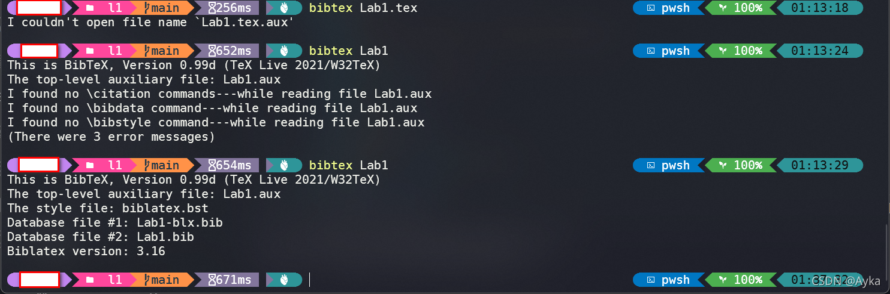

众所周知，参考
Bibliography management with biblatex - Overleaf, Online LaTeX Editor
https://www.overleaf.com/learn/latex/Bibliography_management_with_biblatex
使用 BibLaTeX 管理 LaTeX 文档的参考文献只需以下四条语句：

```latex
\usepackage{biblatex}
\addbibresource{sample.bib}
\cite{einstein}
\printbibliography
```

在 Overleaf 上使用这些语句即可成功生成 Reference，然而本地编译却编译不出，而采用 pdflatex -> bibtex -> pdflatex\*2 或 xelatex -> bibtex -> xelatex*2 的 recipe 会报错，显示 Empty Bibliography、Citation Undefined。参考[Latex技巧：插入参考文献 - 彼岸花杀是条狗 - 博客园 (cnblogs.com)](https://www.cnblogs.com/yifdu25/p/8330652.html)，在命令提示符或 PowerShell 中执行

```powershell
pdflatex Lab1.tex
```

生成 Lab1.aux 文件，然后执行

```powershell
bibtex Lab1
```

输出：

> This is BibTeX, Version 0.99d (TeX Live 2021/W32TeX)
> The top-level auxiliary file: Lab1.aux
> I found no \citation commands---while reading file Lab1.aux
> I found no \bibdata command---while reading file Lab1.aux
> I found no \bibstyle command---while reading file Lab1.aux
> (There were 3 error messages)

即使将 \usepackage 命令改为

```latex
usepackage[utf8]{inputenc}
\usepackage[english]{babel}
\usepackage[backend=babel,style=alphabetic,sorting=ynt]{biblatex}
```

也无济于事。这时，参考
bibliographies - Problem with compiling BibTex: "no \citation commands" error - TeX - LaTeX Stack Exchange
https://tex.stackexchange.com/questions/18045/problem-with-compiling-bibtex-no-citation-commands-error

将 backend 由 babel 改为 bibtex，即

```latex
\usepackage[backend=bibtex,style=alphabetic,sorting=ynt]{biblatex}
```

重新执行

```latex
bibtex Lab1
```

输出：

> This is BibTeX, Version 0.99d (TeX Live 2021/W32TeX)
> The top-level auxiliary file: Lab1.aux
> The style file: biblatex.bst
> Database file #1: Lab1-blx.bib
> Database file #2: Lab1.bib
> Biblatex version: 3.16



这时再用 pdflatex 编译一遍即可成功显示参考文献。 
