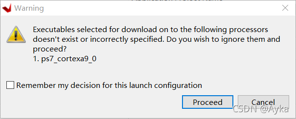
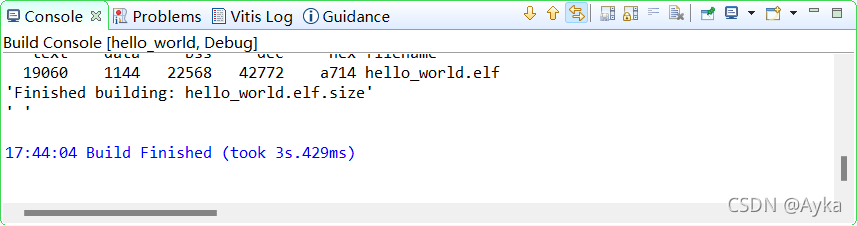

以 Hello World 模板项目为例，在创建好 Application Project 后，点击 Run 图标，报错

executables selected for download on to the following processors doesn't exist or incorrectly specified

 

解决方法是： 菜单栏->Project->Build Project。Console 会切换到 Build Console [hello world, Debug]：

Build 完成后再次运行，该警告即消失。参考：
Bug? executables selected for download following on to the following processors doesn't exist or incorrectly specified
https://support.xilinx.com/s/feed/0D52E00006hpmVqSAI
