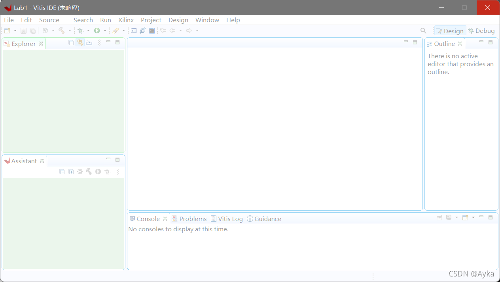
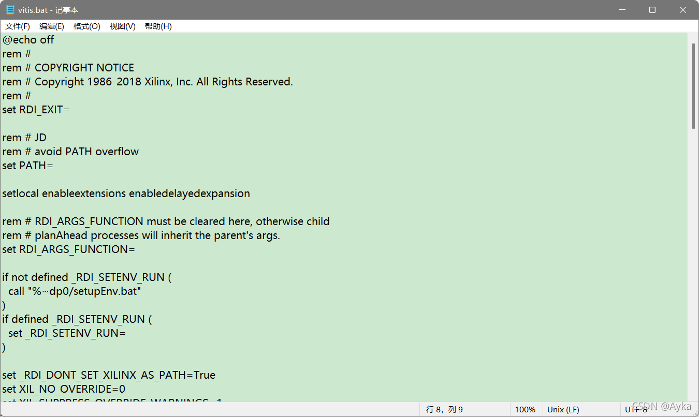

在启动 Xilinx Vitis 2021.1 时，无论是从 Xilinx Vivado 界面的 Launch Vitis 启动还是直接启动都会在启动后显示出主界面后未响应：



其原因是 Windows 系统的 PATH 环境变量溢出了。解决方法是：找到 Xilinx Vitis 安装目录下的 bin 文件夹（形如F:\Xilinx\Vitis\2021.1\bin）下的 vitis.bat 文件，在

```
set RDI_EXIT=
```

行后、

```
setlocal enableextensions enabledelayedexpansion
```

行前添加

```
rem # JD
rem # avoid PATH overflow
set PATH=
```



保存，重启 Xilinx Vitis 即可解决问题。该解决方法至少适用于 2019.2 到 2021.1 之间的版本。参考：

Vitis IDE not responding (frozen) on Windows 10

https://support.xilinx.com/s/feed/0D52E00006hpJxsSAE
