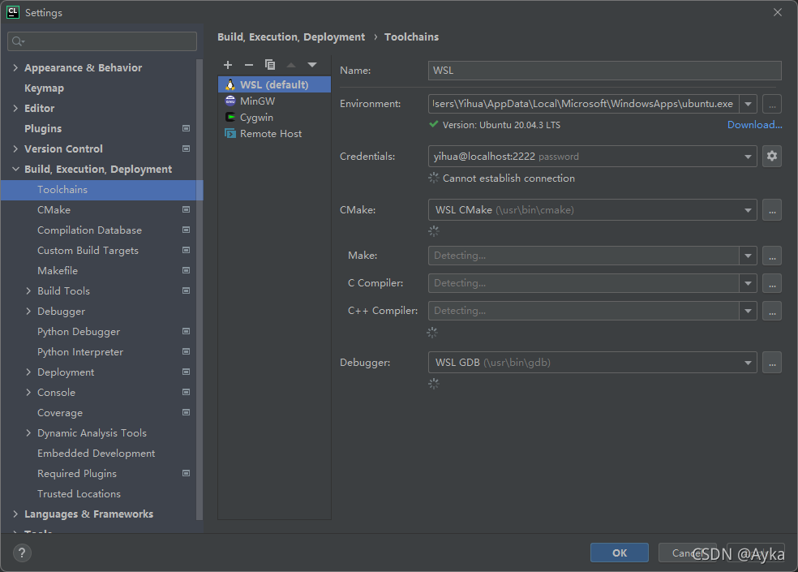
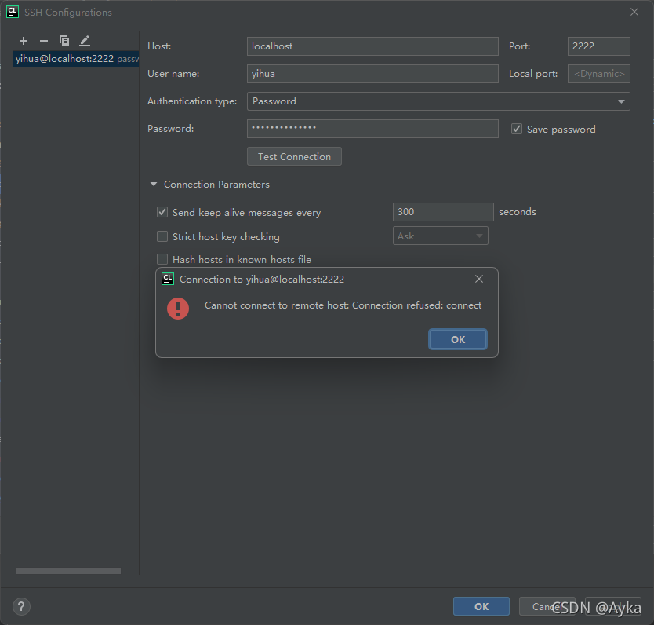
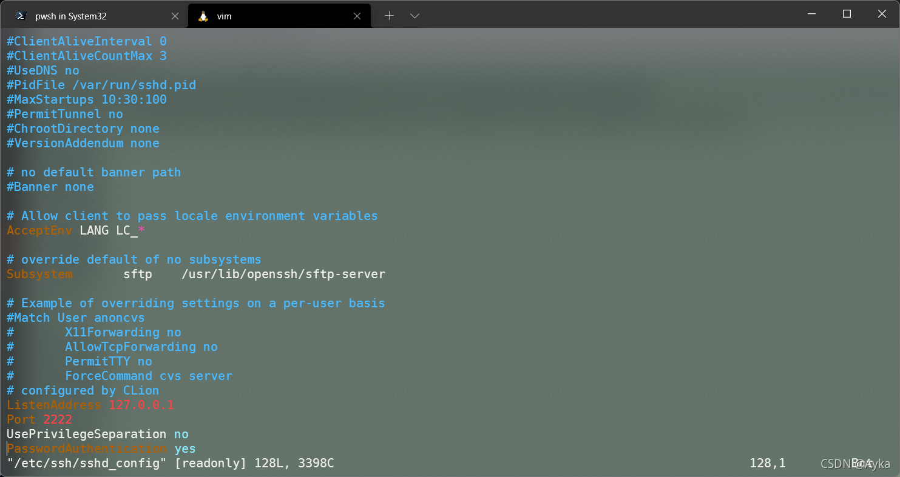
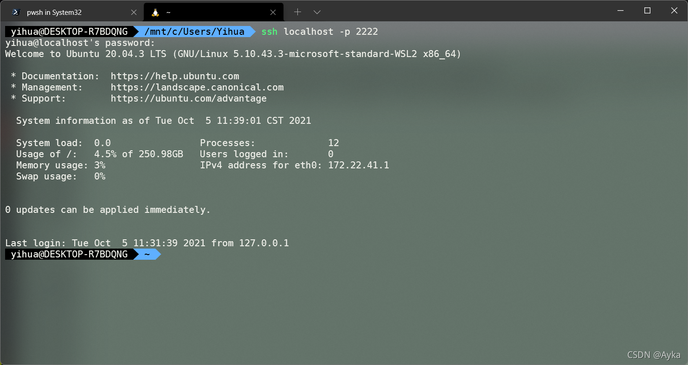
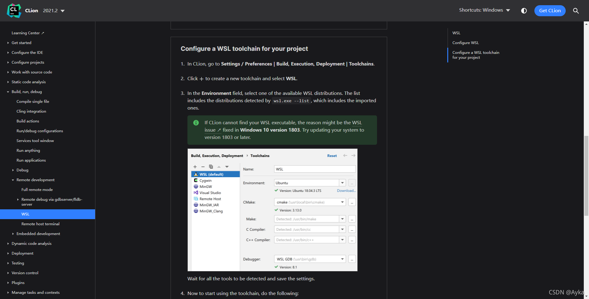
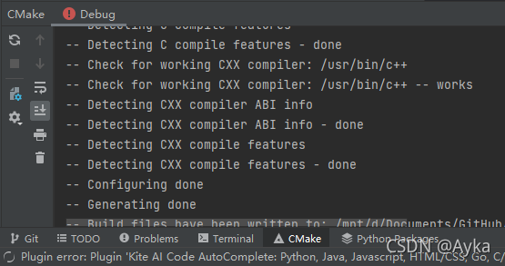
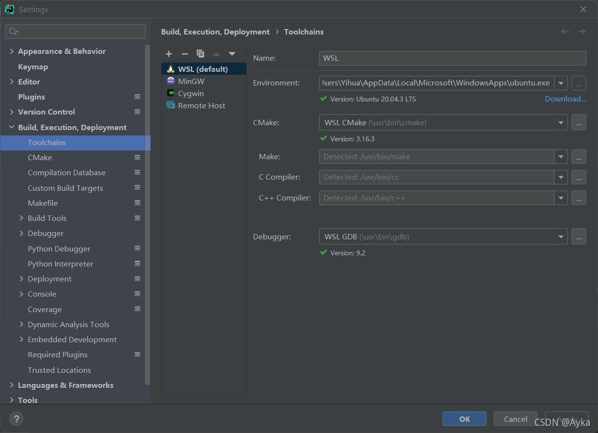

昨天 CLion 2021.1.2 版本连接 WSL 2 用的好好的重启一下电脑以后突然不能用了：





尝试过
WSL2 unable to establish connection : CPP-17763 (jetbrains.com)
https://youtrack.jetbrains.com/issue/CPP-17763

里 Janne Hamalainen 的解决方法，但是没有用。根据
Cannot establish connection : CPP-22590 (jetbrains.com)
https://youtrack.jetbrains.com/issue/CPP-22590

里 Maxim Banaev 的提示尝试在 WSL Ubuntu 中执行

```bash
ssh localhost -p 2222
```

重启了 SSH 服务：

```bash
sudo service ssh restart
```

检查 SSH 和 SSHD 是否已启动：

```bash
ps -e | grep ssh
```

检查 /etc/ssh/sshd_config：

```bash
vim /etc/ssh/sshd_config
```



删掉 ~/.ssh/known_hosts 里过期的 host：

```bash
vim ~/.ssh/known_hosts
```

成功连接 localhost:2222：



但是 CLion 仍无法连接。根据同样是该条 track 下 Vasily Romanikhin 的解答：

> starting CLion 2021.2 there is no need to work with WSL distribution via ssh, ATM we are using dedicated API to run WSL processes.
> So feel free to update to the latest version. I will close the ticket as obsolete.

查看
WSL | CLion (jetbrains.com)
https://www.jetbrains.com/help/clion/how-to-use-wsl-development-environment-in-product.html
也发现内容做了更新：



 通过 JetBrains Toolbox 将 CLion 升级到最新的 2021.2.2 版本，重启 CLion，成功连接：





可以发现 Environment 与 CMake 之间原本有的 Credentials 一栏已经消失。
