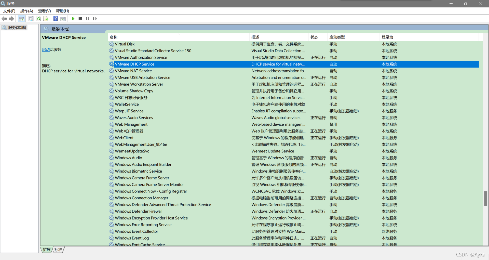
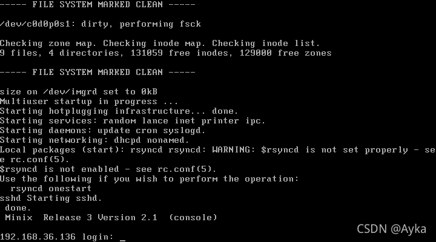

该方法至少对 Minix 3.2.0 - 3.2.1，VirtualBox 4.2 - 4.3.12, VMware Workstation 8 - 15.5.7 版本有效。

参考：

virtualbox.org • View topic - [SOLVED] Minix hangs at boot
https://forums.virtualbox.org/viewtopic.php?f=4&t=61975
Re: [minix3] Boot never progresses past dhcpd nonamed in VMware and VirtualBox (google.com)
https://groups.google.com/g/minix3/c/A_fyO5SaNbw
Windows + R 键调出“运行“，输入 services.msc 打开服务，检查 VMware DHCP Service 和 VMware NAT Service 服务是否已启动：

如果未启动，启动这两个服务，重启 VMware Workstation 后即可：

