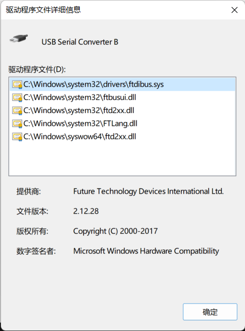

Update on September 13, 2022: please refer to [To V Or Not To V? – FPGA Coding](https://fpgacoding.com/to-v-or-not-to-v/).

In Xilinx Vitis 2021, Menu->Xilinx->Program Device:


It showed an error:


I referred to 
67426 - SDSoC - Cannot debug application when targeting a custom platform (xilinx.com)
https://support.xilinx.com/s/article/67426?language=en_US

but it is not applicable for Xilinx Vitis 2021. Inspired by
【分享】如何使用coresight作为MPSoC的标准输入输出？ - HankFu - 博客园 (cnblogs.com)
https://www.cnblogs.com/hankfu/p/14441851.html

I opened Menu->Xilinx->XSCT Console and ran

```
connect
```


If closing Xilinx Vivado on my computer and tried to reconnect, it succeeded:


Then, re-program the device; anything would be OK. Sometimes this still does not work. However, it seems that restarting the computer always works. What is the reason for this indeed?

1. Try to reinstall the drivers:

   ```
   cd F:\Xilinx\Vivado\2022.1\data\xicom\cable_drivers\nt64
   install_drivers_wrapper.bat
   ```

2. Check the driver setup for the FTDI device. In Device Manager->Universal Serial Bus controllers->USB Serial Converter A and USB Serial Converter B:
   
   Check the "Driver" tab:
   
   To Update Driver does not update because it is already the latest. Check "Driver Details":
   
   Check the "Details" tab and select "Bus reported device description" Property. Check the value "Diligent Adept USB Device":
   

3. Run
   ```
   F:\Xilinx\Vivado\2022.1\bin\unwrapped\win64.o\hw_server.exe
   ```
   
   in CMD. It should output

   > \*\*\*\*\*\* Xilinx hw_server v2022.1.2
   >   \*\*\*\* Build date : Aug  5 2022 at 23:12:38
   >     ** Copyright 1986-2022 Xilinx, Inc. All Rights Reserved.
   >
   > INFO: hw_server application started
   > INFO: Use Ctrl-C to exit hw_server application
   >
   > INFO: To connect to this hw_server instance use url: TCP:Administrator:3121

   but it instead shows:

   > Cannot create listening port: Socket bind error. An attempt was made to access a socket in a way forbidden by its access permissions

4. Run

   ```
   netstat -ano | findstr 3121
   ```

   or

   ```
   netstat -abp TCP | find “3121”
   ```

   but found nothing. No processes are listening or connected to that port.

5. Test by code:

   ```c++
   int createListenSocket(int port) {
       errCode = E_NONE;
   
       auto s = socket(PF_INET, SOCK_STREAM, 0);
       SOCKADDR_IN sin;
        
       sin.sin_family = PF_INET;
       sin.sin_addr.s_addr = 0;
       sin.sin_port = htons(port);
        
       auto result = bind(s, (LPSOCKADDR)&sin, sizeof(sin));
       if (result) {
           errCode = WSAGetLastError();
           closesocket(s);
           return errCode;
       }
        
       result = listen(s, SOMAXCONN);
       if (result) {
           errCode = WSAGetLastError();
       }
        
       closesocket(s);
       return errCode;
   }
   
   int main(int argc, char *argv[]) {
       auto result = initWinsock();
   
       // check ports
       result = createListenSocket(3121);
        
       assert(result == E_NONE);
        
       // cleanup
       WSACleanup();
   }
   ```

   The code was unable to bind successfully to port 3121.

6. One way is to run hw_server by

   ```
   hw_server.exe -s tcp::50000
   ```

   However, it cannot change 3001-3003:

   > Warning: Cannot create '3001:arm64' GDB server: An attempt was made to access a socket in a way forbidden by its access permissions Warning: Cannot create '3002:microblaze' GDB server: An attempt was made to access a socket in a way forbidden by its access permissions Warning: Cannot create '3003:microblaze64' GDB server: An attempt was made to access a socket in a way forbidden by its access permissions

   If try

   ```
   connect_hw_server -url TCP:localhost:50000
   ```

   it will show the error:

   > INFO: [Labtools 27-2285] Connecting to hw_server url TCP:localhost:50000 INFO: [Labtools 27-3415] Connecting to cs_server url TCP:localhost:3042 INFO: [Labtools 27-3417] Launching cs_server... INFO: [Labtools 27-2221] Launch Output: Traceback (most recent call last): File "git_cs_server\chipscope\server\main.py", line 401, in <module> File "git_cs_server\chipscope\server\main.py", line 397, in main File "site-packages\click-7.0-py3.7.egg\click\core.py", line 764, in __call__ File "site-packages\click-7.0-py3.7.egg\click\core.py", line 717, in main File "site-packages\click-7.0-py3.7.egg\click\core.py", line 956, in invoke File "site-packages\click-7.0-py3.7.egg\click\core.py", line 555, in invoke File "git_cs_server\chipscope\server\main.py", line 279, in start_server File "git_cs_server\chipscope\server\main.py", line 259, in start_server File "git_cs_server\chipscope\server\main.py", line 293, in __init__ OSError: [WinError 10013] An attempt was made to access a socket in a way forbidden by its access permissions [22024] Failed to execute script main ERROR: [Labtools 27-3733] Error during cs_server initialization: Unable to connect to cs_server at URL: TCP:localhost:3042. connect_hw_server: Time (s): cpu = 00:00:00 ; elapsed = 00:00:14 . Memory (MB): peak = 1042.156 ; gain = 0.000 ERROR: [Common 17-39] 'connect_hw_server' failed due to earlier errors.

7. The second way is to disable Hyper-V in Settings->Apps & Features->Programs and Features->Windows Features, which is to host Windows Subsystem for Linux (WSL). However, the problem also exists on machines that do not enable Hyper-V.

8. The final solution is given in another article:[netsh int ip 添加/删除 TCP 协议 excludedportrange 的方法_Ayka的博客-CSDN博客](https://blog.csdn.net/yihuajack/article/details/126842823). After that, re-program the device. In XSCT Console->XSCT Process:

> xsct% 
> \*\*\*\*\*\* Xilinx Software Commandline Tool (XSCT) v2022.1.2
> \*\*\*\* SW Build 49 on 2022-08-02-23:22:20
>  ** Copyright 1986-2022 Xilinx, Inc. All Rights Reserved.
>
> XSDB Server URL: TCP:localhost:1137
> xsct% XSDB Server Channel: tcfchan#0
> INFO: [Hsi 55-2053] elapsed time for repository (F:/Xilinx/Vitis/2022.1/data/embeddedsw) loading 0 seconds
> attempting to launch hw_server
>
> \*\*\*\*\*\* Xilinx hw_server v2022.1.2
> \*\*\*\* Build date : Aug  5 2022 at 23:12:38
>  ** Copyright 1986-2022 Xilinx, Inc. All Rights Reserved.
>
> INFO: hw_server application started
> INFO: Use Ctrl-C to exit hw_server application
>
> \*\*\*\*\*\* Xilinx hw_server v2022.1.2
>
> \*\*\*\* Build date : Aug  5 2022 at 23:12:38
>
>  ** Copyright 1986-2022 Xilinx, Inc. All Rights Reserved.
>
> INFO: hw_server application started
>
> INFO: Use Ctrl-C to exit hw_server application
>
> INFO: To connect to this hw_server instance use url: TCP:127.0.0.1:3121
>
> initializing
>   0%    0MB   0.0MB/s  ??:?? ETA
>  27%    1MB   2.1MB/s  ??:?? ETA
>  49%    1MB   1.8MB/s  ??:?? ETA
>  68%    2MB   1.7MB/s  ??:?? ETA
>  94%    3MB   1.7MB/s  ??:?? ETA
> 100%    3MB   1.8MB/s  00:02


