After creating a block design, doint connections, creating HDL wrapper, and generating bitstream, I want to export my hardware. If you ticked "Project is an extensible Vitis platform", your Menu->File->Export will be "Export Platform" rather than "Export Hardware":

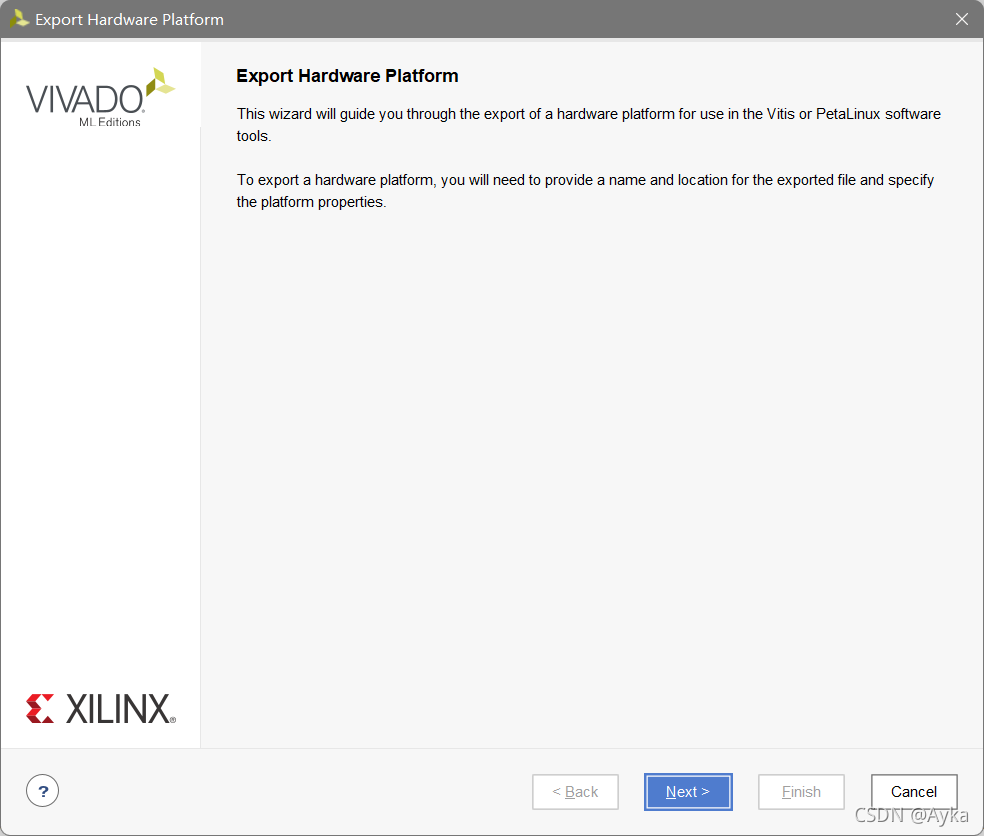

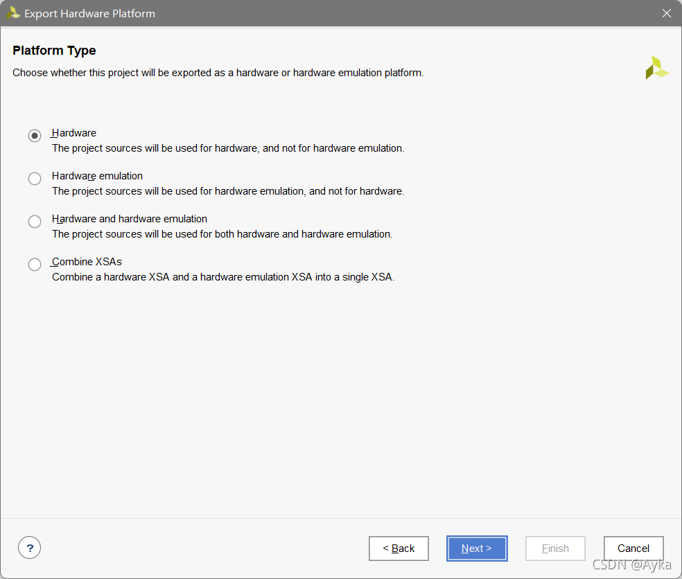

If you use Vivado 2020, you can choose platform type as "Fixed" or "Expandable" (refers to vivado生成plantform报错 (xilinx.com)), but in Vivado 2021, you cannot do that.

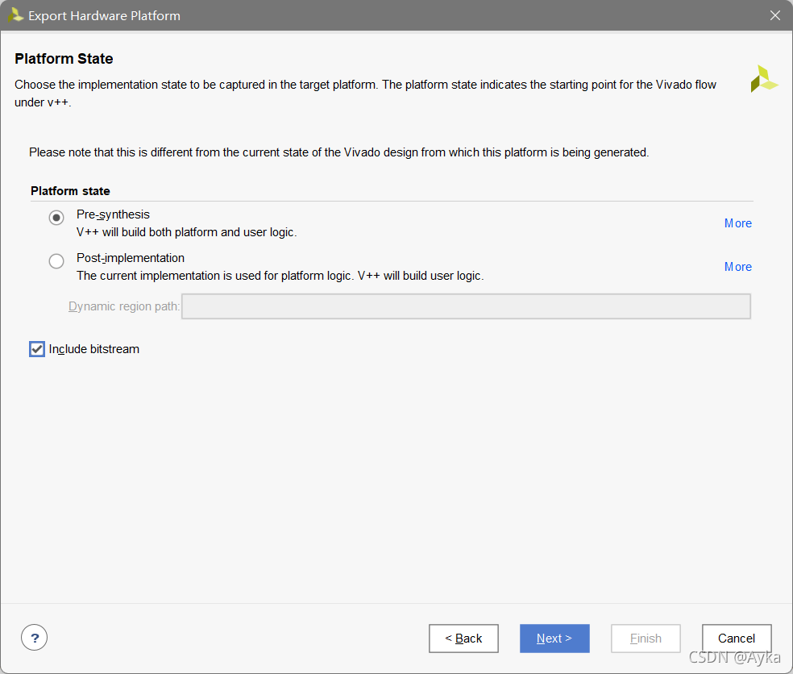

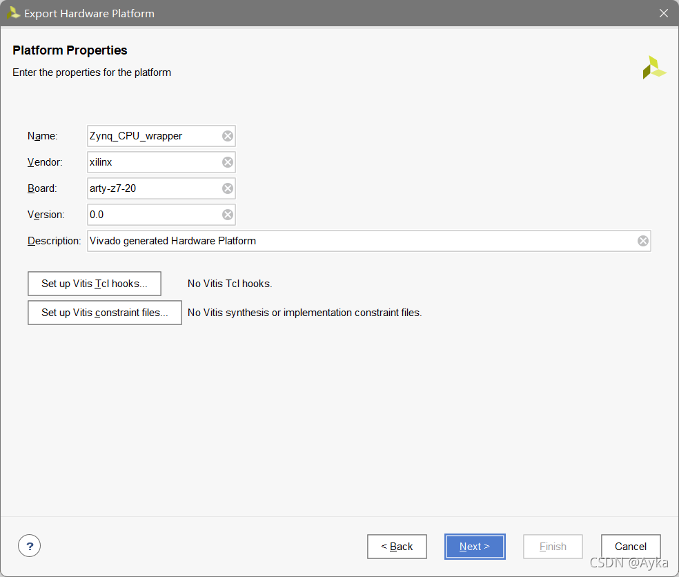

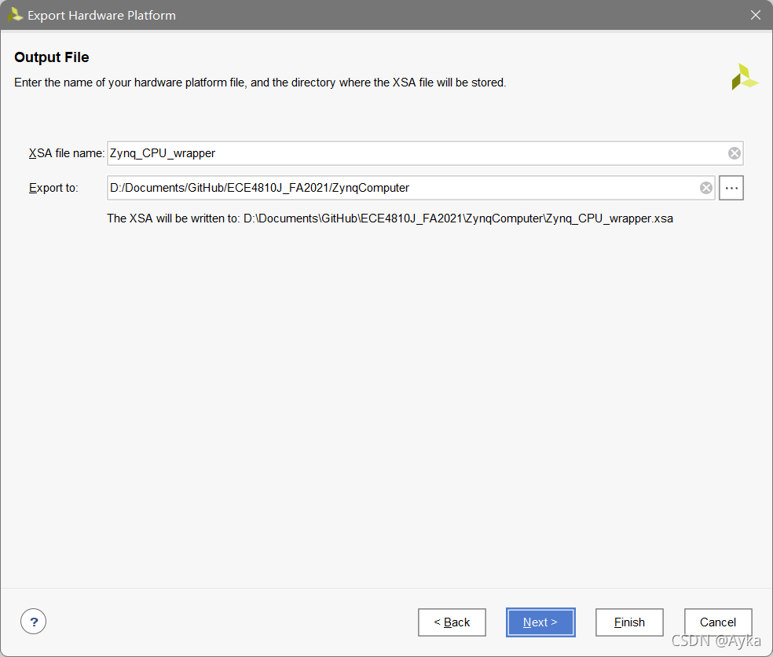

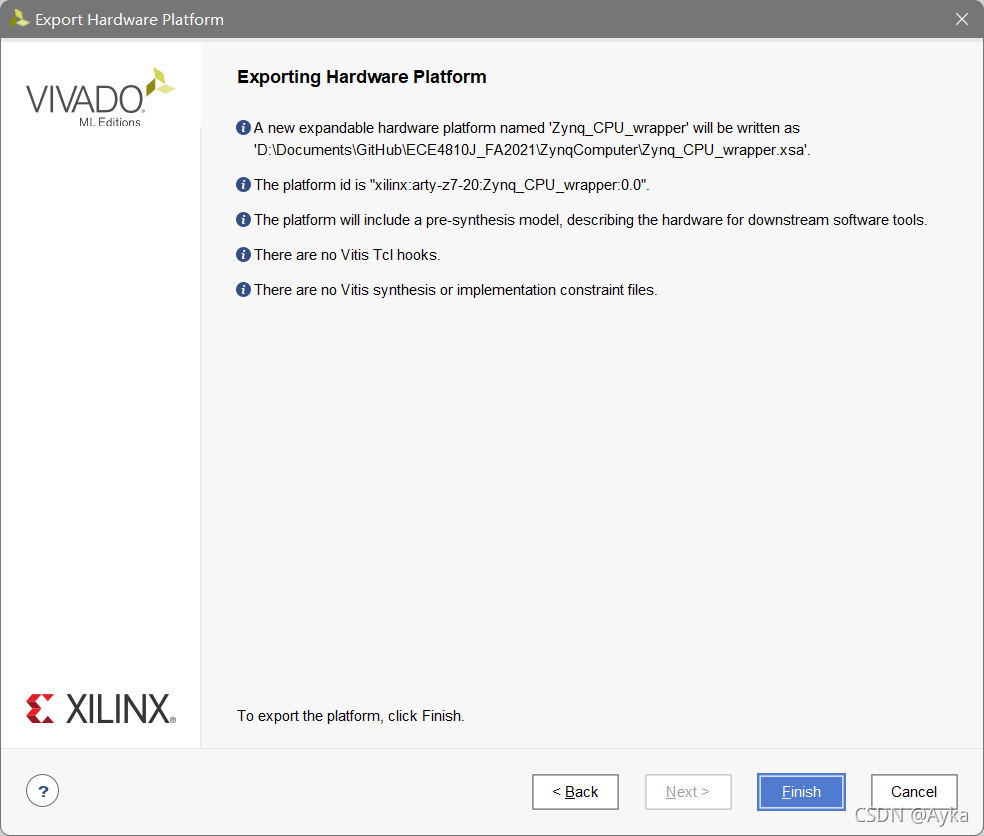

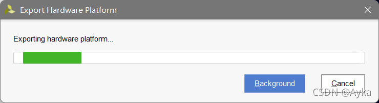

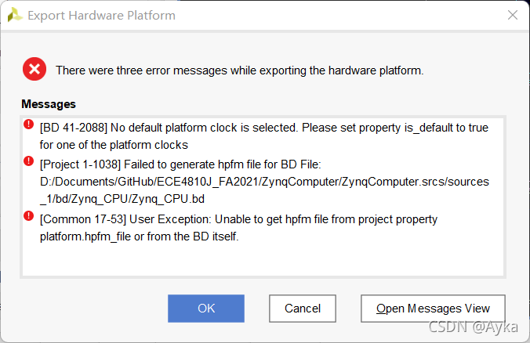

I tried

```tcl
get_clocks
```

in Tcl Console and get output

> clk_fpga_0

but

```tcl
set_property is_default true clk_fpga_0
```

does not work. Then, I open my block design

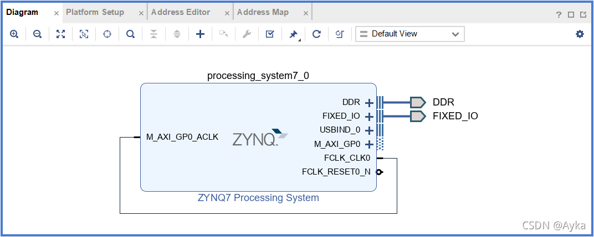

Go to "Platform Setup" tab:

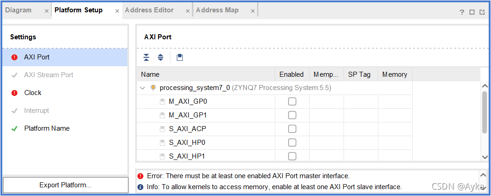

Tick M_AXI_GP0 as Enabled:

```tcl
set_property PFM.AXI_PORT {M_AXI_GP0 {memport "M_AXI_GP" sptag "" memory "" is_range "false"}} [get_bd_cells /processing_system7_0]
```

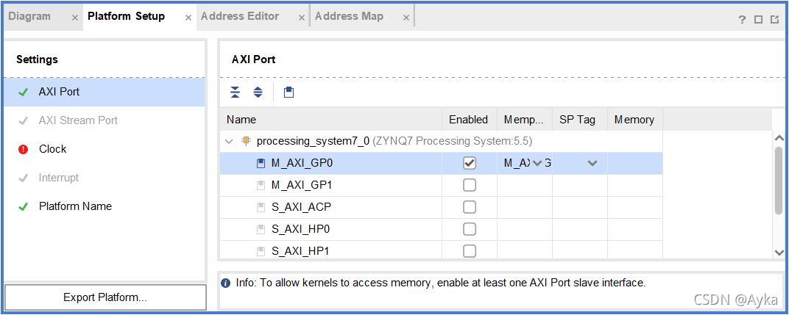

Go to Settings->Clock:

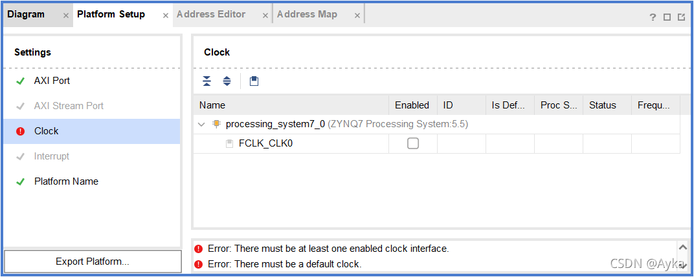

Tick FCLK_CLK0 as Enabled, click Is Default, Proc Sys Reset = ext_reset_in (replace this with the name of your Proc Sys Reset instance, usually you need to **Create and Package New IP**):

```tcl
set_property PFM.CLOCK {FCLK_CLK0 {id "0" is_default "true" proc_sys_reset "ext_reset_in" status "fixed" freq_hz "100000000"}} [get_bd_cells /processing_system7_0]
```

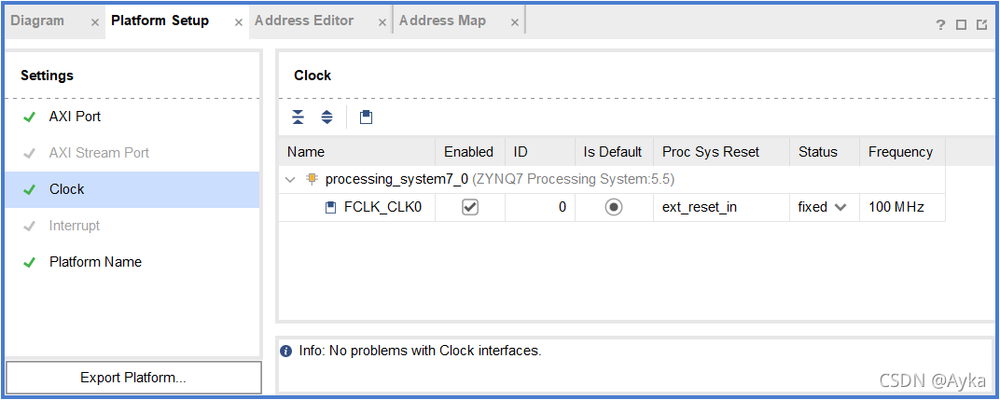

Here you must have an instance of Proc Sys Reset. Save Block Design, Generate bistream (together with Synthesis and Implementation) again, then it will be OK.
