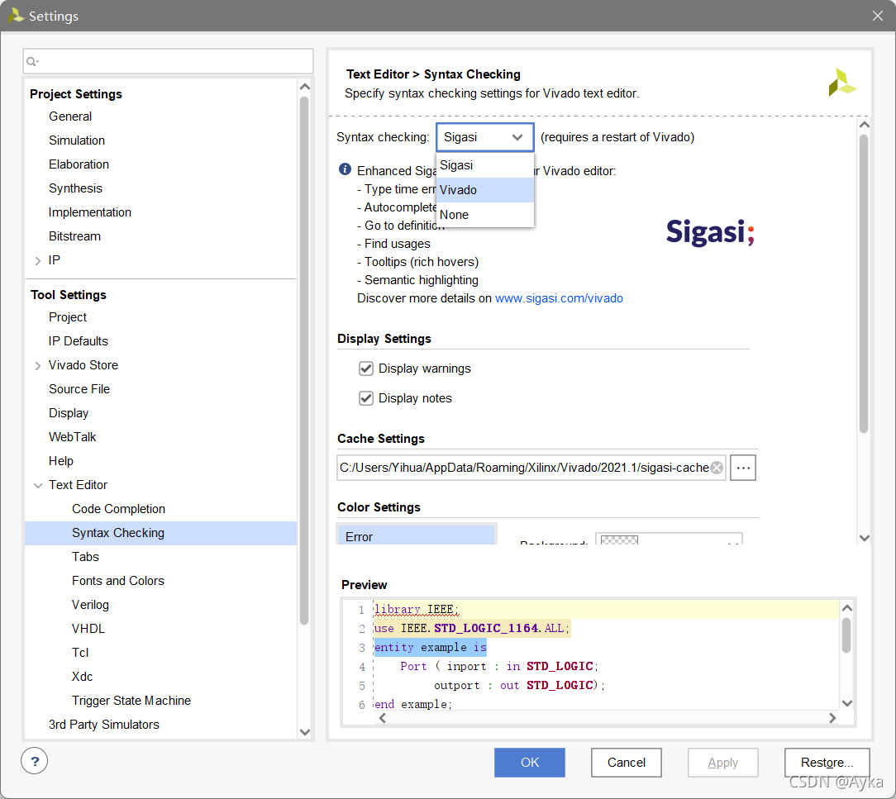

本文参考
Vivado 2021.1 stuck initializing language server (xilinx.com)
https://support.xilinx.com/s/question/0D52E00006hprvB/vivado-20211-stuck-initializing-language-server?language=en_US

我之前曾出现过该问题，但是不知道为什么在一段时间过后重新打开项目不能复现该问题，当时就没管，但最近又出现该问题。我首先根据 [Kele](https://support.xilinx.com/s/profile/0052E00000N2tKUQAZ) 的方法删除了 C:\Users\<username>\AppData\Roaming\Xilinx 文件夹（后来看到 [nicolaseberlein](https://support.xilinx.com/s/profile/0052E00000N2pMqQAJ) 的方法只要删除 C:\Users\<username>\AppData\Roaming\Xilinx\Vivado\tclapp\manifest.tcl 即可），但是重启 Vivado 后打开文件仍然会卡住。根据 [nicolaseberlein](https://support.xilinx.com/s/profile/0052E00000N2pMqQAJ) 的下一条回答我执行了以下步骤：

1. 删除 manifest.tcl；
2. 启动 Vivado，打开项目，打开文件；
3. 等待其卡住为止；
4. 用任务管理器结束 Vivado 进程；
5. 启动 Vivado，再次删除 manifest.tcl，打开项目，再次删除 manifest.tcl；
6. 打开文件。

但是该方案仍无济于事。最后根据 [Kele](https://support.xilinx.com/s/profile/0052E00000N2tKUQAZ) 的下一条回答，打开 Tools -> Settings -> Tool Settings -> Text Editor -> Syntax Checking，将 Syntax checking 从 Sigasi 改为 Vivado：

重启 Vivado 即可解决。
