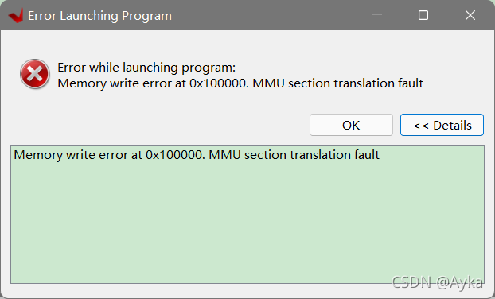

在 Run As -> Launch Hardware (Single Application Debug (GDB)) 时报错：

Error while launching program:

Memory write error at 0x100000. MMU section translation fault

原因是 JP4 接口误接为 SD，改接为 JTAG 后即可顺利 Program Device。
