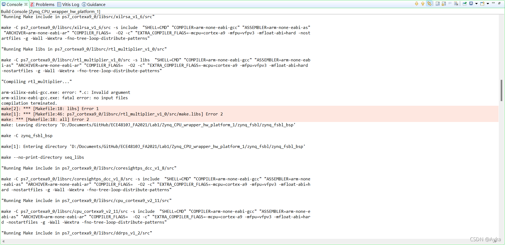
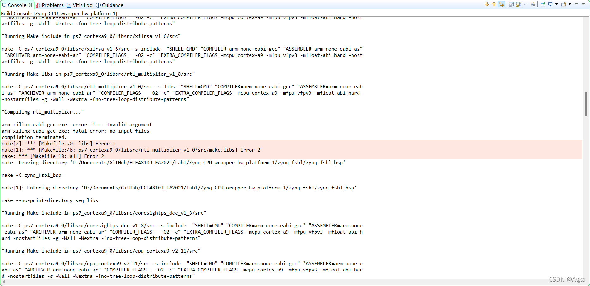
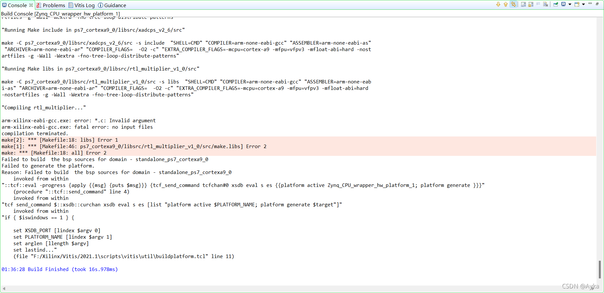
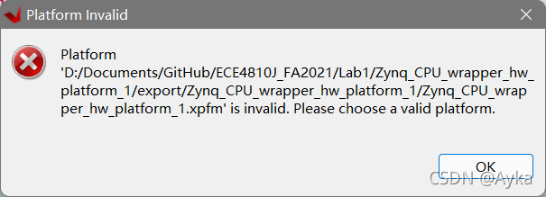
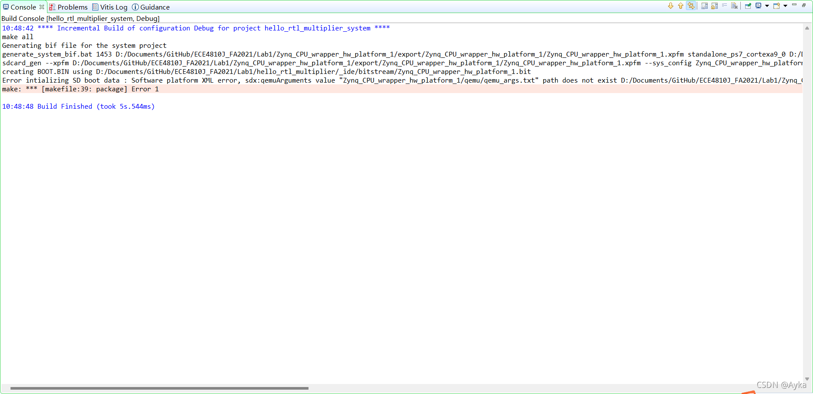

This problem may be a bug of version 2021.1 only. Unfortunately, I'm just currently using this version.

After Build Project:



Find where this Makefile is through "make: Leaving directory" information. For me, it is located at  Zynq_CPU_wrapper_hw_platform_1\zynq_fsbl\zynq_fsbl_bsp\ps7_cortexa9_0\libsrc\rtl_multiplier_v1_0\src\Makefile (we assume Zynq_CPU_wrapper_hw_platform_1 is the platform name and is under the Vitis workspace folder). Locate this file, we see the following code:

```makefile
COMPILER=
ARCHIVER=
CP=cp
COMPILER_FLAGS=
EXTRA_COMPILER_FLAGS=
LIB=libxil.a

RELEASEDIR=../../../lib
INCLUDEDIR=../../../include
INCLUDES=-I./. -I${INCLUDEDIR}

INCLUDEFILES=*.h
LIBSOURCES=*.c
OUTS = *.o

libs:
	echo "Compiling rtl_multiplier..."
	$(COMPILER) $(COMPILER_FLAGS) $(EXTRA_COMPILER_FLAGS) $(INCLUDES) $(LIBSOURCES)
	$(ARCHIVER) -r ${RELEASEDIR}/${LIB} ${OUTS}
	make clean

include:
	${CP} $(INCLUDEFILES) $(INCLUDEDIR)

clean:
	rm -rf ${OUTS}
```

According to

Drivers created in Vivado fail in Vitis 2021.1
https://support.xilinx.com/s/question/0D52E00006ihQSXSA2/drivers-created-in-vivado-fail-in-vitis-20211
75527 - Drivers created in Create or Import Wizard in Vivado fail in Vitis
https://support.xilinx.com/s/article/75527

and [damiet](https://support.xilinx.com/s/profile/0052E00000N2sw8QAB)'s answer in
Vitis IDE 2021.1 custom AXI IP core compile error
https://support.xilinx.com/s/question/0D52E00006hpYgWSAU/vitis-ide-20211-custom-axi-ip-core-compile-error
Note if we do not modify LIBSOURCES as instructed above, there will be still an error pointing to the same line because it requires $(LIBSOURCES):



We modify the Makefile as:

```makefile
COMPILER=
ARCHIVER=
CP=cp
COMPILER_FLAGS=
EXTRA_COMPILER_FLAGS=
LIB=libxil.a

RELEASEDIR=../../../lib
INCLUDEDIR=../../../include
INCLUDES=-I./. -I${INCLUDEDIR}

INCLUDEFILES=*.h
LIBSOURCES=$(wildcard *.c)
OUTS = *.o
OBJECTS = $(addsuffix .o, $(basename $(wildcard *.c)))
ASSEMBLY_OBJECTS = $(addsuffix .o, $(basename $(wildcard *.S)))

libs:
	echo "Compiling rtl_multiplier..."
	$(COMPILER) $(COMPILER_FLAGS) $(EXTRA_COMPILER_FLAGS) $(INCLUDES) $(LIBSOURCES)
	$(ARCHIVER) -r ${RELEASEDIR}/${LIB} ${OBJECTS} ${ASSEMBLY_OBJECTS}
	make clean

include:
	${CP} $(INCLUDEFILES) $(INCLUDEDIR)

clean:
	rm -rf ${OBJECTS} ${ASSEMBLY_OBJECTS}
```

We only modify LIBSOURCES, add OBJECTS and ASSEMBLY_OBJECTS, and replace $(OUTS) at $(ARCHIVER) line and rm -rf line with $(OBJECTS) $(ASSEMBLY_OBJECTS). If you go through Makefile under other directories under libsrc, like Zynq_CPU_wrapper_hw_platform_1\zynq_fsbl\zynq_fsbl_bsp\ps7_cortexa9_0\libsrc\cpu_cortexa9_v2_11\src\Makefile, you will see how is this patch invented.

This time building goes further, but still fails:



and two identical pop-up windows:



By adding echo, we found that this error is no longer caused by the Makefile we modified before. Reading information given by Build Console carefully, we found the following information:

> 'Finished building libraries'
>
> make: Leaving directory 'D:/Documents/GitHub/ECE4810J_FA2021/Lab1/Zynq_CPU_wrapper_hw_platform_1/zynq_fsbl/zynq_fsbl_bsp'
>
> arm-none-eabi-gcc -o fsbl.elf  sd.o  nand.o  image_mover.o  md5.o  fsbl_hooks.o  main.o  nor.o  qspi.o  rsa.o  ps7_init.o  pcap
> .o  fsbl_handoff.o -MMD -MP       -mcpu=cortex-a9 -mfpu=vfpv3 -mfloat-abi=hard   -mcpu=cortex-a9 -mfpu=vfpv3 -mfloat-abi=hard -
> Wl,-build-id=none -specs=Xilinx.spec  -lrsa -Wl,--start-group,-lxil,-lgcc,-lc,--end-group -Wl,--start-group,-lxilffs,-lxil,-lgc
> c,-lc,--end-group -Wl,--start-group,-lrsa,-lxil,-lgcc,-lc,--end-group                                    -Wl,--gc-sections -Lzy
> nq_fsbl_bsp/ps7_cortexa9_0/lib -L./ -Tlscript.ld
>
> Building the BSP Library for domain  - standalone_ps7_cortexa9_0 on processor ps7_cortexa9_0
> make --no-print-directory seq_libs
>
> "Running Make include in ps7_cortexa9_0/libsrc/coresightps_dcc_v1_8/src"
>
> make -C ps7_cortexa9_0/libsrc/coresightps_dcc_v1_8/src -s include  "SHELL=CMD" "COMPILER=arm-none-eabi-gcc" "ASSEMBLER=arm-none
> -eabi-as" "ARCHIVER=arm-none-eabi-ar" "COMPILER_FLAGS=  -O2 -c" "EXTRA_COMPILER_FLAGS=-mcpu=cortex-a9 -mfpu=vfpv3 -mfloat-abi=h
> ard -nostartfiles -g -Wall -Wextra -fno-tree-loop-distribute-patterns"

For me, it is located at Zynq_CPU_wrapper_hw_platform_1\ps7_cortexa9_0\standalone_ps7_cortexa9_0\bsp\ps7_cortexa9_0\libsrc\rtl_multiplier_v1_0\src\Makefile. Its contents are identical to the contents of the previous Makefile.

Interestingly, another same Makefile Zynq_CPU_wrapper_hw_platform_1\hw\drivers\rtl_multiplier_v1_0\src\Makefile does not cause any errors.

After done that, we can see the qemu_args.txt error mentioned by Programaths's answer in

Vitis 2021.1 error Makefile
https://support.xilinx.com/s/question/0D52E00006hpRo8SAE/vitis-20211-error-makefile



> 10:48:42  Incremental Build of configuration Debug for project hello_rtl_multiplier_system 
> make all 
> Generating bif file for the system project
> generate_system_bif.bat 1453 D:/Documents/GitHub/ECE4810J_FA2021/Lab1/Zynq_CPU_wrapper_hw_platform_1/export/Zynq_CPU_wrapper_hw_platform_1/Zynq_CPU_wrapper_hw_platform_1.xpfm standalone_ps7_cortexa9_0 D:/Documents/GitHub/ECE4810J_FA2021/Lab1/hello_rtl_multiplier_system/Debug/system.bif
> sdcard_gen --xpfm D:/Documents/GitHub/ECE4810J_FA2021/Lab1/Zynq_CPU_wrapper_hw_platform_1/export/Zynq_CPU_wrapper_hw_platform_1/Zynq_CPU_wrapper_hw_platform_1.xpfm --sys_config Zynq_CPU_wrapper_hw_platform_1 --bif D:/Documents/GitHub/ECE4810J_FA2021/Lab1/hello_rtl_multiplier_system/Debug/system.bif --bitstream D:/Documents/GitHub/ECE4810J_FA2021/Lab1/hello_rtl_multiplier/_ide/bitstream/Zynq_CPU_wrapper_hw_platform_1.bit --elf D:/Documents/GitHub/ECE4810J_FA2021/Lab1/hello_rtl_multiplier/Debug/hello_rtl_multiplier.elf,ps7_cortexa9_0
> creating BOOT.BIN using D:/Documents/GitHub/ECE4810J_FA2021/Lab1/hello_rtl_multiplier/_ide/bitstream/Zynq_CPU_wrapper_hw_platform_1.bit
> Error intializing SD boot data : Software platform XML error, sdx:qemuArguments value "Zynq_CPU_wrapper_hw_platform_1/qemu/qemu_args.txt" path does not exist D:/Documents/GitHub/ECE4810J_FA2021/Lab1/Zynq_CPU_wrapper_hw_platform_1/export/Zynq_CPU_wrapper_hw_platform_1/sw/Zynq_CPU_wrapper_hw_platform_1/qemu/qemu_args.txt, platform path D:/Documents/GitHub/ECE4810J_FA2021/Lab1/Zynq_CPU_wrapper_hw_platform_1/export/Zynq_CPU_wrapper_hw_platform_1, sdx:configuration Zynq_CPU_wrapper_hw_platform_1, sdx:image standard
> make: *** [makefile:39: package] Error 1
>
> 10:48:48 Build Finished (took 5s.544ms)

Under Zynq_CPU_wrapper_hw_platform_1\export\Zynq_CPU_wrapper_hw_platform_1\sw\Zynq_CPU_wrapper_hw_platform_1, create a new folder called qemu, and create a new TXT file called qemu_args.txt under qemu folder. Just leave it empty (you may find another existing qemu_args under standalone_ps7_cortexa9_0\qemu folder).

Finally, we solved this problem.
