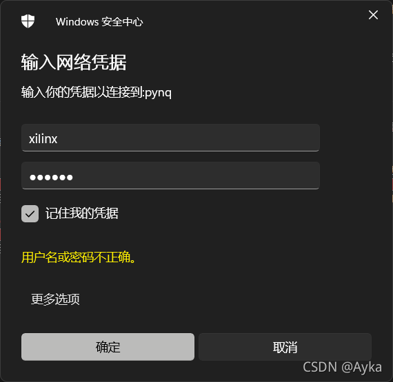
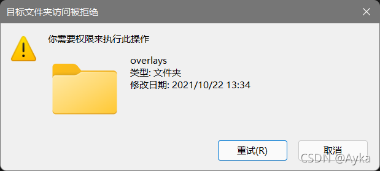

本文使用环境： 

Xilinx Design Tools Vitis Unified Software Platform 2021.1 (version 2021.1.1)

Pynq 2.6.1

Arty Z7

参考：

定制PYNQ的overlay_bramblewalls的博客-CSDN博客
https://blog.csdn.net/bramblewalls/article/details/80045922

如何自定义一个Digilent PYNQ-Z1 Overlay_哔哩哔哩_bilibili
https://www.bilibili.com/video/av837866431/

Overlay Design Methodology — Python productivity for Zynq (Pynq)
https://pynq.readthedocs.io/en/v2.6.1/overlay_design_methodology.html

1. 打开 Xilinx Vitis HLS 2021.1，Create Project 或 File->New Project...

   Project name: hls_adder
   

   Top Function: hls_adder
   

   Solution Configuration->Part Selection: xc7z020clg400-1
   

   Explorer->hls_adder->Source，右键 New File...，选择之前创建好的 hls_adder.cpp
   ```c++
   void hls_adder(int a, int b, int& c) {
   #pragma HLS INTERFACE ap_ctrl_none port=return
   #pragma HLS INTERFACE s_axilite port=a
   #pragma HLS INTERFACE s_axilite port=b
   #pragma HLS INTERFACE s_axilite port=c
   
       c = a + b;
   }
   ```

   Project->Index C Source，Run C Synthesis
   

   Solution->Export RTL
   

2. 打开 Xilinx Vivado 2021.1，File->Project->New... 或 Quick Start->Create Project
   

   ```bash
   git clone git@github.com:cathalmccabe/pynq-z1_board_files.git
   ```

   将 pynq-z1.zip 复制到 F:\Xilinx\Vivado\2021.1\data\boards\board_files 解压或直接复制 pynq-z1 文件夹。
   

   Create Block Design
   

   Add IP (Ctrl+I)，添加 ZYNQ7 Processing System，Run Block Automation。
   Tools->Settings...->Project Settings->IP->Repository->IP Repositories->Add，选择之前创建的 Vitis HLS 项目 hls_adder/solution1/impl/ip，否则后续会提示 Duplicate IP。
   

   在 Block Design - pynq_hls_adder 的 Diagram 窗口中 Add IP (Ctrl+I)，添加 Hls_adder，选中 hls_adder_0，在 Block Properties 中 Name 改为 scalar_add。Run Connection Automation。Renerate Layout。保存。
   在 Sources 选项卡中展开 Design Sources (1)，右键 pynq_hls_adder (pynq_hls_adder.bd) (3)，Create HDL Wrapper... Let Vivado manage wrapper and auto-update
   

   Flow Navigator->PROGRAM AND DEBUG->Generate Bitstream。
   Open Block Design，File->Export...->Export Block Design...
   

3. 启动 Arty Z7 开发板，设置网络连接， 等待 LD0 ~ LD5 闪烁后 LD0 ~ LD3 亮起，LD8、LD9 闪烁，打开浏览器访问 pynq:9090，输入密码登录，打开 Jupyter Notebook 界面，上传位于 pynq_hls_adder 文件夹下的 pynq_hls_adder.tcl 和 pynq_hls_adder\pynq_hls_adder.runs\impl_1 下的 pynq_hls_adder_wrapper.bit 重命名为 pynq_hls_adder.bit 以及 pynq_hls_adder\pynq_hls_adder.gen\sources_1\bd\pynq_hls_adder\hw_handoff 下的 pynq_hls_adder.hwh。或者也可以在文件资源管理器中输入 \\pynq，登录
   

   即可访问 pynq。注意：如果直接在文件资源管理器中创建文件夹可能会失败，提示目标文件夹访问被拒绝
   

   这时需要在 Jupyter Notebook 新建一个 Terminal 通过命令行来新建目录。

4. 新建一个 Jupyter Notebook，运行
   ```python
   from pynq import Overlay
   overlay = Overlay('/home/xilinx/pynq/overlays/adder/pynq_adder.bit')
   ```

   注意：如果之前没有同时拷贝 HWH 文件会报错：
   /usr/local/lib/python3.6/dist-packages/pynq/pl_server/device.py:641: UserWarning: Users will not get PARAMETERS / REGISTERS information through TCL files. HWH file is recommended.
     warnings.warn(message, UserWarning)
    接下来参考文档中的代码执行即可。

   ```python
   overlay?
   add_ip = overlay.scalar_add
   add_ip?
   add_ip.register_map
   add_ip.register_map.a = 3
   add_ip.register_map.b = 4
   add_ip.register_map.c
   add_ip.write(0x10, 4)
   add_ip.write(0x18, 5)
   add_ip.read(0x20)
   ```

5. 创建驱动：

   ```python
   from pynq import DefaultIP
   
   class AddDriver(DefaultIP):
       def __init__(self, description):
           super().__init__(description=description)
   
       bindto = ['xilinx.com:hls:hls_adder:1.0']
        
       def add(self, a, b):
           self.write(0x10, a)
           self.write(0x18, b)
           return self.read(0x20)
   ```

   这一步 Overlay Tutorial 没有解释清楚 binto 后面的内容，bindto 的解释在 
   Python Overlay API — Python productivity for Zynq (Pynq)
   https://pynq.readthedocs.io/en/v2.6.1/overlay_design_methodology/python_overlay_api.html#creating-ip-drivers
   打开 Vivado 之前创建的项目 pynq_hls_adder，Flow Navigator->PROJECT MANAGER->IP Catalog 窗口中 Interfaces 选项卡，右键 User Repository->Properties... (Ctrl+E)，在 Repository Properties 中底部选择 IPs 选项卡，点击 Hls_adder，右侧 Details 显示 VLNV: xilinx.com:hls:hls_adder:1.0，这与 Tutorial 中默认的不同。
   

   如果没有改 bindto，会导致运行 AddDriver 并重载 overlay 后 overlay 中 IP Blocks scalar_add 仍然是 pynq.overlay.DefaultIP 而不是 \__main__.AddDriver，之后的 overlay.scalar_add.add(15,20) 也会报错 AttributeError: ‘DefaultIP’ object has no attribute ‘add’ （参见 Overlay Tutorial AddDriver doesn't work - Support - PYNQ）。接下来执行

   ```python
   overlay = Overlay('/home/xilinx/pynq/overlays/adder/pynq_adder.bit')
   overlay?
   overlay.scalar_add.add(15,20)
   ```

   即可。
