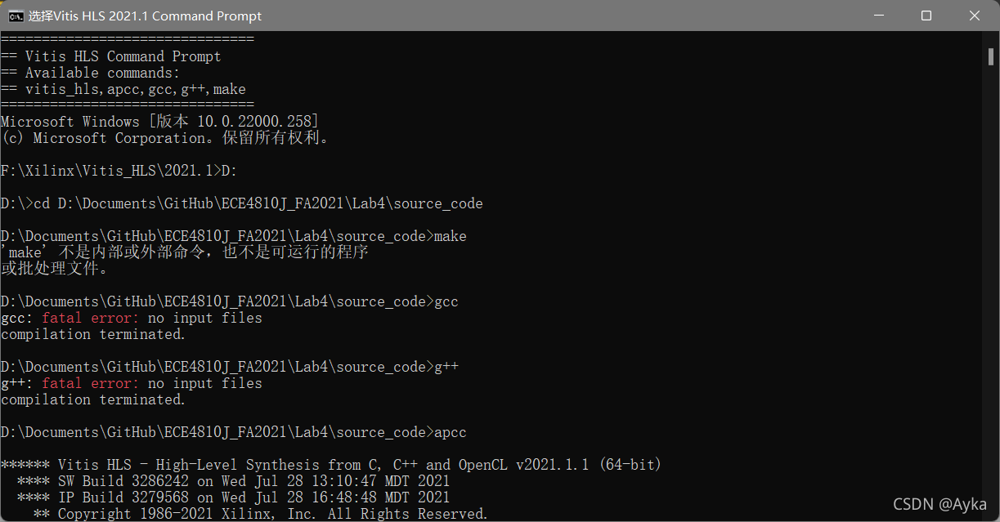
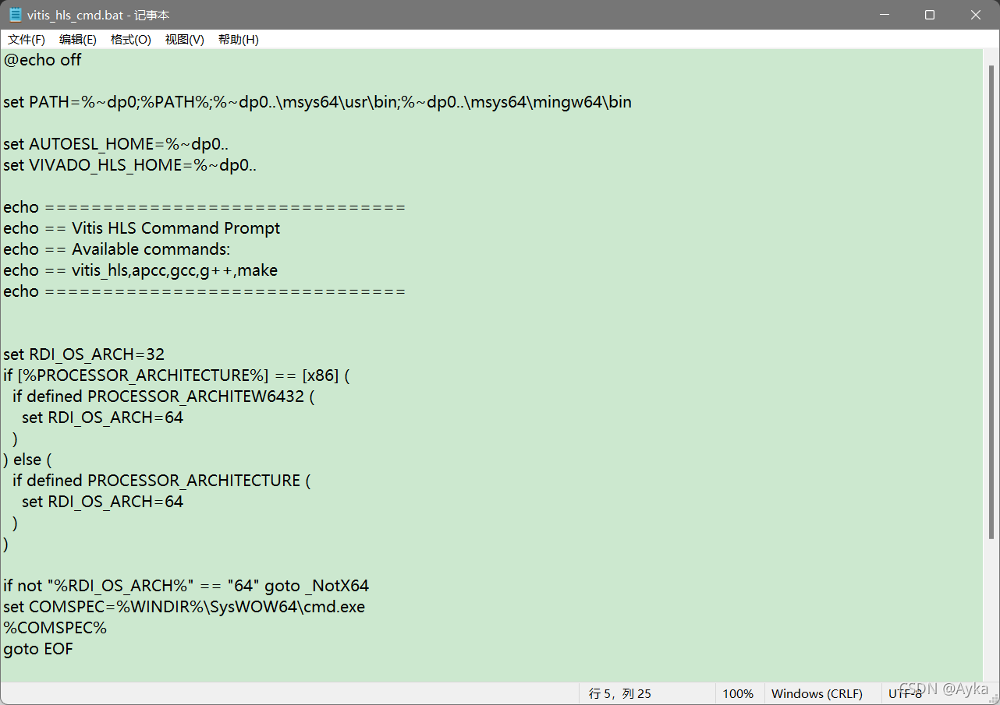
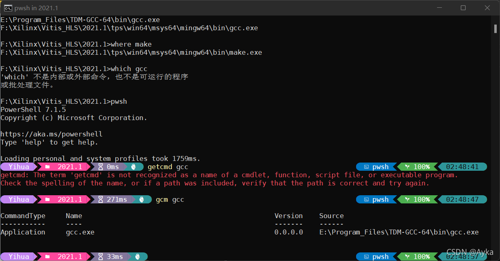

打开 Vitis HLS 2021.1 Command Prompt，执行 make 出错：



通过

```
where gcc
```

命令得知 gcc 是环境变量中的另一个 gcc，并不是 Vitis HLS 自带的。查看 Vitis HLS 2021.1 Command Prompt 的快捷方式所指向的目标为：F:\Xilinx\Vitis_HLS\2021.1\bin\vitis_hls_cmd.bat，打开该 bat 文件：



%~dp0 表示批处理文件所在的目录（包含 vitis_hls 和 apcc、apcc.bat），%PATH% 为系统环境变量，查找其他三个路径，发现 %~dp0%.. 也就是批处理文件的上一级目录下根本没有 msys64 文件夹。F:\Xilinx\Vitis_HLS\2021.1\tps\mingw\6.2.0\win64.o\nt\bin 目录下没有 make.exe，而 F:\Xilinx\Vitis_HLS\2021.1\tps\win64\msys64\usr\bin 下都没有，只有 F:\Xilinx\Vitis_HLS\2021.1\tps\win64\msys64\mingw64\bin 有 gcc.exe、g++.exe 和 make.exe。备份该 vitis_hls_cmd.bat 文件，修改 set PATH 行为

```
set PATH=%~dp0;%PATH%;%~dp0..\tps\win64\msys64\usr\bin;%~dp0..\tps\win64\msys64\mingw64\bin
```

注意：%~dp0..\tps\win64\msys64\usr\bin 是有用的，包含了诸如 which.exe 之类的程序。如果系统环境变量中有其他的 gcc、g++、make 等，例如执行

```
where gcc
```

可以查看是否有多个 gcc，如果是，在 Command Prompt 中启动 PowerShell Core：

```
pwsh
```

然后参考 [Is there an equivalent of 'which' on the Windows command line? - Stack Overflow](https://stackoverflow.com/questions/304319/is-there-an-equivalent-of-which-on-the-windows-command-line) 执行

```powershell
Get-Command gcc
```

或 

```powershell
gcm gcc
```



可以看到系统环境变量里的 gcc 覆盖掉了 Vitis 自带的 gcc，所以需要将系统环境变量中的其他 gcc 所在的路径删去（不要将 set PATH 行中的 %PATH%; 删去，这样会导致 where 等命令无法使用）：

```powershell
set PATH=%~dp0;%~dp0..\tps\win64\msys64\usr\bin;%~dp0..\tps\win64\msys64\mingw64\bin
```

参考
Vitis HLS 2021.1 vitis_hls_cmd.bat sets wrong path? (xilinx.com)
https://support.xilinx.com/s/question/0D52E00006nbVBlSAM/vitis-hls-20211-vitishlscmdbat-sets-wrong-path?language=en_US
